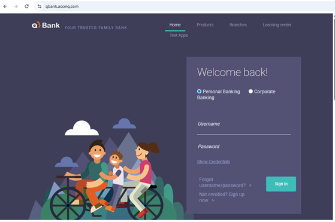
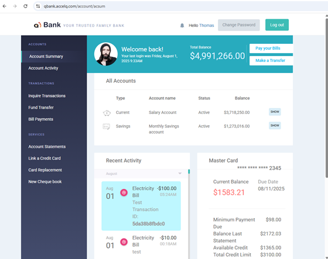
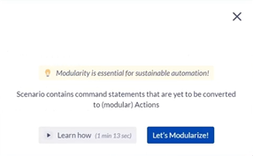
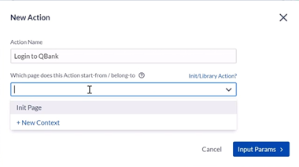
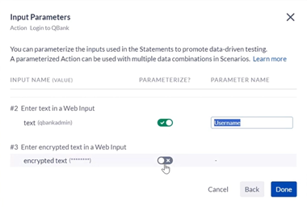
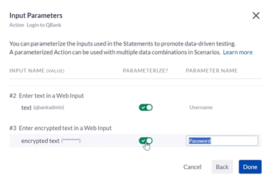
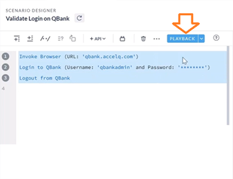
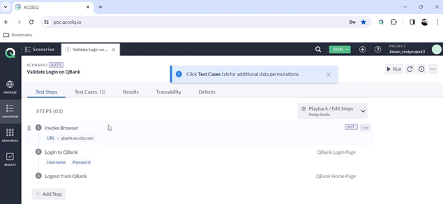
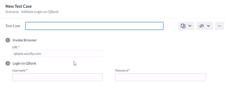

# ACCELQ Academy

Most useful courses to develop the skills needed in this new era of QAs in AI.

<https://community.accelq.io/c/learn-to-automate/>

## Section 1: Getting Started - Web Automation

### 1. ▶️ Hello World! Let's Automate our first Scenario!

>[!WARNING]
>
> El ejercicio empieza en este sitio , pero infortunadamente no tenemos acceso, así que todo se hará con ejercicios en la imaginación.
>

1. Un escenario en `AccleQ` representa un caso de uso o un proceso de negocio que se intenta automatizar.
2. Aquí tenemos un ejemplo que comienza con:
   * La invocación del navegador
   * El inicio de sesión en el banco
   * El proceso de transferencia de fondos
   * Para transferir fondos al banco
   * Y cerrar sesión.
3. Intentemos crear nuestro primer escenario en un proyecto completamente nuevo.
4. Vamos a la parte izquierda a `Navigator` y luego seleccionamos el tabulador `Scenarios`
5. Clic en el botón `[Create Scenario]`.
6. El nombre es `Validate Login on QBank`.
7. Tenemos dos opciones o:   » `Record in Design Studio` </b> o   » `➕ Add Step`   Seleccionamos la primera `Record in Design Studio`.
8. En la parte superior derecha, en la casilla de `WEB`, ponemos la _URL_ `qbank.accelq.com`   
9. Aparece el primer paso:   `1️⃣ Invoke Browser (URL: 'qbank.accelq.com')`
10. Hace clic en el cuadro al medio a la derecha con el nombre de `Username` y me aparecen un selector de campos y escojo `enter text in a web input`.
11. Presiono la tecla [`Enter`] y tengo el paso número 2, que debo completar:   `2️⃣ Enter text` _in input field whose label (equals, ignore case): 'Username'. Look for the label anyware on page_   Lo completamos con `qbankadmin` y presionamos la tecla [`Enter`].
12. Repetimos haciendo clic en el cuadro al medio a la derecha con el nombre de `Password` y me aparecen un selector de campos y escojo `enter encrypted text in a web input`.
13. Presiono la tecla [`Enter`] y tengo el paso número 3, que debo completar:    `3️⃣ Enter encrypted text` _in input field whose label (equals, ignore case): 'Password'. Look for the label anyware on page_   Lo completamos con `qbTrnPass1&` y presionamos la tecla [`Enter`].
14. Finalmente clic en el botón verde de `[Sign In]` y en el selector escojo `click on a web element`.
15. Presiono la tecla [`Enter`] y tengo el paso número 4, que debo completar:    `4️⃣ Click on text` _(equals, ignore case): 'Sign In'. Look for the clickable text on page_
16. Como se puede ver, estamos grabando estas declaraciones, la declaración es generada y la interacción también está pasando en el cuadro de la derecha:   
17. Damos clic en el botón verde de `[Log out]` y en el selector de campos selecciono `click on a web element`.
18. Presiono la tecla [`Enter`] y tengo el paso número 5, que debo completar:    `5️⃣ Click on text` _(equals, ignore case): 'Log out'. Look for the clickable text on page_
19. Hemos completado el proceso, pero en este punto si trata de **Finalizar y Salir**, es decir dar clic en el botón `[Finalize]` en la parte superior derecha y luego `💾 Finalize Changes`, sale una ventana:      Modularizar es convertir este escenario grabado en funcionales bloques reusables, que se llaman _actions_.
20. Clic en el botón azul `[Let's Moduralize!]`.
21. Esto ayuda en el mantenimientoy la velocidad del desarrollo a medida que vayas construyendo más escenarios en `AccelQ`.
22. Selecciono del paso `2️⃣ Enter 'qbankadmin' in input` hasta el paso `4️⃣ Click on text (equals, ignore case): 'Sign In'` y presiono el clic derecho.
23. Y selecciono de la lista el penúltimo `Create New Action and Replace`.
24. En el `Action Name`, le pongo `Login to QBank`.
25. En el cuadro selector de nombre `Which page does this Action star-from/belong-to ❓`, escribo `QBank Login Page` y presiono [`Enter`]   _¿De donde sale este nombre? pues le sale de los 🥚🥚 al Instructor_).  
26. Clic en el botón `[Input Params >]`:   
27. En este podemos parametrizar los datos a usar en los pasos del _login_. Si quisiera usar el _login_ con diferentes _usernames_ y _passwords_ a través de diferentes escenarios y variar la información.
28. Seleccione el `Username` y dele clic   
29. Selecciono el `Password` y dmos clic   
30. Damos clic en el botón azul `[Done]`.
31. La lista de pasos se redujo a solo 2:   ")   La modularidad se construyó, se puede ver a la izquierda.
32. Vamos a hacer lo mismo con la declaración de `Log out`, para convertirla en acción, dando clic derecho al paso `2️⃣ Click on text (equals, ignore case): 'Log out'` y seleccionando `Create New Action`.
33. En el cuadro de `Action Name` le ponemos `Logout from QBank` y en el selector de `Which page does this Action star-from/belong-to ❓`, escribo `QBank Home Page`.
34. Damos clic en el botón de `[Create Action]`.
35. En este paso el escenario que grabamos se convirtió en una serie de pasos reutilizables. Esto se puede validar al seleccionar las declaraciones de la izquierda y presionando el botón de `[PLAYBACK]`   
36. Luego que corrió la prueba, puede presionar el botón superior derecho de `Finalize` y `Finalize Changes` y nos aparece el Escenario, listo para correr:      con solo tres pasos:   » 1️⃣ Invoke Browser   » 2️⃣ Login to QBanck   » 3️⃣ Logout from QBank
37. Damos clic al tabulador `Test Cases` y existe solo uno de nombre `Test case 1`, que es el resultado de la grabación.
38. Se pueden crear mas _Test Cases_, con _usernames_ o crendenciales diferentes:   

>[!IMPORTANT]
>
>
>

