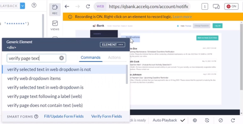

# ACCELQ Academy

Most useful courses to develop the skills needed in this new era of QAs in AI.

<https://community.accelq.io/c/learn-to-automate/>

## Section 1: Getting Started - Web Automation

### 1. ▶️ Hello World! Let's Automate our first Scenario!

>[!WARNING]
>
> El ejercicio empieza en este sitio , pero infortunadamente no tenemos acceso, así que todo se hará con ejercicios en la imaginación.
>

1. Un escenario en `AccleQ` representa un caso de uso o un proceso de negocio que se intenta automatizar.
2. Aquí tenemos un ejemplo que comienza con:
   * La invocación del navegador
   * El inicio de sesión en el banco
   * El proceso de transferencia de fondos
   * Para transferir fondos al banco
   * Y cerrar sesión.
3. Intentemos crear nuestro primer escenario en un proyecto completamente nuevo.
4. Vamos a la parte izquierda a `Navigator` y luego seleccionamos el tabulador `Scenarios`
5. Clic en el botón `[Create Scenario]`.
6. El nombre es `Validate Login on QBank`.
7. Tenemos dos opciones o:   » `Record in Design Studio` </b> o   » `➕ Add Step`   Seleccionamos la primera `Record in Design Studio`.
8. En la parte superior derecha, en la casilla de `WEB`, ponemos la _URL_ `qbank.accelq.com`   
9. Aparece el primer paso:   `1️⃣ Invoke Browser (URL: 'qbank.accelq.com')`
10. Hace clic en el cuadro al medio a la derecha con el nombre de `Username` y me aparecen un selector de campos y escojo `enter text in a web input`.
11. Presiono la tecla [`Enter`] y tengo el paso número 2, que debo completar:   `2️⃣ Enter text` _in input field whose label (equals, ignore case): 'Username'. Look for the label anyware on page_   Lo completamos con `qbankadmin` y presionamos la tecla [`Enter`].
12. Repetimos haciendo clic en el cuadro al medio a la derecha con el nombre de `Password` y me aparecen un selector de campos y escojo `enter encrypted text in a web input`.
13. Presiono la tecla [`Enter`] y tengo el paso número 3, que debo completar:    `3️⃣ Enter encrypted text` _in input field whose label (equals, ignore case): 'Password'. Look for the label anyware on page_   Lo completamos con `qbTrnPass1&` y presionamos la tecla [`Enter`].
14. Finalmente clic en el botón verde de `[Sign In]` y en el selector escojo `click on a web element`.
15. Presiono la tecla [`Enter`] y tengo el paso número 4, que debo completar:    `4️⃣ Click on text` _(equals, ignore case): 'Sign In'. Look for the clickable text on page_
16. Como se puede ver, estamos grabando estas declaraciones, la declaración es generada y la interacción también está pasando en el cuadro de la derecha:   
17. Damos clic en el botón verde de `[Log out]` y en el selector de campos selecciono `click on a web element`.
18. Presiono la tecla [`Enter`] y tengo el paso número 5, que debo completar:    `5️⃣ Click on text` _(equals, ignore case): 'Log out'. Look for the clickable text on page_
19. Hemos completado el proceso, pero en este punto si trata de **Finalizar y Salir**, es decir dar clic en el botón `[Finalize]` en la parte superior derecha y luego `💾 Finalize Changes`, sale una ventana:      Modularizar es convertir este escenario grabado en funcionales bloques reusables, que se llaman _actions_.
20. Clic en el botón azul `[Let's Moduralize!]`.
21. Esto ayuda en el mantenimientoy la velocidad del desarrollo a medida que vayas construyendo más escenarios en `AccelQ`.
22. Selecciono del paso `2️⃣ Enter 'qbankadmin' in input` hasta el paso `4️⃣ Click on text (equals, ignore case): 'Sign In'` y presiono el clic derecho.
23. Y selecciono de la lista el penúltimo `Create New Action and Replace`.

24. En el `Action Name`, le pongo `Login to QBank`.
25. En el cuadro selector de nombre `Which page does this Action star-from/belong-to ❓`, escribo `QBank Login Page` y presiono [`Enter`]   _¿De donde sale este nombre? pues le sale de los 🥚🥚 al Instructor_).  
26. Clic en el botón `[Input Params >]`:   
27. En este podemos parametrizar los datos a usar en los pasos del _login_. Si quisiera usar el _login_ con diferentes _usernames_ y _passwords_ a través de diferentes escenarios y variar la información.
28. Seleccione el `Username` y dele clic   
29. Selecciono el `Password` y dmos clic   
30. Damos clic en el botón azul `[Done]`.
31. La lista de pasos se redujo a solo 2:   ")   La modularidad se construyó, se puede ver a la izquierda.
32. Vamos a hacer lo mismo con la declaración de `Log out`, para convertirla en acción, dando clic derecho al paso `2️⃣ Click on text (equals, ignore case): 'Log out'` y seleccionando `Create New Action`.
33. En el cuadro de `Action Name` le ponemos `Logout from QBank` y en el selector de `Which page does this Action star-from/belong-to ❓`, escribo `QBank Home Page`.
34. Damos clic en el botón de `[Create Action]`.
35. En este paso el escenario que grabamos se convirtió en una serie de pasos reutilizables. Esto se puede validar al seleccionar las declaraciones de la izquierda y presionando el botón de `[PLAYBACK]`   
36. Luego que corrió la prueba, puede presionar el botón superior derecho de `Finalize` y `Finalize Changes` y nos aparece el Escenario, listo para correr:      con solo tres pasos:   » 1️⃣ Invoke Browser   » 2️⃣ Login to QBanck   » 3️⃣ Logout from QBank
37. Damos clic al tabulador `Test Cases` y existe solo uno de nombre `Test case 1`, que es el resultado de la grabación.
38. Se pueden crear mas _Test Cases_, con _usernames_ o crendenciales diferentes:   

>[!IMPORTANT]
>
>
>

### 2. 🚀 Pop Quiz: Introduction to ACCELQ Automation

>[!NOTE]
>
>
>

### 3. ▶️ Extending Hello World!

1. Ahora que se hizo el escenario `Hello World`, vamos a crear un escenario de complejidad algo identificable. Vamos a tratar de verificar transferencia de fondos en `QBank`.
2. Ya hay un escenario de nombre `Verify Founds Transfer on QBank` y seleccionamos `Record in Design Studio`:   
3. En la parte derecha agregar la _URL_ apuntando a `http://qbank.accelq.com`, que por defecto lo deja en la página de _login_, al darle [`ENTER`], aparece el paso:   `1️⃣ Invoque Browser (URL: 'http://qbank.accelq.com')`   ")
4. Vamos a hacer _login_ de nuevo, así que dar click derecho en el cuadro de `Username` de la derecha, aparecen los `Commands`, entonces cambia a `Actions`:   
5. Seleccionamos el que creamos en el paso [24](#1-️-hello-world-lets-automate-our-first-scenario) anterior: `Login to QBank`, y nos pide completar `Username` y `Password`:   
6. Una vez adentro Damos click derecho al botón `[Make a Transfer]`y cambiamos de `Actions` a `Commands`, para luego seleccionar:   `clic on a web element`      Esto crea el tercer paso   `3️⃣ Click on text (equals, ignore case): 'Make a Transfer'`
7. Nos abre un formulario para llenar:   
8. Damos clic derecho sobre el primer campo de `Transfer form` y Seleccionamos `select an item from a web dropdown`, pero sería mas largo y demorado hacer cada paso.
9. Sugerencia seleccionar toda el área que envuelve el formulario:     

  

    
Transfer Funds

    

      

        
01

        
Fill Details

      

      

        
02

        
Confirmation

      

    

    

      <form>
        

          

            
Transfer from 

            

              <select>
                <option></option>
                <option>Salary Account</option>
                <option>Monthly Savings account</option>
              </select>1️⃣
            

          

          

            
Transfer to 

            

              <select>
                <option></option>
                <option>Electricity Bill</option>
                <option>Mortgage Payment</option>
                <option>Day care</option>
                <option>ac</option>
                <option>TEST</option>
                <option>Kumar</option>
                <option>sai</option>
              </select>2️⃣
            

          

          

            
Amount ($)

            

              <input type="number" />3️⃣
              

                Transfer amount not to exceed $150
              

            

          

          

            
Date of Transfer

            

              <input type="date" />4️⃣
            

          

          

            
Memo

            

              <input type="text" />5️⃣
            

            

              

            

          

          

            

              
One-time or repeating?

            

            

              <label>
                <input type="radio" name="onetime_or_repeating" />6️⃣
                One-time
              </label>
              <label class="qbl-radiolabel">
                <input type="radio" name="onetime_or_repeating" />7️⃣
                Repeating
              </label>
            

            

              

            

          

          

            

            

              <button type="button">Cancel</button>
              <button type="submit">Submit</button>
            

          

        

      </form>
    

  

10. Damos clic derecho y seleccionamos un link abajo de nombre `Fill/Update Form Fields`:   
11. Nos trae una estructura numerada con los siete (7) campos que podemos completar:   
12. El primer campo de `Transfer from`1️⃣, le selecciono `Salary Account`.
13. El segundo campo de `Transfer to`2️⃣, le selecciono `Electricity Bill`.
14. En el tercero de `Amount($)`3️⃣, escribo `10`.   Así se ve los campos seleccionados hasta el momento:   
15. En el cuarto de `Date of Transfer`4️⃣, le quito el chulo o _checkbox_ ☑️ -> 🔲.
16. El quinto de `Memo`5️⃣, le pongo `test`.
17. El sexto de `One-time`6️⃣ lo dejo intacto y quito el chulo o _checkbox_ ☑️ -> 🔲 de `Repeating`7️⃣, y así van los campos:   
18. El cuadro de abajo que dice `Button Label`, le escribo `Submit`.
19. Por último presiono el botón de `[Done]`, y nos sale la ventana de `Generación exitosa` y atrás los pasos que se crearon   
20. Aquí le damos al botón `[Create Action]`.
21. Y le ponemos un nombre: `Populate Found Transfer Info` y para `Which page does this Action`, escribimos `Transfer info page`  
22. Damos clic en el botón azúl `[Input Params>]` y nos lleva a esta pantalla:   
23. Seleccionamos, los tres primeros y ajustamos los nombres para que no tengan caracters especiales:   
24. La lista de pasos se redujo a cuatro:   
25. Vamos a darle clic derecho al botón superior derecho de `[Log out]` y seleccionamos `Actions` el de nombre `Logout from QBank`:   
26. Si revisa la lista de pasos, el 3️⃣, tiene mas acciones que el resto:   
27. Como tenemos seleecionado el paso 3️⃣ , en la parte superior seleccionamos en `CREATE ACTION FROM SELECTION`, la opción `Create Action and Replace`:   
28. Le ponemos de nombre `Navigate to founds transfer` y en el campo de `Wich page dows Action`, seleccionamos `QBanck Home Page`:     Y clic en el botón azul de `[Create Action]`.
29. VAmos a la parte superior derecha en el botón `[Finalize]` y seleccionamos 💾 `Finalize Changes`:   
30. Esta es la manera en como se reutilizan acciones en ACCELQ y como el sistema los muestra cuando hay una oportunidad.   Así es como se construyen mas y mas escenarios, y se convierte en un reuso eficiente, de activos en vez de recrear o regrabar la lógica de nuevo.    Pasos")

>[!IMPORTANT]
>
>
>

### 4. 🚀 Pop Quiz: Action Reuse in Scenario Development

>[!NOTE]
>
>

### 5. ▶️ Basic Entities in ACCELQ

>[!NOTE]
>
>1. En los últimos dos ejemplos, ACCELQ toma una primera aproximación al diseño para la automatización del test. 
>Aquí mientras estamos construyendo elementos en vez de grabar los casos de prueba. Esencialmente esto quiere decir que estamos construyendo una configuración modular desde el _get-go_ (Ve y consigue) y varios pasos han sido creados por ACCELQ como unas simples tareas.
>
>2. Vamos a darle otra mirada a esto en este escenario:   
>Cada paso que se ve comprende dos porciones. 
>Una es el `Login to QBank` que es una acción en ACCELQ, que puede tener ciertos parámetros (_Username_ y _Passord_) y adicional cada acción toma un lugar en un particular página de su aplicación, el cual llama un contexto.
>
>3. Por lo tanto, simplemente por proveer un nombre de página, usted creó una acción, dando mucho mejor contexto a su proceso de negocios y ayuda a entender que está pasando.
>
>4. Antes demostrar los pasos relacionados mas allá del ejemplo, permítame abrir una acción y mostrarla:   
>Notará que la acción primariamente consiste de la automatización de la lógica.
>
>5. Esto se detallará mas en próximos vídeos. Ahora vamos detrás de las escenas y examinemos el botón de `NAVIGATOR` que muestra los elementos que van a ser construídos:   
>
>6. Lo primero que muestra son los Escenarios, Contextos y Acciones:    
>Se pueden ver las acciones formuladas, los contextos creados y los escenarios que hemos grabado.
>
>7. Ahora todo esto pasa sin requerir habilidades técnicas avanzadas o esfuerzo adicional de su parte.
>Así que se continua construyendo mas escenarios de pruebas en ACCELQ, todo estará uniéndose y demuestra como esto ayuda a reducir el mantenimiento e incrementar la velocidad de desarrollo.
>
>8. Y el `UNIVERSE` captura las posibles interacciones en su aplicación:     
>y empieza a auto-formular como se construyen los elementos.
>
>9. Ahora antes de terminar, deseo clarificar y asegurar que todo esté claro. La diferencia entre una `Action` y un `Scenario`:    
>Un `Scenario` es un proceso del negocio que se está probando en cambio una `Action` es un bloque de lógica reutilizable significativo y funcional que se usa como un `Step` en un `Scenario`.

>[!IMPORTANT]
>
>
>

### 6. 🚀 Pop Quiz: Key Entities in ACCELQ

>[!NOTE]
>
>

### 7. ▶️ Introduction to Element Identification (Web)

1. Empezamos con un ejemplo, dando clic en el cuadro de `Username`, después de un rato aparecen las opciones:     Para obtener un elemento para la prueba que se va a correr.   La identificación de elementos involucra la definición de este criterio y el término `locator` es comunmente usado para indicar la identifación de un elemento.
2. Se utilizan dos aproximaciones para la identificación de un elemento:   » Uno es el **Locator-Free**.   » Y el otro es el **Smart-Locator**.
3. **Locator-Free**, no tiene `locators`, es decir no tiene localizadores o identificadores de elemento.
4. **Smart-Locator**, usa una combinación de atributos _HTML_ que son óptimos y probalemente estáticos a favor de identificar un elemento.

5. En la mayoría de los casos ACCELQ puede identificar usando la aproximación  usando el **Locator-Free**. En el Escenario no se requiere buscar los elementos o los _locators_, que son implícitos yendo con el **Locator-Free**. El ACCELQ permite configurar por defecto cual aproximación utilizar.
6. Yendo por `RESOURCES` está la opción `Project Preferences`   
7. Se especifica el uso de **Locator-Free** o **Smart-Locator**:      Vamos a escribir un Escenario ejemplo el cual demuestra estos dos típos de localizadores. El sistema detecta automáticamente cuando usar que tipo de localizador.
8. El primer paso a invocar en el browser dando [`ENTER`] en la _URL_:      
9. El siguiente es darle clic derecho al cuadro de `Username` y vamos a la opción de `Actions` y luego `Login to QBank`:   
10. Aparece a la izquierda y completamos los campos vacíos o pendientes:   
11. Damos clic en un ícono en la parte superior al centro:      Al momento parece esta información:   
12. Damos clic derecho y seleccionamos la opción `click on a web element`:   
13. Pide un nombre al elemento:    Esto es un **Smart-Locator** y es manejado como un elemento que necesita proveer un nombre, para tratar con este elemento.   Le da clic para completar la operación y aparece el tercer elemento:   `3️⃣ Click on Notification icon web element`.
14. Y esto hace que se nevegue a la página siguiente:   
15. Damos clic en `ELEMENTS`:   ")   Aparecen todos los **Smart-Locators**
16. Si le doy clic en `Notification icon`:   
17. Damos clic en el texto `Notifications` y esperamos :   
18. Aparece el menú de `Generic Element`:      Buscamos y seleccionamos `verify page text`:   
19. Seleccionamos `verify page contains text (web)`:   ")
20. Completamos el texto faltante de `4️⃣ verify page contains text (web)`:    -> Notifications")
21. Vamos por el botón superior derecho:      Y me aparecen dos opciones, **Locator-Free** y **Smart-Locator**:   
22. Selecciono el **Locator-Free** y obtengo el quinto paso:     nos lleva a una nueva página:   
23. Damos clic en el paso 5️⃣ en el texto `(equals, ignore case)` y seleccionamos `starts with`   
24. Cambiamos el texto del paso 5️⃣ por `Mark as Read`      De esta manera, aunque el _label_ fue algo dinámico, se usarí un **Locator-Free**.   Y una vez esto esta hecho, puede pasar al normal curso para convertir esto en una `Action` y salir de este `Scenario`.

>[!IMPORTANT]
>
>
>

### 8. 🚀 Pop Quiz: Introduction to Element Identification

>[!NOTE]
>
>

### 9. ▶️ Navigating around ACCELQ

1. Navegar a través de `ACCELQ`, es muy intuitivo, veremos algunos controles y las funcionalidades disponibles.
2. Empezando por la navegación superior, está en la imagen superior a la derecha, el `Profile` o Perfil:      Se ve la descripción, el correo, cambio de contraseña.
3. `Auth Properties`: Están las `KEY` o _Tokens_ para utilizar desde una _API_.

|||
|-|-|
| | Las `KEY` se usan para herramientas de integración con `ACCELQ`.|

4. `Project Information`: Al lado de la imagen del `Profile` o Perfil, está el proyecto y la información de este.

|||
|-|-|
|| Se puede cambiar entre los diferentes proyectos.  Aquí también aparece el `Role` = `QA Engineer`.  Y los privilegios a los que este corresponde.  También el `Test Asset View`, los cuales son las preferencias que se tienen tanto para automatización como para manual. Controla que _asset_ desea verse y obtiene una vista rápida a configuración.|

5. `Project Settings`, donde puede configurar una montón de cosas relacionadas con el proyecto.

|||
|-|-|
|| Se debe tener privilegios de administrador.|

6. `Project Activity`: Se pueden ver los proyectos recientes

|||
|-|-|
|  |Se accede a los proyectos recientes.|

7. `Activity`: Estos sería la vista de los proyectos recientes.

|||
|-|-|
||En este caso de las dos últimas semanas|

8. `Activity -> Filter by users`: Por defecto aparecen `ALL USERS`

|||
|-|-|
||También lo puede filtrar por cada usuario|

9. `Help Center`: El el botón con el ❔ es el `Help Center` o centro de ayuda:

|||
|-|-|
||Se puede consultar cualquier tema del `ACCELQ`|

10. `Help Center -> Knowledge Base`: Se escribe de forma libre.

|||
|-|-|
||Provee acceso a la base del conocimiento, donde puede escribir o preguntar de forma libre, sobre el tema que se desea aprender.|

11. `Browse Product Guide`: Se puede tener acceso a recursos de aprendizaje.

|||
|-|-|
||» `Product Guide` o Guía de productos  » `Learn by Videos` o Aprender por vídeos   » `Commands in Action Logic` o Comandos Lógicos de Acciones|

12. `What's New?`: Abajo a la derecha del `Help Center`.

|||
|-|-|
||Para mirar las nuevas características que están disponibles en la actual versión|

13. `What's New in Release 5.1`: Al darle clic a `What's New?` aparece esta ventana.

|||
|-|-|
|   |En el botón `Explore Now`, muestras las nuevas características que le fueron agregadas.     Las caracterías que tenemos en esta versión.|

14. `Create New Entity`: el botón con el signo de ➕.

|||
|-|-|
|    |Donde se puede crear de forma rápida uno de los siguiente elementos:   » `AUTO` ->`Test Suite` o Conjunto de Pruebas en Auto   » `AUTO`-> `Scenario` o Escenarios en Auto   » `AUTO`->`Context` o Contextos en Auto   » `AUTO`->`Action` o Acciones en Auto     » `MANUAL`->`Test Suite` o Conjunto de Pruebas Manuales   » `MANUAL`->`Scenario` o Escenarios Manuales|

15. `RUN`: El botón para ejecución

|||
|-|-|
|    | Provee acceso a ejecutar pruebas.     Estas pueden ser:  » `Run Automation Test` o Correr pruebas automáticas   » `Create CI Job` o Crear Trabajos de Integración Continua  » `Start Manual Test` o Ejecutar pruebas Manuales|

16. `Global Search / ctrl+G`🔍: Búsqueda Global.

|||
|-|-|
|    |Acá se puede conseguir cualquier entidad sin necesidad de hacerlo manualmente.     Busca por cualquier parte del nombre con mayúsculas o minúsculas, y luego seleccionarlo.|

17. `UNIVERSE`: En la barra izquierda de navegación.

|||
|-|-|
| | Esquema Visual de como se relacionan loe elementos en las pruebas.     Permite seguir los casos de prueba y navegar sobre estas.|

18. `NAIGATOR`: Va a alguno de los elementos del aplicativo.

|||
|-|-|
| |Donde se puede navegar de forma rápida uno de los siguiente elementos:   » `AUTO` ->`Test Suite` o Conjunto de Pruebas en Auto   » `AUTO`-> `Scenario` o Escenarios en Auto   » `AUTO`->`Context` o Contextos en Auto   » `AUTO`->`Action` o Acciones en Auto     » `MANUAL`->`Test Suite` o Conjunto de Pruebas Manuales   » `MANUAL`->`Scenario` o Escenarios Manuales|

19. `NAVIGATOR`->`Scenarios`: Seleccioné este y me lleva a los Escenarios, que tengo creados, para este Proyecto.

|||
|-|-|
| |Lista todos los escenarios que están disponibles.   Se pueden aplicar algunos filtros.   Puede cambiar el Orden de la lista.  |

20. `RESOURCES`: las herramientas que se pueden utilizar.

|||
|-|-|
| |Estos recursos los cuales son el soporte a las entidades.   » `DATA`->`Global Propierties`   » `DATA`->`Run Properties`   » `DATA`->`Data List`   » `DATA`->`Data Types`   » `RESOURCES`->`User Extensions`   » `RESOURCES`->`Local Agents`   » `RESOURCES`->`Drivers Profiles`|

21. `Global Propierties`: Tengo acceso a los diferente elementos de `RESOURCES`

|||
|-|-|
| | Presentación similar a los elementos de `NAVIGATOR`.     En la parte de arriba se ven las listas de `RESOURCES`.|

22. `RESULTS`: En el menú de la izquierda.

|||
|-|-|
|    |Son los resultados tanto Automáticos como manuales y las Tareas de Integración Contiua `CI Jobs`.   Los listados son ordenados del mas reciente al mas antiguo.    |

23. Puedo por ejemplo empezar por `NAVIGATOR`, seleccionar `Scenarios`.   Luego estando en `SCENARIOS`, Selecciono uno de esa lista, ejemplo `Verify Login on QBank`.   Luego puedo revisar una de las `Action` en esta lista y me lleva a visualizar en detalle esa `Action`:   
24. Puedo navegar a `Account Summary Page`:   
25. Aqui pudimos ver un rápido vistazo a las mútiples entidades que tenemos, las cuales se pueden editar em cualquier momento.

>[!IMPORTANT]
>
>
>

