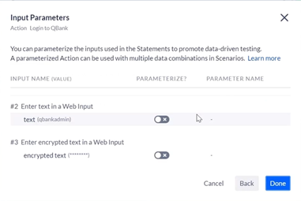

# ACCELQ Academy

Most useful courses to develop the skills needed in this new era of QAs in AI.

<https://community.accelq.io/c/learn-to-automate/>

## Section 1: Getting Started - Web Automation

### 1. ▶️ Hello World! Let's Automate our first Scenario!

>[!WARNING]
>
> El ejercicio empieza en este sitio , pero infortunadamente no tenemos acceso, así que todo se hará con ejercicios en la imaginación.
>

1. Un escenario en `AccleQ` representa un caso de uso o un proceso de negocio que se intenta automatizar.
2. Aquí tenemos un ejemplo que comienza con:
   * La invocación del navegador
   * El inicio de sesión en el banco
   * El proceso de transferencia de fondos
   * Para transferir fondos al banco
   * Y cerrar sesión.
3. Intentemos crear nuestro primer escenario en un proyecto completamente nuevo.
4. Vamos a la parte izquierda a `Navigator` y luego seleccionamos el tabulador `Scenarios`
5. Clic en el botón `[Create Scenario]`.
6. El nombre es `Validate Login on QBank`.
7. Tenemos dos opciones o:   » `Record in Design Studio` </b> o   » `➕ Add Step`   Seleccionamos la primera `Record in Design Studio`.
8. En la parte superior derecha, en la casilla de `WEB`, ponemos la _URL_ `qbank.accelq.com`   
9. Aparece el primer paso:   `1️⃣ Invoke Browser (URL: 'qbank.accelq.com')`
10. Hace clic en el cuadro al medio a la derecha con el nombre de `Username` y me aparecen un selector de campos y escojo `enter text in a web input`.
11. Presiono la tecla [`Enter`] y tengo el paso número 2, que debo completar:   `2️⃣ Enter text` _in input field whose label (equals, ignore case): 'Username'. Look for the label anyware on page_   Lo completamos con `qbankadmin` y presionamos la tecla [`Enter`].
12. Repetimos haciendo clic en el cuadro al medio a la derecha con el nombre de `Password` y me aparecen un selector de campos y escojo `enter encrypted text in a web input`.
13. Presiono la tecla [`Enter`] y tengo el paso número 3, que debo completar:    `3️⃣ Enter encrypted text` _in input field whose label (equals, ignore case): 'Password'. Look for the label anyware on page_   Lo completamos con `qbTrnPass1&` y presionamos la tecla [`Enter`].
14. Finalmente clic en el botón verde de `[Sign In]` y en el selector escojo `click on a web element`.
15. Presiono la tecla [`Enter`] y tengo el paso número 4, que debo completar:    `4️⃣ Click on text` _(equals, ignore case): 'Sign In'. Look for the clickable text on page_
16. Como se puede ver, estamos grabando estas declaraciones, la declaración es generada y la interacción también está pasando en el cuadro de la derecha:   
17. Damos clic en el botón verde de `[Log out]` y en el selector de campos selecciono `click on a web element`.
18. Presiono la tecla [`Enter`] y tengo el paso número 5, que debo completar:    `5️⃣ Click on text` _(equals, ignore case): 'Log out'. Look for the clickable text on page_
19. Hemos completado el proceso, pero en este punto si trata de **Finalizar y Salir**, es decir dar clic en el botón `[Finalize]` en la parte superior derecha y luego `💾 Finalize Changes`, sale una ventana:      Modularizar es convertir este escenario grabado en funcionales bloques reusables, que se llaman _actions_.
20. Clic en el botón azul `[Let's Moduralize!]`.
21. Esto ayuda en el mantenimientoy la velocidad del desarrollo a medida que vayas construyendo más escenarios en `AccelQ`.
22. Selecciono del paso `2️⃣ Enter 'qbankadmin' in input` hasta el paso `4️⃣ Click on text (equals, ignore case): 'Sign In'` y presiono el clic derecho.
23. Y selecciono de la lista el penúltimo `Create New Action and Replace`.

24. En el `Action Name`, le pongo `Login to QBank`.
25. En el cuadro selector de nombre `Which page does this Action star-from/belong-to ❓`, escribo `QBank Login Page` y presiono [`Enter`]   _¿De donde sale este nombre? pues le sale de los 🥚🥚 al Instructor_).  
26. Clic en el botón `[Input Params >]`:   
27. En este podemos parametrizar los datos a usar en los pasos del _login_. Si quisiera usar el _login_ con diferentes _usernames_ y _passwords_ a través de diferentes escenarios y variar la información.
28. Seleccione el `Username` y dele clic   
29. Selecciono el `Password` y dmos clic   
30. Damos clic en el botón azul `[Done]`.
31. La lista de pasos se redujo a solo 2:   ")   La modularidad se construyó, se puede ver a la izquierda.
32. Vamos a hacer lo mismo con la declaración de `Log out`, para convertirla en acción, dando clic derecho al paso `2️⃣ Click on text (equals, ignore case): 'Log out'` y seleccionando `Create New Action`.
33. En el cuadro de `Action Name` le ponemos `Logout from QBank` y en el selector de `Which page does this Action star-from/belong-to ❓`, escribo `QBank Home Page`.
34. Damos clic en el botón de `[Create Action]`.
35. En este paso el escenario que grabamos se convirtió en una serie de pasos reutilizables. Esto se puede validar al seleccionar las declaraciones de la izquierda y presionando el botón de `[PLAYBACK]`   
36. Luego que corrió la prueba, puede presionar el botón superior derecho de `Finalize` y `Finalize Changes` y nos aparece el Escenario, listo para correr:      con solo tres pasos:   » 1️⃣ Invoke Browser   » 2️⃣ Login to QBanck   » 3️⃣ Logout from QBank
37. Damos clic al tabulador `Test Cases` y existe solo uno de nombre `Test case 1`, que es el resultado de la grabación.
38. Se pueden crear mas _Test Cases_, con _usernames_ o crendenciales diferentes:   

>[!IMPORTANT]
>
>
>

### 2. 🚀 Pop Quiz: Introduction to ACCELQ Automation

>[!NOTE]
>
>
>

### 3. ▶️ Extending Hello World!

1. Ahora que se hizo el escenario `Hello World`, vamos a crear un escenario de complejidad algo identificable. Vamos a tratar de verificar transferencia de fondos en `QBank`.
2. Ya hay un escenario de nombre `Verify Founds Transfer on QBank` y seleccionamos `Record in Design Studio`:   
3. En la parte derecha agregar la _URL_ apuntando a `http://qbank.accelq.com`, que por defecto lo deja en la página de _login_, al darle [`ENTER`], aparece el paso:   `1️⃣ Invoque Browser (URL: 'http://qbank.accelq.com')`   ")
4. Vamos a hacer _login_ de nuevo, así que dar click derecho en el cuadro de `Username` de la derecha, aparecen los `Commands`, entonces cambia a `Actions`:   
5. Seleccionamos el que creamos en el paso [24](#1-️-hello-world-lets-automate-our-first-scenario) anterior: `Login to QBank`, y nos pide completar `Username` y `Password`:   
6. Una vez adentro Damos click derecho al botón `[Make a Transfer]`y cambiamos de `Actions` a `Commands`, para luego seleccionar:   `clic on a web element`      Esto crea el tercer paso   `3️⃣ Click on text (equals, ignore case): 'Make a Transfer'`
7. Nos abre un formulario para llenar:   
8. Damos clic derecho sobre el primer campo de `Transfer form` y Seleccionamos `select an item from a web dropdown`, pero sería mas largo y demorado hacer cada paso.
9. Sugerencia seleccionar toda el área que envuelve el formulario:     

  

    
Transfer Funds

    

      

        
01

        
Fill Details

      

      

        
02

        
Confirmation

      

    

    

      <form>
        

          

            
Transfer from 

            

              <select>
                <option></option>
                <option>Salary Account</option>
                <option>Monthly Savings account</option>
              </select>1️⃣
            

          

          

            
Transfer to 

            

              <select>
                <option></option>
                <option>Electricity Bill</option>
                <option>Mortgage Payment</option>
                <option>Day care</option>
                <option>ac</option>
                <option>TEST</option>
                <option>Kumar</option>
                <option>sai</option>
              </select>2️⃣
            

          

          

            
Amount ($)

            

              <input type="number" />3️⃣
              

                Transfer amount not to exceed $150
              

            

          

          

            
Date of Transfer

            

              <input type="date" />4️⃣
            

          

          

            
Memo

            

              <input type="text" />5️⃣
            

            

              

            

          

          

            

              
One-time or repeating?

            

            

              <label>
                <input type="radio" name="onetime_or_repeating" />6️⃣
                One-time
              </label>
              <label class="qbl-radiolabel">
                <input type="radio" name="onetime_or_repeating" />7️⃣
                Repeating
              </label>
            

            

              

            

          

          

            

            

              <button type="button">Cancel</button>
              <button type="submit">Submit</button>
            

          

        

      </form>
    

  

10. Damos clic derecho y seleccionamos un link abajo de nombre `Fill/Update Form Fields`:   
11. Nos trae una estructura numerada con los siete (7) campos que podemos completar:   
12. El primer campo de `Transfer from`1️⃣, le selecciono `Salary Account`.
13. El segundo campo de `Transfer to`2️⃣, le selecciono `Electricity Bill`.
14. En el tercero de `Amount($)`3️⃣, escribo `10`.   Así se ve los campos seleccionados hasta el momento:   
15. En el cuarto de `Date of Transfer`4️⃣, le quito el chulo o _checkbox_ ☑️ -> 🔲.
16. El quinto de `Memo`5️⃣, le pongo `test`.
17. El sexto de `One-time`6️⃣ lo dejo intacto y quito el chulo o _checkbox_ ☑️ -> 🔲 de `Repeating`7️⃣, y así van los campos:   
18. El cuadro de abajo que dice `Button Label`, le escribo `Submit`.
19. Por último presiono el botón de `[Done]`, y nos sale la ventana de `Generación exitosa` y atrás los pasos que se crearon   
20. Aquí le damos al botón `[Create Action]`.
21. Y le ponemos un nombre: `Populate Found Transfer Info` y para `Which page does this Action`, escribimos `Transfer info page`  
22. Damos clic en el botón azúl `[Input Params>]` y nos lleva a esta pantalla:   
23. Seleccionamos, los tres primeros y ajustamos los nombres para que no tengan caracters especiales:   
24. La lista de pasos se redujo a cuatro:   
25. Vamos a darle clic derecho al botón superior derecho de `[Log out]` y seleccionamos `Actions` el de nombre `Logout from QBank`:   
26. Si revisa la lista de pasos, el 3️⃣, tiene mas acciones que el resto:   
27. Como tenemos seleecionado el paso 3️⃣ , en la parte superior seleccionamos en `CREATE ACTION FROM SELECTION`, la opción `Create Action and Replace`:   
28. Le ponemos de nombre `Navigate to founds transfer` y en el campo de `Wich page dows Action`, seleccionamos `QBanck Home Page`:     Y clic en el botón azul de `[Create Action]`.
29. VAmos a la parte superior derecha en el botón `[Finalize]` y seleccionamos 💾 `Finalize Changes`:   
30. Esta es la manera en como se reutilizan acciones en ACCELQ y como el sistema los muestra cuando hay una oportunidad.   Así es como se construyen mas y mas escenarios, y se convierte en un reuso eficiente, de activos en vez de recrear o regrabar la lógica de nuevo.    Pasos")

>[!IMPORTANT]
>
>
>

### 4. 🚀 Pop Quiz: Action Reuse in Scenario Development

>[!NOTE]
>
>

