# QA Practice - AI Testing Fundamentals

Most useful courses to develop the skills needed in this new era of QAs in AI.

## QA_Practice-AI_Testing_Fundamentals

<https://perficient.udemy.com/learning-paths/10210909/>

[](https://www.udemy.com/course/generative-ai-for-beginners-b/)

## Section 1: Introduction to the Course

>[!NOTE]  
>Aprenderemos todo sobre IA Generativa empezando por los conceptos más fundamentales incluyendo Inteligencia
>Artificial, Machine Learning, Deep Learning para luego adentrarnos en los avanzados.
>También haremos una demostración de `ChatGPT` y aprenderemos sus características, y lo que realmente lo diferencia de todo lo
>que vino en el pasado o lo que está por venir.
>Ahora, en el módulo dos, echaremos un vistazo a algunas de las terminologías clave
>que se oyen mucho en la IA Generativa, y quiero asegurarme de que las entiendes.
>Hablaremos de LLM, Prompt Engineering, Embeddings, Fine tuning, todo esto.
>
> A continuación hablaremos de cómo la IA Generativa puede resolver algunos de los casos de uso en algunas industrias.
>Y esto le dará ideas prácticas y consejos sobre cómo utilizar la IA Generativa en su organización o trabajo,
>y crear algo a partir de ella.
>A continuación, en el módulo cuatro, crearemos un chatbot avanzado que podrá utilizar para consultar sus datos
>y formular preguntas, todo ello mediante la API `ChatGPT`.
>Y este módulo en particular va a ser increíble porque verás cómo podemos lograr
>todo eso en sólo 30 a 50 líneas de código.
>Y ese es el verdadero poder de las herramientas generativas como `ChatGPT`.

.

>[!IMPORTANT]  
>**Quick points about this learning journey**
>Hi Friends, as we progress on this learning journey, I wanted to mention three points.
>
>1 - Just to reiterate, this course entitles you to life time query support facility. So if you have any question (today, tomorrow...., or even after completing the course), do not hesitate to use the Q&A option, or email me on <aakriti.elearning@gmail.com> ... I reply to all questions within 48 hours.
>
>2 - At some point in the course, Udemy will ask you to provide a review.
>
>If you want to do it later, just click on "Ask me later" or "Ask me at the end of the course".
>
>Else you can select a star rating of your choice, and leave a small message.
>
>Your rating and feedback are very important to us. So please spare a few moments to leave a rating and feedback comments. This will hardly take 2 minutes of your time but it will help support us in creating great content like this.

## Section 2: Understanding Generative AI

### 3. Generative AI - Introduction

>[!NOTE]  
>Deep Learning, porque esto
>nos ayudará a entender todos los detalles.
>A continuación, a partir de estos aprendizajes,
>haremos una recapitulación y comprenderemos aún más la IA Generativa.
>Y por último hablaremos de `ChatGPT`, lo veremos en acción y veremos por qué de repente hay tanto revuelo
>sobre la IA Generativa.
>
>Por qué es el único tema del que se oye hablar en cada reunión, en cada post de LinkedIn, en cada artículo de Internet.
>Así que adelante.
>Empecemos.
>Así que chicos, qué es la IA Generativa como su propio nombre indica, es una combinación de Generativa e Inteligencia
>Artificial o IA.
>
>La clave aquí es que la IA utiliza esta tecnología para "generar" algo para ti, para producir algo
>nuevo.
>Chicos, este ha sido un breve resumen de tres minutos sobre la IA Generativa y por ahora lo he mantenido muy simple.
>A medida que avancemos en el curso, ampliaremos todo esto.
>
>Te voy a contar todos los aspectos de la IA Generativa de una forma muy sencilla, pero realmente, para entender las
>cosas con más profundidad, primero tenemos que entender ¿qué es la IA o Inteligencia Artificial?
>
>**¿Cómo funciona el aprendizaje automático?**
>
>Porque son como un precursor del aprendizaje de la IA Generativa.
>Así que lo que haremos es pasar al siguiente vídeo y aprender sobre IA, Aprendizaje Automático, Aprendizaje Profundo.
>Y una vez hecho esto, tendremos algunos fundamentos más resueltos,
>volveremos de nuevo a la IA Generativa y la comprenderemos aún más a fondo.

### 4. Artificial Intelligence (AI), Machine Learning (ML) & Deep Learning

>[!NOTE]  
>Así que en este vídeo vamos a hablar de Inteligencia Artificial, Machine Learning y Deep Learning.
>Y es importante entender estos temas primero porque son los antecedentes clave para conocer la
>IA Generativa.
>Así que vamos a entenderlos uno por uno.
>
>**En primer lugar, entendamos qué es la Inteligencia Artificial.**
>
>Así que los humanos son la especie más inteligente que ha existido en la Tierra.
>Destacamos en todo lo que hacemos, ya sean ciencias, artes o deportes.
>El cerebro humano es lo más inteligente de la Tierra.
>Esto sí que es inteligencia.
>Cuando intentamos replicar esta inteligencia en una máquina, es decir, cuando intentamos hacer
>una máquina tan lista, tan inteligente como un ser humano, eso se llama Inteligencia Artificial o IA.
>La Inteligencia Artificial es el desarrollo de máquinas capaces de realizar tareas que normalmente requieren inteligencia
>humana.
>
>**¿Cómo hacer que las máquinas aprendan?**
>
>Así que piénsalo.
>Y chicos, voy a ir paso a paso.
>Iremos nivel por nivel.
>Y te contaré todo esto de forma muy sencilla, muy interactiva, para que tus conceptos queden
>absolutamente claros.
>
>**Si lo piensas bien, ¿cómo aprendemos algo los humanos?**
>
>Por ejemplo, hay un niño y ¿cómo aprendería, digamos, qué es una manzana?
>Verán muchas frutas a su alrededor.
>Verán plátano, verán naranja, verán manzana.
>Y con el tiempo entenderán que, vale, todo lo que es redondo, todo lo que es de color rojo, es
>una manzana.
>Y la próxima vez que este niño vea diez frutas colocadas delante de él, podrá identificar fácilmente cuál
>es una manzana.
>Porque han memorizado algunas propiedades de la fruta, la han visto, la han aprendido, y así
>es como todos aprendemos las cosas.
>
>**¿Qué es el aprendizaje profundo?**
>
>Veamos ahora la definición.
>Es un subconjunto del Aprendizaje Automático,
>y procesa datos a través de redes neuronales.
>Y esto se traduce en una mayor precisión para los problemas complicados.
>Así que no es necesario recordar todo esto.
>Recuerda los detalles sencillos.
>
>Y sólo tres cosas es realmente lo que debes sacar de esta diapositiva.
>
>* En primer lugar, el aprendizaje profundo
>es un subconjunto del aprendizaje automático.
>
>* Dos, utiliza una red neuronal.
>
>* Y en tercer lugar, ofrece resultados mucho mejores y más precisos en caso de problemas complejos.
>
>Así que chicos, esto iba de Inteligencia Artificial, Machine Learning y Deep Learning.
>Sólo para ponerlos en una sola vista, en un solo contexto.
>Tenemos la Inteligencia Artificial, que se refiere a crear máquinas que sean inteligentes como los humanos, es decir,
>crear máquinas en las que se desea que tengan normalmente el mismo nivel de inteligencia que tienen
>originalmente los humanos.
>
>En segundo lugar, tenemos el aprendizaje automático, que podemos decir que es un facilitador de la inteligencia artificial.
>Permite a las máquinas aprender y mejorar con el tiempo.
>
>Y, por último, tenemos el aprendizaje profundo, que es un subconjunto del aprendizaje automático.
>Y utiliza redes neuronales para resolver el complejo problema.

### 5. Generative AI - Recap

>[!NOTE]
>
>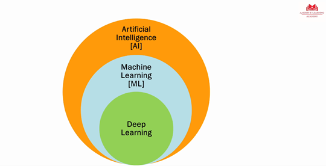
>
>**¿Dónde encaja la IA Generativa en todo esto?**
>
>Como habrás adivinado, la IA generativa es un subconjunto del aprendizaje profundo.
>Utiliza las redes neuronales de aprendizaje profundo que vimos en el vídeo anterior para comprender los datos de entrenamiento,
>aprender de ellos y generar nuevos contenidos.
>
>Así que, de nuevo, la diferenciación clave que sigue apareciendo es esta palabra "generativa" o la capacidad
>de generar algo nuevo.
>
>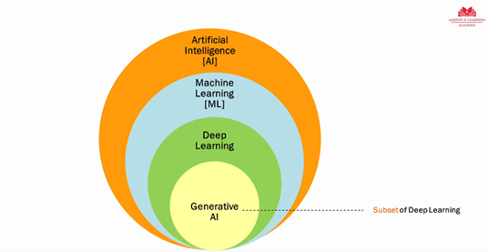
>
>Los sistemas de IA existentes que denominamos sistemas de IA convencionales funcionaban de este modo.
>Les dabas datos de entrenamiento, el modelo aprendía de ellos y luego hacía predicciones o clasificaba
>los datos en categorías, o procesaba el lenguaje como traducciones, o hacía visión por ordenador como qué
>es una imagen.
>
>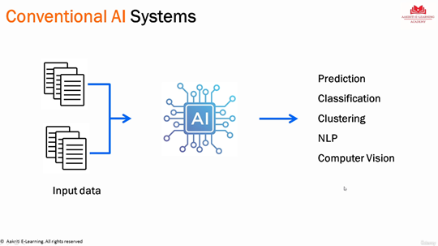
>
>**En cambio, la IA generativa es totalmente distinta.**
>
>Le damos al modelo de IA muchos datos de entrenamiento... mucho, mucho más de lo que normalmente hemos dado al sistema
>de IA convencional.
>Y a partir de estos datos de entrenamiento, basados en la red neuronal que opera entre bastidores, es
>capaz de generar nuevos contenidos, ya sean textos, imágenes, vídeos o lo que sea.
>
>Así que si hablamos del mismo ejemplo que hemos comentado antes, entrenamos nuestro modelo -esta vez un modelo generativo
>de IA- en el mismo conjunto de datos de imágenes de manzanas.
>Y luego le pedimos que nos genere la imagen de una manzana.
>Y puede hacerlo.
>Puede darnos esta nueva imagen.
>
>Nótese que esta imagen no procede de los millones de imágenes con las que se ha entrenado este modelo.
>No es un ejercicio extractivo.
>Es un ejercicio generativo.
>
>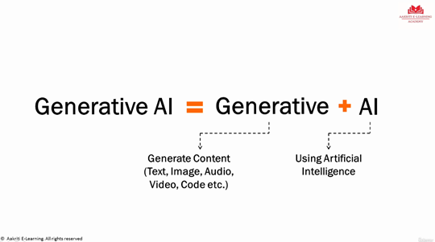
>
>**Y una vez más, eso es la IA Generativa.**
>
>Está generando nuevos contenidos, ya sean textos, imágenes, audio o vídeo, utilizando la Inteligencia Artificial.
>Espero que ahora lo tengas muy claro.
>Ahora que entramos en el siguiente vídeo y empezamos a hablar más en profundidad sobre la IA Generativa, cómo funciona
>entre bastidores, su aplicabilidad, todas esas cosas,
>realmente quiero que recuerdes tres cosas clave de estos vídeos anteriores.
>En primer lugar, para que las máquinas sean inteligentes y precisas, hay que entrenarlas con un gran volumen de datos.
>
>**El segundo aspecto clave es que necesitamos una gran capacidad de cálculo, y ya hemos hablado de ello.**
>
>Alimentamos un gran volumen de datos de entrenamiento,
>utilizamos redes neuronales, que
>son muy complejas.
>Esperamos respuestas rápidas cuando escribimos algo en `ChatGPT`.
>Así que la potencia de cálculo tiene que ser enorme.
>Tiene que ser muy potente para poder procesar estos datos en muy poco tiempo.
>Y en tercer lugar, estamos asistiendo a un cambio en la forma de interactuar con estos modelos de aprendizaje automático.

### 6. Explore `ChatGPT`: Features & Capabilities

>[!NOTE]
>
>
>
>**¿Qué es `ChatGPT`?**
>
>Leamos la introducción y luego entenderemos los detalles clave.
>`ChatGPT` es un modelo lingüístico desarrollado por OpenAI.
>Está diseñado para la comprensión y generación de lenguaje natural, concretamente en un contexto conversacional.
>
>¿Verdad?
>
>Y no quiero que profundices demasiado en las palabras.
>Centrémonos en los componentes clave de esta definición que aparecen resaltados en naranja.
>En primer lugar, es lo que llamamos un Gran Modelo Lingüístico o LLM (Large Language Model).
>Y cubriremos LLM en el próximo módulo,
>pero por ahora recuerda que `ChatGPT` es un LLM.
>Y lo que significa es que es un sistema de inteligencia artificial que es realmente muy bueno con el lenguaje humano.
>En segundo lugar, está diseñado para la comprensión y generación de lenguaje natural, como
>ya he mencionado.
>
>**Dicho todo esto, ¿por qué no entramos en `ChatGPT` y hacemos una demostración de su capacidad, incluido el aspecto conversacional?**
>
>Así que aquí tengo GPT4, que es la versión de pago de esta herramienta.
>Y como puedes ver aquí, también ofrece DALL-E, que es el modelo de generación de imágenes.
>Pero como la mayoría de los espectadores utilizarán una versión gratuita, cambiaré a la 3. 5, que utilizaremos para demostrar
>sus capacidades.
>
>Así que yo le preguntaría a `ChatGPT` algo como ¿cuántos aeropuertos hay en Nueva York?>
>Lo primero que quiero que tengas en cuenta es que `ChatGPT` sólo se ha formado en contenidos hasta 2021, por lo que es posible que no pueda ofrecerte
>información actualizada, especialmente si preguntas sobre acontecimientos recientes.
>Pero en mi caso, lo pregunto sobre los aeropuertos de Nueva York, que no es una información muy reciente.
>Estos aeropuertos llevan allí mucho tiempo, así que obtuve una buena respuesta.
>Me dice que hay tres aeropuertos, y también me dice que hay aeropuertos más pequeños.
>
>**En primer lugar, es una aplicación de IA Generativa.**
>
>Está generando datos.
>Puede generar texto similar al humano.
>
>Puede responder preguntas, completar frases, traducir idiomas y realizar análisis de sentimientos.
>Y la versión 4 puede incluso generar imágenes.
>
>En resumen, `ChatGPT` es una aplicación de IA generativa.
>
>**En segundo lugar, está desarrollado por una empresa llamada OpenAI, y Microsoft tiene una muy buena inversión en OpenAI.**
>
>Es por eso que si nos fijamos en la aplicación de Microsoft, que es donde OpenAI se está utilizando mucho comercialmente,
>ya sea Bing Search, Windows Copilot, Microsoft Teams, todos ellos tienen integraciones con GPT, las aplicaciones
>iniciales, todas las que vinieron eran todas de Microsoft.
>De hecho, en lo que respecta a la nube, por ahora esta capacidad solo está disponible en Azure Cloud, que es una
>plataforma de Microsoft.
>
>**Tercer punto `ChatGPT` se entrena con miles de millones de documentos.**
>
>Por poner un ejemplo, la versión actual que vimos, la 3. 5, OpenAI no revela con cuántos datos
>se entrenó, pero la versión anterior, que era GPT 3, se entrenó con 570 GB de datos
>de texto.
>Ahora bien, si has guardado un archivo de texto o si has guardado una página web, sabrás que la mayoría están en KB inferiores.
>
>Y aquí estamos hablando de 570 GB de datos de texto.
>Así que imagina lo grande que es el volumen.
>Se ha entrenado en casi toda la Wikipedia, blogs enteros, artículos de noticias, todo lo que sea texto
>en Internet.
>
>Y si recuerdas lo que comentábamos en la nota final de nuestro último vídeo, cuantos más datos de entrenamiento,
>más posibilidades de precisión tendrá tu aplicación.
>Y eso explica por qué `ChatGPT` es tan bueno.
>
>
>
>De hecho, ChatGPT es sólo el principio.
>
>Cada día aparecen nuevos modelos y se producen nuevos avances.
>Tal vez haya algún modelo nuevo que llegue mañana y sustituya a ChatGPT como campeón del mercado.
>Nunca se sabe.
>Pero lo que permanecerá es la idea de que todos tendremos que adoptar la IA Generativa en nuestro trabajo.
>
>Ya seamos desarrolladores, probadores, analistas empresariales, comerciales, expertos en marketing o cualquier otra persona, todos
>tendremos que aprender sobre la IA Generativa y empezar a utilizarla en nuestro trabajo.
>Y de eso va a tratar este curso.

## Section 3: Quiz

### Quiz 1: Generative AI Basics

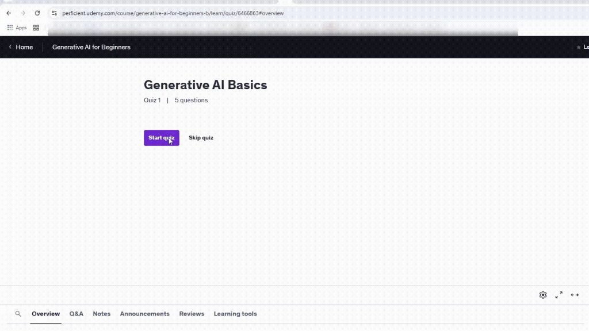


## Section 4: Understanding key terminologies

### 7. Introduction

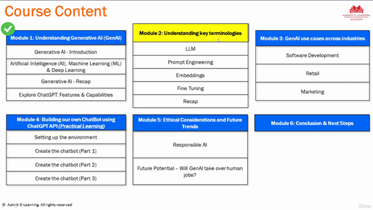

### 8. LLM (Large Language Model)

>[!NOTE]
>
>**¿Qué es un LM y por qué oímos hablar tanto de él?**
>
>Para que lo entiendas de forma sencilla, a un nivel muy alto, cuando estamos en un smartphone intentando
>enviar un mensaje de texto a alguien y aparece una función de texto predictivo.
>Como puede ver, la persona teclea cant y el sistema predice las siguientes palabras: cantidad, cantina
>o cantar.
>
>Eso es más o menos lo que es un nivel muy alto.
>Pero, por supuesto, es más masivo.
>Hay mucha más precisión y también intervienen muchos otros componentes.
>Del mismo modo, cuando escribimos algo en el chat, GPT y responde por nosotros, eso también es una LM, una muy fuerte.
>
>Así que sí, el chat GPT también es un LM, por lo que los LM no son más que un tipo específico de modelos de IA que están diseñados para comprender
>y generar textos similares a los humanos.
>Por tanto, solo hay una cosa clave que debes recordar de esta diapositiva.
>
>Y eso es LM significa texto.
>Pueden comprender textos, procesarlos y generarlos.
>
>**¿Cómo funciona una LM?**
>
>Ya conocemos las redes neuronales y su capacidad para manejar escenarios complejos con eficacia gracias
>a su estructura en capas.
>Así que el cerebro de la LM es un tipo específico de red neuronal, también llamada transformadora.
>Y no vamos a profundizar en lo que es un transformador.
>Su arquitectura les permite entender el lenguaje, el
>significado y el contexto.
>Todo eso.
>
>Y lo veremos con más detalle cuando hablemos de incrustaciones más adelante.
>Pero de momento, recuerda que Transformers es un tipo de red neuronal muy buena para entender el lenguaje
>humano.
>Las palabras tienen significado, contexto, etcétera.
>Y este transformador está entrenado con muchos datos de entrenamiento, de hecho, mucho, mucho más de lo que vemos.
>
>Por ejemplo, `ChatGPT` está entrenado en Wikipedia completa y muchos más sitios web basados en texto, blogs, manuales,
>etcétera.
>Y base de este aprendizaje.
>Es realmente bueno en la comprensión del texto y la entrega de la salida.
>
>Por eso, si miras `ChatGPT`, por ejemplo, le preguntas cualquier cosa.
>Entiende tu pregunta, da buena respuesta.
>Y la razón de ello es que se está entrenando en el conjunto masivo de datos, como he mencionado.
>Y este enorme número de parámetros transformador de base, red neuronal.
>
>**Tercer y último punto.**
>
>La formación no termina aquí.
>Lo que vimos aquí fue nuestro pre-entrenamiento con el que los modelos ya vienen hechos.
>A continuación, también podemos realizar algunos ajustes finos, lo que significa que podemos ajustar aún más el LM a un conjunto de datos
>más específico y orientado a la tarea.
>Más adelante hablaremos más a fondo del ajuste fino.
>Pero por poner un ejemplo, si queremos utilizar un LM para completar o resumir textos, podemos afinarlo
>exponiéndolo a los datos relacionados con estas tareas.
>
>**¿Dónde se puede utilizar el LMS?**
>
>La respuesta es cualquier cosa que implique texto y, de hecho, ya se están utilizando en muchos de estos espacios.
>El primero es la generación de contenidos.
>Así que usted está en las ventas de publicidad de marketing en cualquier lugar.
>Podemos utilizar LMS como `ChatGPT` o Lama para nuestra generación de contenido de texto.
>
>**El segundo es el chat bot.**
>
>Este es un ámbito en el que los LMS tendrán un gran impacto.
>Cuando chateamos con el servicio de atención al cliente, LMS puede sustituir ese primer nivel de compromiso y responder a las preguntas
>por usted basándose en la documentación de la empresa.
>Y si el usuario sigue insatisfecho, puede hablar con un humano.
>
>Y por último, las preguntas y respuestas, probablemente el caso de uso más utilizado.
>Pedimos `ChatGPT` para cualquier pregunta y dar.
>Nos da la respuesta puntual.
>
>Imagina que si quiero saber quién ganó la Superbowl 2020, no tengo que entrar en Wikipedia y leer un largo
>documento.
>Puedo hacer esa pregunta y obtener una respuesta concreta en la parte de aprendizaje práctico de este curso.
>Más adelante crearemos un chatbot como este y lo verás en acción.
>Así que, chicos, estos son algunos de los casos de uso de LM.
>
>Pero recuerde que la lista no acaba aquí.
>LMS cambiará todas las formas en que interactuamos y manipulamos los datos de texto.
>Y la lista de LMS está creciendo cada día de GPT a Lama a la palma de la mano para señalar LMS para la industria automotriz industria financiera.

### 9. Prompt Engineering

>[!NOTE]
>
>Así que cada vez que se hace una pregunta o se da una instrucción y una entrada para obtener la respuesta
>deseada, eso es un prompt.
>
>Por solicitud se entiende una pregunta específica o una entrada que se da a un sistema de IA para obtener la respuesta requerida.
>
>Tenemos algunos ejemplos en la pantalla, como puedo decirle a `ChatGPT` que resuma los puntos clave de un artículo de investigación,
>o puedo decirle que escriba una historia corta, o puedo decirle a Dall-E, que es una aplicación generativa de imágenes,
>que genere imágenes de un coche amarillo.
>O puedo pedirle a GitHub Copilot, que es un compañero de generación de código, que escriba un programa en Python para sumar
>dos números.
>Así que todo esto son indicaciones.
>Así que, incluso sin conocer esta terminología, hasta ahora todos utilizábamos prompts cada
>vez que introducíamos algo en `ChatGPT`.
>
>Y en eso consiste la ingeniería rápida.
>Si quieres obtener buenas respuestas, tienes que hacer buenas preguntas.
>Así pues, la ingeniería de la rapidez consiste en elaborar consultas bien definidas para formular preguntas claras.
>Si haces preguntas concretas y precisas, preguntas sin ambigüedades, obtendrás respuestas mejores,
>precisas y pertinentes.
>
>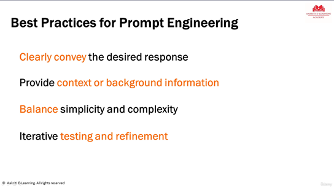


### 10. Embeddings

>[!NOTE]
>
> Ahora bien, todo eso era estupendo y perfecto, pero si se hace una pausa y se piensa en ello, hay algo
>muy fundamental en lo que no hemos pensado.
>
>Y es que las máquinas no entienden el texto.
>Sólo entienden de números.
>
>Entonces, ¿cómo entienden estos llms lo que significa una palabra?
>
>¿O cómo pueden las máquinas reconocer la similitud entre dos textos como cuando le preguntas cuál es la capital de
>la India?
>¿Y genera la palabra Nueva Delhi?
>
>**Ahí es donde entran en escena las incrustaciones.**
>
>Por tanto, una incrustación es una representación numérica del texto.
>
>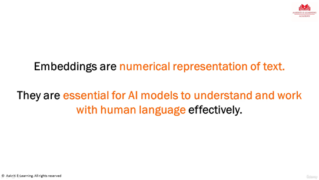
>
>Ahora bien, lo que significan estas incrustaciones sólo lo sabe el modelo de transformador que las generó.
>Esto es lo que el entrenamiento del modelo le ha enseñado a generar correctamente estas incrustaciones.
>Cómo retener el significado.
>
>**El contexto de la relación.**
>
>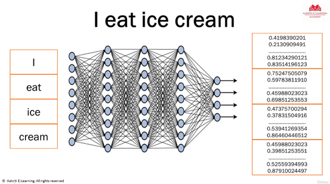
>
>Toda esta información se almacena en estas incrustaciones y sólo el la entiende.
>Lo utiliza para generar la salida.
>
>Por ejemplo, basándose en las incrustaciones, el LM sabe que la palabra I va seguida de una palabra de acción como
>comer.
>También sabe que las palabras hielo y crema van juntas.
>Por eso ves que las incrustaciones de hielo y nata son muy parecidas entre sí.
>Así es como fue entrenado.
>Y recuerda que lo ha hecho durante miles de millones de palabras.
>Ha generado billones de estas incrustaciones, y ese ha sido el entrenamiento de un modelo como
>`ChatGPT`.
>Y durante este entrenamiento, ha dominado el arte de capturar toda esta información con precisión en las incrustaciones.
>Así que cuando alguien le pida al LM que genere un texto, utilizará todo este aprendizaje que ha conseguido,
>utilizará todas estas incrustaciones que ha descubierto y las utilizará para predecir qué palabra viene
>a continuación.

### 11. Fine Tuning

>[!NOTE]
>
>Es decir, le haces una pregunta a ChatGPT sobre cualquier tema genérico y te dará una buena respuesta.
>Por tanto, los llms suelen estar preentrenados y ser muy precisos.
>Pero todo esto es formación general.
>Si desea generar información sobre una tarea específica o un conjunto de datos concreto de su organización, tendrá
>que entrenar el modelo con su conjunto de datos concreto.
>Y ahí es donde entra en juego el ajuste fino.
>
>**¿Qué es el ajuste fino?**
>
>Es como ajustar un LM preentrenado o lo que llamamos modelo base para realizar una tarea más específica.
>
>**¿Por qué lo hacemos?**
>
>Lo hacemos para obtener mejores resultados en un conjunto de datos específico, por ejemplo, un conjunto de datos médicos ajustado
>con precisión le dará mejores respuestas a sus consultas que uno básico o de vainilla.
>Ése era el qué y el por qué.
>
>**Hablemos de cómo hacer el ajuste fino.**
>
>Así que hay tres formas de afinar un modelo.
>
>* Y la primera se denomina ajuste fino autosupervisado.
>Y lo que significa es que le das a tu modelo base una gran pila de datos de entrenamiento que son específicos de tu
>dominio, y haces que el modelo aprenda de ellos.
>Así, el modelo aprende a predecir los datos que faltan.
>Como cuando dices yo helado, el modelo predice que la palabra que falta es comer.
>Ahora bien, esto es muy similar a cómo se entrena el modelo base.
>Y tienes razón.
>
>**La siguiente es lo que llamamos ajuste fino supervisado, y en realidad es una forma supervisada de aprendizaje.**
>
>Es decir, se proporcionan datos de entrenamiento detallados y etiquetados que tienen entrada y salida, y el modelo puede aprender
>de ellos.
>
>Así que tu conjunto de datos etiquetados diría algo así como, ¿cómo encuentro un hueso roto?
>Y la salida sería de rayos X.
>Así que estás dando estos conjuntos de datos etiquetados a tu modelo.
>Y va aprendiendo y mejorando en función de ellos.
>
>**Y el último es lo que llamamos aprendizaje por refuerzo.**
>
>Y en realidad el aprendizaje por refuerzo es un concepto antiguo.
>
>Es básicamente un método de aprendizaje basado en la retroalimentación.
>
>**¿Cómo habilitar GPT para responder a esa pregunta?**
>
>La respuesta es el ajuste fino.
>
>Usted entrenará el modelo con su conjunto de datos, y éste será capaz de darle ahora respuestas pertinentes para ese
>conjunto de datos.
>En eso consiste el ajuste fino.
>
>Ahora, al mismo tiempo, hablemos de lo que no es el ajuste fino.
>En primer lugar, la puesta a punto no consiste en crear algo desde cero.
>No partimos de cero.
>Partimos de un modelo básico que ya ha sido entrenado en un conjunto de datos de gran volumen, y
>sólo lo adaptamos a nuestro conjunto de datos específico.
>
>Por lo tanto, el ajuste fino es como construir sobre el conocimiento ya existente, no es reemplazar ese conocimiento.
>El ajuste fino no significa que no se necesite ningún dato.


### 12. Recap - Summary View

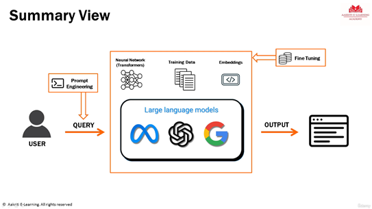


## Section 5: Quiz

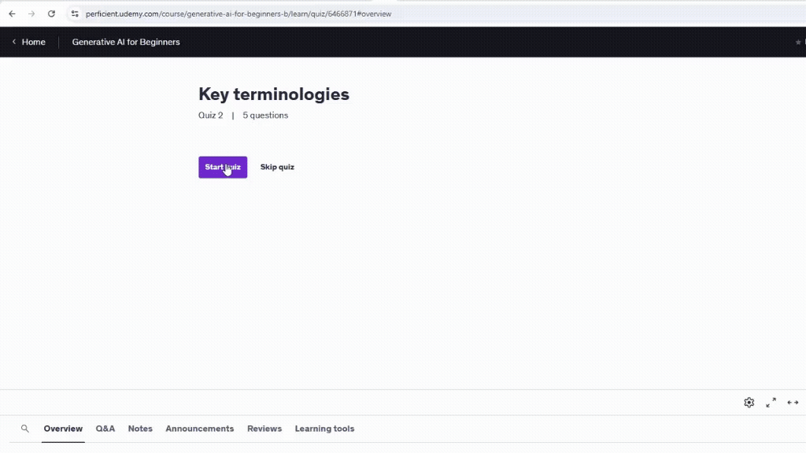


## Section 6: GenAI Use Cases Across Industries

### 13. Introduction

>[!NOTE]
>
>Ya estamos en el módulo tres del curso, y aquí hablaremos de cómo la IA generativa está trastornando
>muchas industrias.
>
>Como he mencionado antes, también hay un invento que aparece una vez cada diez años que cambia las reglas
>del juego y pretende influir en todos los sectores, en todas las formas de interacción humana y de trabajo.
>Está claro que la IA generativa es esa tecnología.
>Es el invento de la década.
>
>Así pues, el objetivo de este módulo del curso es mostrarle cuál es el potencial de la IA generativa
>en algunos sectores, cuáles son los casos de uso comunes que pueden resolverse y qué beneficios aporta.
>Así que, sea cual sea el sector en el que trabajes, tanto si se trata aquí como si no, mi idea es
>plantar esta idea en tu mente sobre todo lo que es posible, y luego espero que vuelvas, pienses en tu
>área de trabajo y veas cómo puedes utilizar la IA generativa en ella.
>
>Ese es todo mi proceso de pensamiento y mantendremos una sesión muy orientada a la práctica.
>
>Antes de empezar, un consejo.
>
>La gente mira la IA generativa desde un nuevo prisma, pero no es que sólo pueda utilizarse para nuevos casos de uso.
>Muchos de los casos de uso existentes, como el chatbot, el marketing predictivo o el análisis de sentimientos, llevan
>mucho tiempo en el mercado y se gestionan mediante sistemas de IA convencionales, pero pueden optimizarse aún más utilizando
>la IA generativa.
>
>Así que tenga en cuenta también sus casos de uso existentes y piense en cómo la IA generativa puede mejorarlos aún más.

### 14. Software Development

>[!NOTE]
>
>El primer campo del que vamos a hablar es el desarrollo de software.
>
>El desarrollo de software es un campo muy amplio.
>Creamos todo tipo de software para distintos fines y cada aplicación es
>diferente.
>Pero en el fondo hay unas cuantas actividades que son comunes a cualquier desarrollo
>de software.
>
>Siempre habría una fase de construcción, siempre habría una fase de pruebas,
>siempre habría una fase de análisis de requisitos, y cada una de ellas tendría
>ciertos resultados.
>Y podemos mejorar la productividad y la calidad de cada una de estas etapas utilizando
>
>la IA Generativa.
>Así que hablemos primero de ellos aquí y luego no nos limitaremos
>sólo a la teoría.
>
>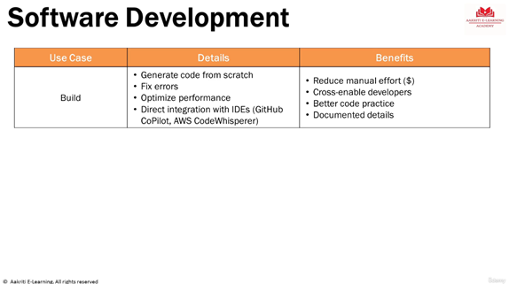
>
>**¿Cómo puede ayudarle aquí la IA generativa?**
>
>* En primer lugar, la IA generativa puede ayudarle a generar el código desde cero.
>Así que puedes decirle a GPT que cree un código python para, digamos sumar dos
>números, ¿verdad?
>O puedes decirle que se conecte a una base de datos y GPT generará rápidamente
>ese código para ti.
>
>* Así que cuando estás desarrollando el código, lo ejecutas, te encuentras con un error,
>ahora tienes que depurarlo.
>Puedes pegar ese mensaje de error en GPT y te sugerirá cuáles son las
>resoluciones para eso, cómo puedes solucionarlo.
>
>* El tercer punto es que puedes utilizar los consejos de la IA generativa para optimizar el
>rendimiento.
>Así que piensa, tienes una consulta SQL que hace algo, puedes pegar
>esa consulta SQL en GPT y te daría sugerencias sobre cómo mejorar
>el rendimiento general.
>
>* Y por último, para todas las ideas anteriores, no necesitas
>ir a GPT ni a ningún otro LLM.
>Hay empresas como GitHub y AWS que han creado sus propios compañeros
>de código.
>Así que hay utilidades como GitHub Copilot, AWS CodeWhisperer, y puedes integrarlas
>directamente en tus IDEs, y obtendrías recomendaciones
>de inmediato sobre cuál debería ser el código, cuál es el error, ese
>tipo de cosas.
>
>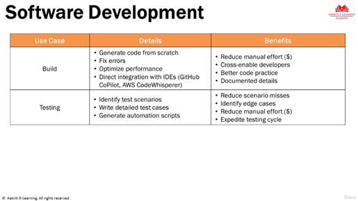
>
>Le pedimos que desempeñe el papel de un comprobador manual.
>Y luego decimos que la aplicación tiene una página de inicio de sesión donde el usuario introduce
>un nombre de usuario, contraseña, pulsa el botón de inicio de sesión.
>Así que estoy dando detalles muy claros que hay tres campos.
>Así son los nombres de los campos.
>
>El nombre del botón es botón de inicio de sesión.
>
>También hay una opción para olvidar el nombre de usuario y la contraseña.
>
>¿Puede generar escenarios de prueba para esto?
>
>Así que adelante, dejemos que haga su magia.
>Y como puedes ver, ha empezado a generar algo y está convirtiendo
>escenarios.
>Me está dando login válido, login inválido, credenciales vacías, inyección SQL.
>Así que, como puedes ver desde el primer momento, ha empezado a rellenar los detalles.
>
>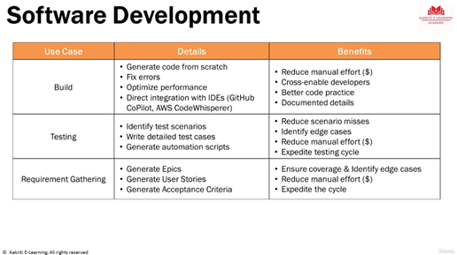
>
>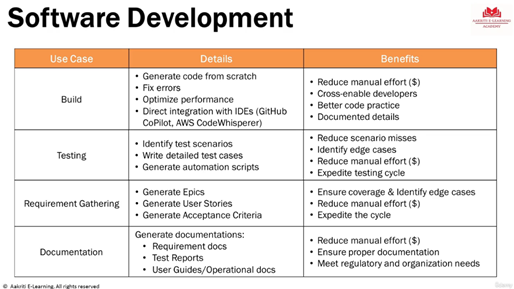


### 15. Retail

>[!NOTE]
>
>**El primer caso de uso del que quiero hablar es la recomendación de productos.**
>
>Así que si lo piensas hay cientos de miles de productos disponibles en Amazon.
>Ahora, cuando un cliente acuda a la aplicación apenas tardará entre 10 y 15 minutos.
>Por eso es muy importante que pueda encontrar el producto fácilmente.
>_eben tener una descripción detallada del producto.
>
>Debe incluir viñetas, especificaciones, reseñas, preguntas y respuestas, todas estas cosas para ayudarle a hacer la elección
>rápidamente.
>Y todo esto es información de texto.
>Así que la IA generativa es muy buena generando texto.
>Y, por tanto, podemos utilizarla para generar todos estos detalles.
>
>Además, también podemos pedirle que lo haga SEO amigable.
>Podemos pedirle que lo haga corto descriptivo como queramos.
>Puede generar todas esas combinaciones para nosotros.
>Otra cosa que podemos hacer es marketing específico y localizado.
>
>Así, por ejemplo, digamos que soy alguien que ha comprado un portátil, así que me pueden enviar recomendaciones de monitor,
>teclado y soporte para el portátil porque es algo que quizá quiera comprar en un futuro próximo.
>
>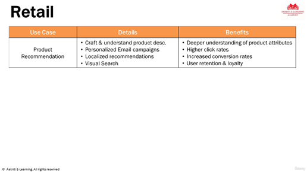
>
>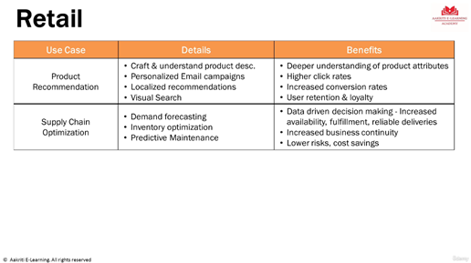
>
>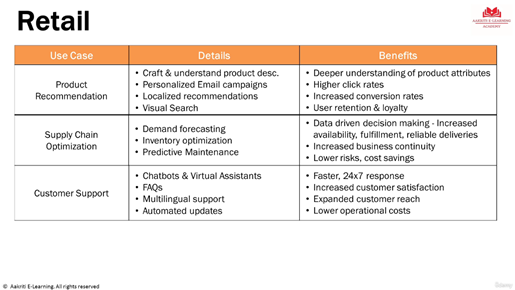
>
>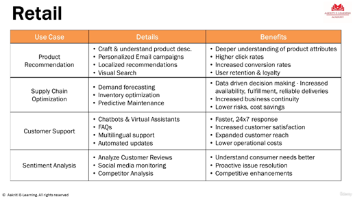
>
>Y por eso dije, chicos, que el comercio minorista es un espacio donde la IA generativa tiene un potencial tremendo.
>Y por eso quería hablarte de ello.
>Bien.
>Muchos de los casos de uso que aparecen aquí siguen realizándose con IA convencional.
>
>Hay sistemas para hacer incluso este análisis de sentimiento del que hablamos, hay sistemas convencionales
>de IA para hacerlo.
>Pero de nuevo, como he dicho, todo esto es texto, ¿verdad?
>Y realmente sobresale en ello.
>Bien.
>
>Obtendrá mejores resultados.
>Obtendrá un lenguaje natural, capacidad de conversación.
>
>Puedes seguir adelante y puedes usarlo para generar nuevos contenidos para tus campañas de marketing, para
>tus publicaciones en redes sociales, y lo veremos en la próxima.
>Pero todo esto puede disparar las operaciones minoristas.
>
>Todo ello puede mejorar la cadena de suministro, la satisfacción del cliente y generar enormes beneficios
>en el sector minorista.
>¿Verdad?
>Las posibilidades de la IA generativa en el comercio minorista son infinitas, ¿verdad?
>Hay muchas vías que tocar, muchas opciones que mejorar, modificar, automatizar.
>Y por eso dije que incluía el comercio minorista en este vídeo en concreto.
>Así que puedo darte una idea de cuáles son.

### 16. Marketing

>[!NOTE]
>
>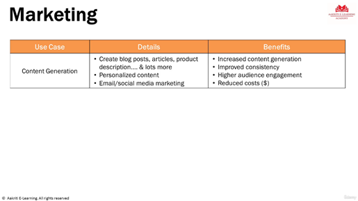
>
>")
>
>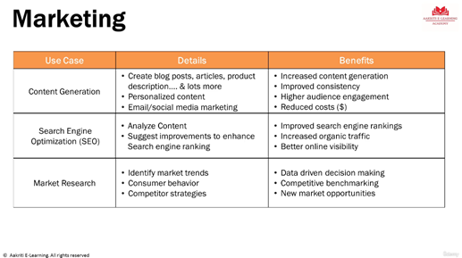
>
>

## Section 7: Quiz

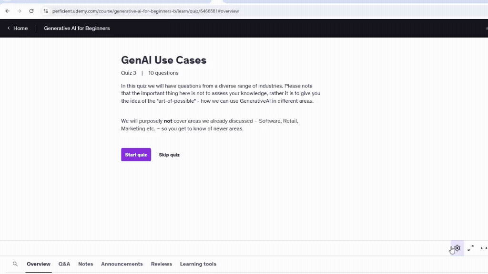


## Section 8: Building our Own GenAI Chatbot

### 17. Introduction

>[!NOTE]
>
>Así que ya estamos en el módulo cuatro del curso.
>Y esta va a ser nuestra sección de aprendizaje práctico.
>
>Vamos a crear algo similar a ChatGPT un chatbot que podemos utilizar para consultar nuestros propios datos.
>Le haremos preguntas, obtendremos respuestas y lo construiremos completamente desde cero.
>Y esta sección va a ser importante.
>
>Experimentaremos lo que aprendimos en el pasado y lo veremos en acción.
>Así que mi sugerencia es que veas esta sección con atención y lo hagas junto conmigo.
>Si usted es alguien que no es de un fondo técnico es todavía verlo.
>Te dará una idea de las capacidades.
>
>Y para los que tengan formación técnica, usaremos integraciones API de Python, todas
>esas cosas.
>
>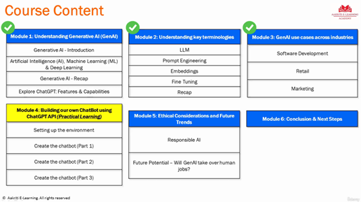


### 18. MUST READ: IMPORTANT INFORMATION for next videos

>[!IMPORTANT]
>
>#### MUST READ: IMPORTANT INFORMATION for next videos
>
>Hello everyone, as part of the next few videos, where we would be creating a Chatbot using OpenAI services, you may need the following:
>
>**1: Initial Setup** -> If you are new to Python or need help with setting up Python, PyCharm, Libraries etc., we have created a handy help guide:
>* [drive -> Chabot Module - Initial Setup.pdf](https://drive.google.com/file/d/1yvFHp3osx0g70MLb5cbYZEIuMaVDkD8M/view?usp=sharing)
>* [local -> Chabot Module - Initial Setup.pdf](documents/1801-Chabot%20Module%20-%20Initial%20Setup.pdf)
>
>**2: Common Errors and resolutions** -> We have also compiled a list of common errors and how to solve them:
>* [drive -> Chatbot Module - Common Issues and how to fix them.pdf](https://drive.google.com/file/d/12ISkREk3aQkeZ-1ZOoHd-SO1hlDlUDvW/view?usp=sharing)
>* [local -> Chatbot Module - Common Issues and how to fix them.pdf](documents/1802-Chatbot%20Module%20-%20Common%20Issues%20and%20how%20to%20fix%20them.pdf)
>
>But even beyond this, if you need any other help, we are here. Email us on <aakriti.elearning@gmail.com> with the error details, steps and screenshots.
>
>**3: Update on OpenAI credit** -> Note that as of May'24, OpenAI has stopped giving free credits. You will need to recharge your account with minimum $5 to be able to proceed. If you do not wish to do so, just watch along and you will be fine.
>
>**Note** - To efficiently utilize OpenAI's credit, please use a small document of 1-2 pages in next videos. A bigger document would exhaust all your credits quickly.
>
>**4: Test Document** -> As part of our learning, we would be using a subset of the Indian Constitution (English version) pdf. You can find the file here:
>* [drive -> Chatbot Code](https://drive.google.com/file/d/1_COGeFyFaIC1AhHPnpZl3JWMzJoZv-2h/view?usp=sharing)
>* [local -> Chatbot Code](documents/1804-Chatbot%20Code.py)
>
>Or its also attached to the Resources section of this lecture. You can use any other file, it's perfectly ok. Use a small 1-2 page document as mentioned earlier.
>
>**5: Code Snippet** -> You can find the code snippet here:
>* [drive -> Chatbot Code](https://docs.google.com/document/d/1MtVvNhxFHtGvsb9sQj7q2GNQTWfb68laVYfPTLsMoUk/edit?usp=sharing)
>* [local -> Chatbot Code](documents/1805-Chatbot%20Code.py)
>
>Or its also attached to the Resources section of this lecture. Do not forget to put your OpenAI API key next to the "OPENAI_API_KEY" variable
>
>Thank you!!
>
>**Resources for this lecture**
>* [Constitution_India_subset.pdf](https://att-c.udemycdn.com/2023-11-19_18-47-05-7623ba4f834e2aadbb2f21c70424a49c/original.pdf?response-content-disposition=attachment%3B+filename%3DConstitution_India_subset.pdf&Expires=1752612415&Signature=SESegS~b3wtg5ASZXEraV0hAGPgau7Llhkx0j0C1hnsbaCtFi9ztPZNmqLjDveQndbkZbqEKTOHCuMeyOiYzL6S5bSGDFdinyxelcuWzE4j9wBA-x0EZ2yMEcDMei1qJ7Zw~sZcJcReE0eX22eBetXOfUu~gxSCYog2MMobtQ7tvNGwiNeuMC3N80Q1zc9O-ImBAbFGdKQUh8H0gB6KPkShqEDCWJbvJqVzTJaqHaX5-eurArNdBvVizWEt6zXnpkyfD6WX6~ZcIuaxrn7KmlmpSfkA1jdpxxepyfoMGD0PiTQv~pQTUIHYYjV4sDBjKQ9MOti884dmkSmme15YTUA__&Key-Pair-Id=K3MG148K9RIRF4)
>* [Chabot Module - Initial Setup.pdf](https://att-c.udemycdn.com/2024-06-02_08-38-14-3f89122c408da54969eaa4210c146956/original.pdf?response-content-disposition=attachment%3B+filename%3DChabot%2BModule%2B-%2BInitial%2BSetup.pdf&Expires=1752612409&Signature=UVGcAvTOCezUAIQlciVqc9CYQ-fzRpUcPCkJzNTMQxl4D~Rt6mjultD2RuJf17z1HE-u89Nge1XEbe9FfkxcrkB5r--PdVsa8NiId6AcAapd5VBvfNzhjDIzFMHhyXpQN1mQ4vQxO8cuEDyB08qd6ZDvsD-Dzx651MXw4OX6vgnqgKgFxU8NrgcoL0FXi3KUw3emkDspHk38eqP2ZShgQ6D7YT~sjp9EQQPYKhRBgK32PoYUpauxeVrBqRdNlIzZlm5zSiUlrXfef2U8a7sKNs4hNMXeZQT1AUIRy4kHLUlHgohrXb4RBycdTlmxTYAiv7~~ePr7mDh4E3lOwVWyRw__&Key-Pair-Id=K3MG148K9RIRF4)
>* [Chatbot Code.txt](https://att-c.udemycdn.com/2024-07-16_03-01-56-a96a42b51cecb37a4b501b8b50ee8792/original.txt?response-content-disposition=attachment%3B+filename%3DChatbot%2BCode.txt&Expires=1752612411&Signature=s9VliWkepX1eJBSsLLftYdLByHskOaVdomkAnm5nVWfOS8LXVnsQs~XtnnqsSzF6SL8fkj2uGCzep33r1~G~b1oBqUoYi~jftwJeeW5vbKHBd~Lzup4WLVjm5GamLPBzu8DvoAABdiXVbAg98c28x4doNbQcGCNEbsVzL8U5lbu4GZkVvuEOTXalCf0fN96STVV1bJUj-Ywcqlzz5aRDdXOe1STYmIMl83qM7h3NteyO3ErBbW-7y2UL9U3MZPk3Ql4L0HJugdp5XTrGv4Q8G0lYWmmOtDw~0tq4wH8BQilIAjlexELPk~bj1t45uSf0RdALqwH8P1P4a~GcRDwC9A__&Key-Pair-Id=K3MG148K9RIRF4)
>* [Chatbot Module - Common Issues and how to fix them.pdf](https://att-c.udemycdn.com/2024-07-16_03-03-07-5720e25a388cf1d31e86445b4200aaac/original.pdf?response-content-disposition=attachment%3B+filename%3DChatbot%2BModule%2B-%2BCommon%2BIssues%2Band%2Bhow%2Bto%2Bfix%2Bthem.pdf&Expires=1752612410&Signature=C4swcdhDrIDSqG0qarhKV8lMEDLEzGsUNr0bZNTAtyJM1xCX6XWeeHjnhFLIDLxFr2TC81zi9v3ZkpGx0SQLwhh12xBwX9XgB6elWUgXFuGvYJrTGvrweAaq1DiwveshXVkVSdqTMyQTGJiC1r9w-T8hVHBQt0cFcAlBIzYin9kiVqS43y4X~Bhn6GVvVXIaUbykrunOteqaOEHgJU8phnBflDRxz0dBKEidL6IFBd1xGET1lE4sTTOALV7SkHIuRVJBRvaOnrYtQox-ACKdjDNKBIJIEbQjMAZUdfTZeBHKGzzSQ64P1SE~EVu5MLAak9WIZuxaF3mCt4TlSwqIqw__&Key-Pair-Id=K3MG148K9RIRF4)

1. Lo primero con base en la documentación, es descargar el  [Python 3.11.6](https://www.python.org/downloads/release/python-3116/)
2. Este sería el proceso de instalación: </br> 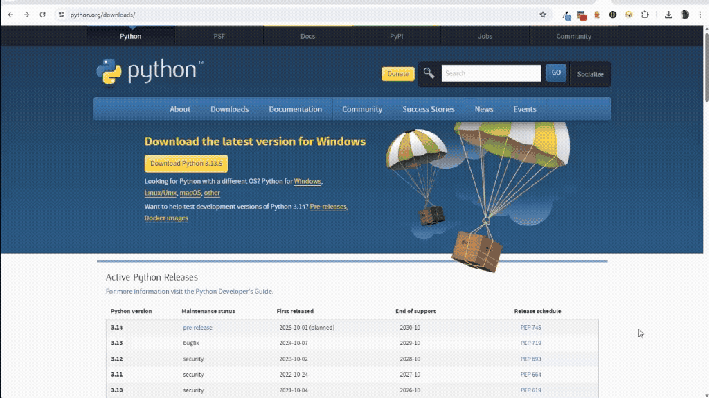
3. Cierro el `Visual Studio Code` y lo vuelvo a abrir, creo un archivo de nombre **`HelloWorld.py`**, con este código:
```py
print('Hello world!')
```
4. Presiono el botón de `run` y el debe ejecutar sin problemas
5. Extensiones requeridas en `Visual Studio Code`:
   * [Python Extension Pack](https://marketplace.visualstudio.com/items?itemName=donjayamanne.python-extension-pack) de _Don Jayamanne_.
   * [autopep8](https://marketplace.visualstudio.com/items?itemName=ms-python.autopep8) de _Microsoft_.
   * [Code Runner](https://marketplace.visualstudio.com/items?itemName=formulahendry.code-runner) de _Jun Han_.


### 19. Setting up the environment & keys

1. Esta es la arquitectura: </br> 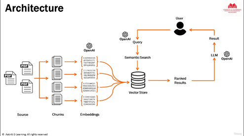
2. El _IDE_ es `Visual Studio Code`
3. _API key_ de [`Open AI`](https://openai.com/api/), debes hacer login a la `API Platform`, se sugiere con una cuenta de `Google`: </br> 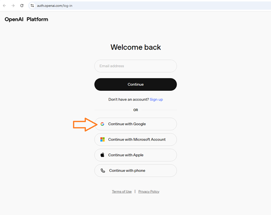.
4. Aquí es donde se pretende ingresar a `Start building`: </br> 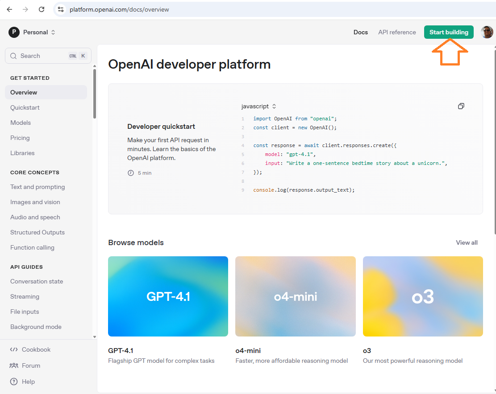
6. Así sería el proceso para:
   * Hacer `Log in`.
   * Crear la `Organization`.
   * Crear el `Project`.
   * Obtener  `API Keys`. </br> **Recuerde almacenar o guardar las API Keys cuando estas aparecen**: </br> 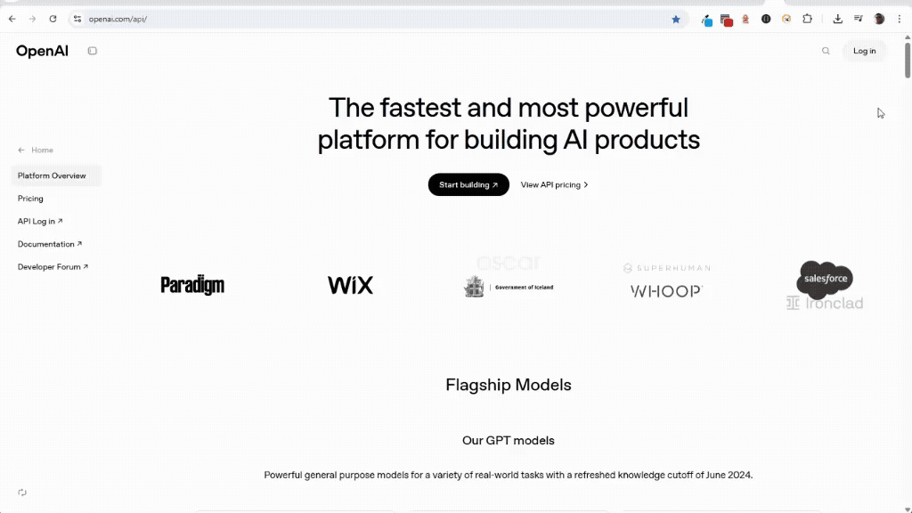


### 20. Creating chatbot (Part 1)

1. Se nos pide instalar unas bibliotecas de `Python` con el comando `pip`: </br>
`pip install streamlit pypdf2 langchain faiss-cpu`
* Bibliotecas `pip`:
  * [`streamlit 1.47.0`](https://pypi.org/project/streamlit/). </br> **¿Qué es Streamlit?**
Streamlit te permite transformar scripts de Python en aplicaciones web interactivas en minutos, en lugar de semanas. Crea paneles de control, genera informes o crea aplicaciones de chat. Una vez creada una aplicación, puedes usar nuestra plataforma Community Cloud para implementarla, administrarla y compartirla.</br> **¿Por qué elegir Streamlit?**
Sencillo y Pythonic: Escribe código atractivo y fácil de leer.
Prototipado rápido e interactivo: Permite que otros interactúen con tus datos y proporcionen comentarios rápidamente.
Edición en vivo: Observa cómo tu aplicación se actualiza al instante mientras editas tu script.
Código abierto y gratuito: Únete a una comunidad dinámica y contribuye al futuro de Streamlit.
  * [`PyPDF2 3.0.1`](https://pypi.org/project/PyPDF2/). </br> PyPDF2 es una biblioteca PDF gratuita y de código abierto, desarrollada en Python, capaz de dividir, fusionar, recortar y transformar páginas de archivos PDF. También permite añadir datos personalizados, opciones de visualización y contraseñas a los archivos PDF. PyPDF2 también puede recuperar texto y metadatos de archivos PDF.
  * [`langchain 0.3.26`](https://pypi.org/project/langchain/). </br> **¿Qué es esto?**
Los modelos de lenguaje grandes (LLM) están surgiendo como una tecnología transformadora que permite a los desarrolladores crear aplicaciones que antes no podían. Sin embargo, usar estos LLM de forma aislada suele ser insuficiente para crear una aplicación realmente potente; el verdadero potencial surge al combinarlos con otras fuentes de computación o conocimiento.
  * [`faiss-cpu 1.11.0.post1`](https://pypi.org/project/faiss-cpu/). </br>Este repositorio proporciona scripts para compilar paquetes de rueda para la biblioteca faiss. </br> Compilación de la versión solo para CPU con cibuildwheel.
Incluye OpenBLAS en Linux/Windows. </br>
Utiliza el framework Accelerate en macOS.
También hay un paquete fuente para personalizar el proceso de compilación.
    * _Nota: El paquete binario de GPU se discontinuó a partir de la versión 1.7.3. Compilación de un paquete fuente compatible con las funciones de GPU._

>[!WARNING]
>Al Ejecutarlo sale una advertencia
>```diff
>[notice] A new release of pip is available: 23.2.1 -> 25.1.1
>[notice] To update, run: python.exe -m pip install --upgrade pip
>```
>Voy a probar cerrando el `Visual Studio Code` e instalando la última versión disponible de [`Python 3.13.5`](https://www.python.org/downloads/) </br> 

2. Ejecuto de nuevo el comando: </br> `pip install streamlit pypdf2 langchain faiss-cpu` </br> Demora pero si empieza el proceso.
```diff
Collecting streamlit
  Downloading streamlit-1.47.0-py3-none-any.whl.metadata (9.0 kB)
Collecting pypdf2
  Downloading pypdf2-3.0.1-py3-none-any.whl.metadata (6.8 kB)
Collecting langchain
  Downloading langchain-0.3.26-py3-none-any.whl.metadata (7.8 kB)
Collecting faiss-cpu
  Downloading faiss_cpu-1.11.0.post1-cp313-cp313-win_amd64.whl.metadata (5.1 kB)
...
Downloading streamlit-1.47.0-py3-none-any.whl (9.9 MB)
+   ━━━━━━━━━━━━━━━━━━━━━━━━━━━━━━━━━━━━━━━━ 9.9/9.9 MB 7.2 MB/s eta 0:00:00
Downloading altair-5.5.0-py3-none-any.whl (731 kB)
+   ━━━━━━━━━━━━━━━━━━━━━━━━━━━━━━━━━━━━━━━━ 731.2/731.2 kB 11.6 MB/s eta 0:00:00
Downloading numpy-2.3.1-cp313-cp313-win_amd64.whl (12.7 MB)
+   ━━━━━━━━━━━━━━━━━━━━━━━━━━━━━━━━━━━━━━━━ 12.7/12.7 MB 21.2 MB/s eta 0:00:00
Downloading pandas-2.3.1-cp313-cp313-win_amd64.whl (11.0 MB)
+   ━━━━━━━━━━━━━━━━━━━━━━━━━━━━━━━━━━━━━━━━ 11.0/11.0 MB 22.4 MB/s eta 0:00:00
Downloading pillow-11.3.0-cp313-cp313-win_amd64.whl (7.0 MB)
+   ━━━━━━━━━━━━━━━━━━━━━━━━━━━━━━━━━━━━━━━━ 7.0/7.0 MB 22.4 MB/s eta 0:00:00
...
Downloading pydeck-0.9.1-py2.py3-none-any.whl (6.9 MB)
+   ━━━━━━━━━━━━━━━━━━━━━━━━━━━━━━━━━━━━━━━━ 6.9/6.9 MB 24.3 MB/s eta 0:00:00
...
Successfully installed MarkupSafe-3.0.2 PyYAML-6.0.2 SQLAlchemy-2.0.41 altair-5.5.0 annotated-types-0.7.0 anyio-4.9.0 attrs-25.3.0 blinker-1.9.0 cachetools-6.1.0 certifi-2025.7.14 charset_normalizer-3.4.2 click-8.2.1 colorama-0.4.6 faiss-cpu-1.11.0.post1 gitdb-4.0.12 gitpython-3.1.44 greenlet-3.2.3 h11-0.16.0 httpcore-1.0.9 httpx-0.28.1 idna-3.10 jinja2-3.1.6 jsonpatch-1.33 jsonpointer-3.0.0 jsonschema-4.24.1 jsonschema-specifications-2025.4.1 langchain-0.3.26 langchain-core-0.3.69 langchain-text-splitters-0.3.8 langsmith-0.4.6 narwhals-1.47.0 numpy-2.3.1 orjson-3.11.0 packaging-25.0 pandas-2.3.1 pillow-11.3.0 protobuf-6.31.1 pyarrow-20.0.0 pydantic-2.11.7 pydantic-core-2.33.2 pydeck-0.9.1 pypdf2-3.0.1 python-dateutil-2.9.0.post0 pytz-2025.2 referencing-0.36.2 requests-2.32.4 requests-toolbelt-1.0.0 rpds-py-0.26.0 six-1.17.0 smmap-5.0.2 sniffio-1.3.1 streamlit-1.47.0 tenacity-9.1.2 toml-0.10.2 tornado-6.5.1 typing-extensions-4.14.1 typing-inspection-0.4.1 tzdata-2025.2 urllib3-2.5.0 watchdog-6.0.0 zstandard-0.23.0
```

>[!NOTE]
>
>* Así que vamos a utilizar `streamlit` que es una biblioteca para la creación de interfaces de usuario, vamos a utilizar
>* `pypdf2`, que nos permite leer nuestros archivos PDF de origen.
>* Vamos a utilizar la `langchain`, que es básicamente una interfaz para utilizar servicios abiertos de IA.
>* Y vamos a utilizar `faiss-cpu`, que es un almacén de vectores para almacenar incrustaciones.
>
>Así que adelante, introduce esta línea y pulsa enter.
>Y esto instalará las librerías por ti más cualquier dependencia que tengas.

3. Empezamos creando el archivo **`chatboy.py`**, e importando las primeras bibliotecas:
```py
import streamlit as st

# Upload PDF files
st.header("My First Chatbot")
```
4. Seguimos agregando mas código a **`chatboy.py`**:
```py
with st.sidebar:
    st.title("Your Documents")
    # Con esto cargamos los archivos PDF
    file = st.file_uploader("Upload a PDF and start asking questions",
                            type="pdf", accept_multiple_files=True)
```
5. Ejecuto este código y este es el resultado obtenido:
```diff
WARNING streamlit.runtime.scriptrunner_utils.script_run_context: Thread 'MainThread': missing ScriptRunContext! This warning can be ignored when running in bare mode.
 
  Warning: to view this Streamlit app on a browser, run it with the following
  command:

    streamlit run e:\Development\..\chatboy.py [ARGUMENTS]
...
2025-07-18 07:43:13.943 Thread 'MainThread': missing ScriptRunContext! This warning can be ignored when running in bare mode.

[Done] exited with code=0 in 2.087 seconds
```
6. La primera vez que lo ejecutes, obtendrás algo como esto:</br>`streamlit run e:\Development\..\chatboy.py [ARGUMENTS]`</br>
Y básicamente lo que significa es que tienes que inicializar un `streamlit` en tu máquina.</br>Así que adelante, copia este texto:</br>`streamlit run ./chatboy.py`
7. Al ejecutar nos sale un texto:</br>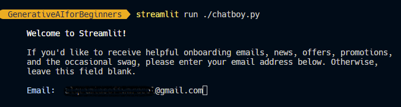</br>Completo con mi correo personal de `gmail.com`.
8. Luego nos sale la explicación del sitio que va a compartir: </br> 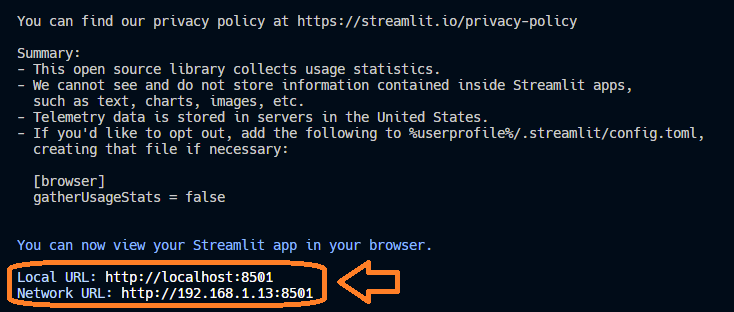
9. Ahora si, aparece en el _browser_ la página en cuestión: </br> 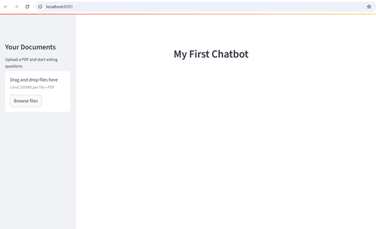

>[!NOTE]
>
>* Así que introducimos una barra lateral izquierda que básicamente te permite hacer cosas como navegar, subir
>ese tipo de cosas.
>* Y dijimos que el título de esta sección debería ser Tus Documentos, que se muestra aquí.
>* Y entonces dijimos que necesitamos una capacidad de carga de archivos.
>* Necesitamos una sección que nos permita subir un archivo.
>* Y puedes poner el texto, subir un archivo por ahí para facilitarle las cosas al usuario.
>* ¿Y cuál es el tipo de archivo que queremos cargar?
>Queremos cargar un archivo PDF.
>Así que como se puede ver que ha dado a esta sección.
>Tiene este texto aquí que queríamos.
>Y aquí se dice que esto es para PDF.

10. Hacemos clic en el botón `[Browse files]` y buscamos el archivo en nuestro proyecto [`THE CONSTITUTION OF INDIA`](documents/1806-Constitution_India_subset.pdf), y esperamos a que este disponible:</br> 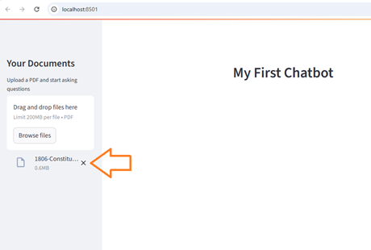
11. Añadimos este código en el archivo **`chatboy.py`**:
```py
    text = ""
    for pdf_file in file:
        reader = PdfReader(pdf_file)
        for page in reader.pages:
            text += page.extract_text() + "\n"
# Proceso dado por el insructor
# if file is not None:
#    pdf_reader = PdfReader(file)
#    text = ""
#    for page in pdf_reader.pages:
#        text += page.extract_text() # + "\n" # Le falta este salto de línea
```
12. Ahora dentro del ciclo `for` iprimimos el `text`, según el instructor, pero prefiero hacerlo al final:
```py
    st.write("Extracted Text:")
    st.write(text)
```
13. Damos clic en el botón de arriba a la derecha `[Rerun]`: </br> 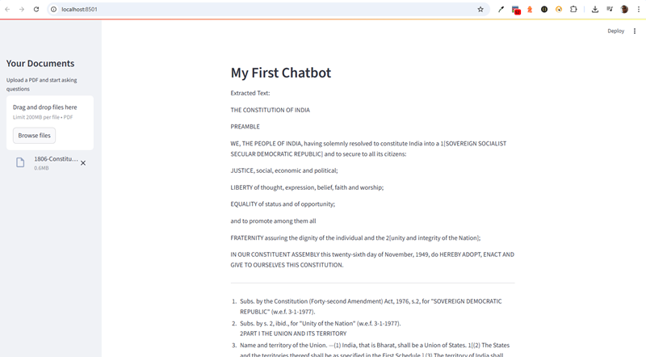

>[!NOTE]
>
>Así que dividirlo en pequeños trozos ayuda a asegurarse de que estás trabajando en una pequeña sección, y
>es capaz de entender mejor esa sección, trabajar en ella mejor.
>
>Así que para dividirlo en trozos, vamos a utilizar algo que ofrece Lang Chain, ¿verdad?
>
>Y voy a traer esa dependencia.
>Y voy a decir de Lang cadena de texto divisor.
>Bien.
>
>Así que básicamente `langchain` me ofrece un divisor de texto.
>Y allí también voy a utilizar el divisor de texto de carácter recursivo.

14. Regresamos al archivo **`chatboy.py`** y agrego lo siguiente:
```py
from langchain.text_splitter import RecursiveCharacterTextSplitter
...
# Break the text into chunks
text_splitter = RecursiveCharacterTextSplitter(
    separators="\n", chunk_size=1000, chunk_overlap=150, length_function=len
)
chunks = text_splitter.split_text(text)

# Display the extracted text
st.write("Extracted Text in Chunks:")
st.write(chunks)
```
15. Regresamos al _browser_ y presionamos de nuevo el botón `[Rerun]`: </br> 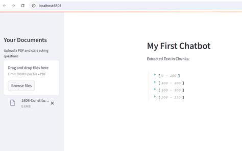

>[!NOTE]
>Así que básicamente es el mismo texto, pero ahora está dividido en pequeñas secciones, pequeños trozos.
>Bien.
>Y se rige por la norma que le hemos dado.
>
>Así que habíamos dicho que el tamaño del trozo debe ser 1000.
>Así que se rompe a los 1000 caracteres.
>
>Puedes pegar esos trozos dentro de un archivo word y puedes comprobar que la longitud de cada trozo sería
>de 1000 caracteres o menos.
>Y cuando decimos solapamiento de trozos de 150, lo que queremos decir es que, si lo piensas bien, este solapamiento se producirá
>bruscamente, ¿no?
>
>Empezaría a leer desde el principio.
>Encuentra 5000 caracteres.
>Rómpelo.
>Córtalo otra vez.
>Iría en 5000 caracteres de paréntesis.
>Trocéalo.
>Bien.
>
>Así que cuando lo haces así, cuando lo haces bruscamente, al azar, ese chunking ocurriría, esa división
>ocurriría.
>Puedes perder algo de sentido, ¿verdad?
>Así, por ejemplo, si ves aquí, mi primer trozo termina diciendo el nombre y el territorio de la Unión
>


