# QA Practice - AI Testing Fundamentals

Most useful courses to develop the skills needed in this new era of QAs in AI.

## QA_Practice-AI_Testing_Fundamentals

<https://perficient.udemy.com/learning-paths/10210909/>

[ Models
")](https://www.udemy.com/course/introduction-to-testing-ai-models-llms-and-chatbots/)

## Section 1: Introduction

### 1. Introduction to Material

>[!NOTE]
>
>1. Bienvenidos a este material sobre cómo probar modelos de IA, modelos de lenguaje extensos, chatbots, IA conversacional, etc.
>Este es un material único.
>Al momento de la grabación, no había otro material disponible en línea.
>Solo hay fragmentos de información sobre cómo probar y comparar modelos de IA.
>Y esta es la razón por la que decidí crear este tipo de material.
>En las próximas 8 o 9 horas, veremos qué es la IA hoy en día.
>Aquí les presento una introducción a la IA, ya que, en mi opinión, no se puede probar la IA hasta que se comprenda cómo funciona.
>2. Partiendo de eso, analizaremos las pruebas funcionales.
>¿Cómo se prueba funcionalmente un modelo de IA?
>Por supuesto, se realizará la generación.
>¿Cómo se generan texto, imágenes, vídeos, etc.?
>Pero también está la parte sobre el razonamiento de estilo y el _NPL_.
>Y luego analizaremos siete herramientas de código abierto que se pueden usar para comparar el modelo con diferentes tipos de problemas.
>Y esto se hará con Python.
>3. Continuando, analizaremos las pruebas adversarias.
>Se trata de una especie de prueba de penetración de seguridad.
>Sabemos que el modelo de IA puede usarse contra personas.
>Puede usarse para ingeniería social, para crear bombas, etc.
>Por eso también analizaremos cómo realizar ataques de envenenamiento, ataques de evasión, pruebas rápidas, fugas de privacidad, etc.
>4. Luego, veremos cómo se puede automatizar el chatbot.
>En nuestro caso, usaremos Postman.
>Usaremos GitHub.
>Haremos pruebas automatizadas con ChatGPT.
>Al final, esto se integrará en una canalización CSV para sentar las bases, al menos para la parte de pruebas de MLOps.
>5. Y, por último, pero no menos importante, analizaremos las consideraciones éticas de la IA, ya que, al final, la IA está cada vez más regulada.
>Por ejemplo, si quieres implementar tu modelo de IA en la Unión Europea, debes cumplir ciertos criterios.
>Así que analizaremos cómo podemos detectar sesgos.
>¿Cuáles son los riesgos asociados con la IA, la imparcialidad, etc.?
>
>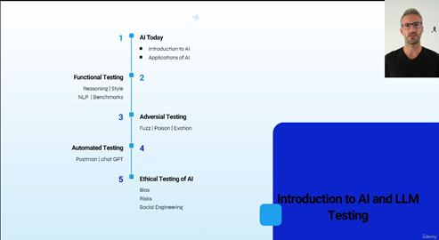


### 2. 5 Minute Fast AI Testing Challenge

>[!NOTE]
>
>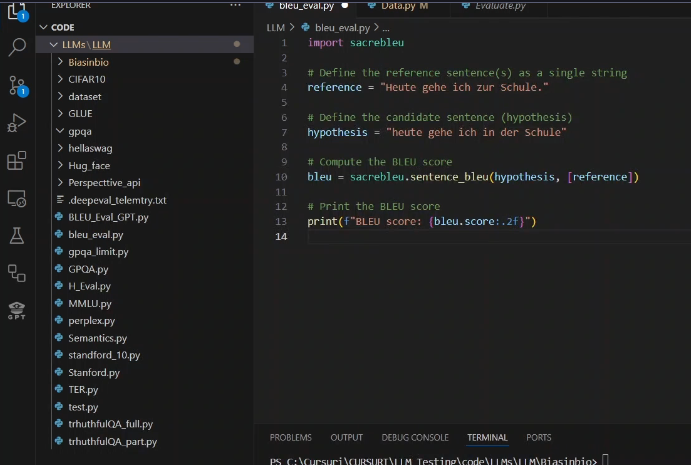
>
>Imaginemos la siguiente situación.
>Mañana vas a trabajar y alguien te dice: «Necesito a alguien que evalúe este modelo».
>Queremos implementar un nuevo modelo en producción, pero no sabemos si está sesgado ni si es lo suficientemente bueno para la tarea en cuestión, porque no sabemos cómo evaluarlo ni con qué compararlo.
>Y entonces dices: «Claro, no hay problema, porque vi a alguien en internet que me enseñó a hacerlo».
>
>Tenemos el siguiente escenario:
>
>El modelo que quieres validar es un robot que selecciona candidatos para puestos de trabajo, y quieres asegurarte de que no esté sesgado hacia ningún género, ya sea masculino o femenino.
>Perfecto.
>Imaginemos que ya tienes un modelo, pero en mi caso necesitamos seleccionar uno.
>
>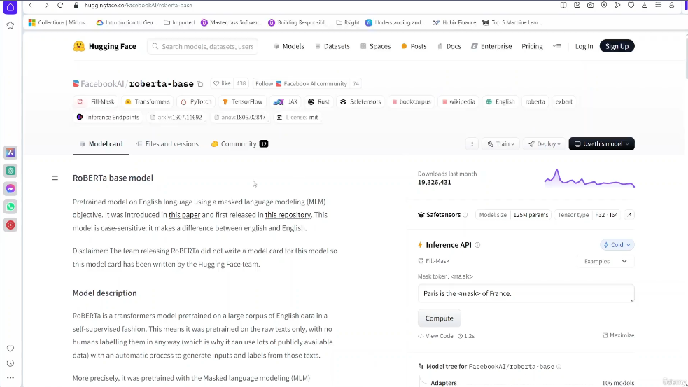
>
>En nuestro caso, como se basa en texto,
>Vamos a usar a Roberta en Facebook, un modelo diseñado específicamente para trabajar con texto.
>Perfecto.
>
>Entramos en nuestro código.
>Este es el código que quiero usar.
>Aquí está el modelo.
>Y simplemente digo: "Oye, dame la base de Roberta".
>Por cierto, es así de fácil.
>Este es el modelo.
>Este es el tokenizador para esta información.
>Lo encontraremos, por cierto, en Huggingface.
>Descarga el modelo preentrenado aquí.
>
>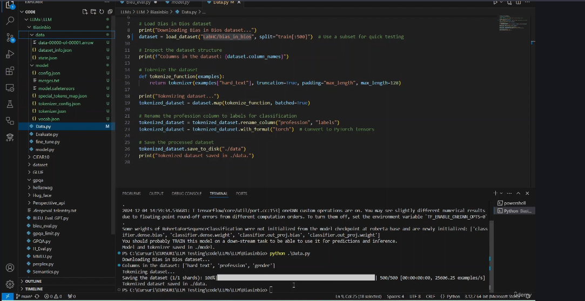
>
>Vuelvo a decir "datos de Python" y ahora estoy descargando los datos.
>Estoy descargando mis datos y, al mismo tiempo, necesito tokenizarlos para el modelo porque, eh,
>tienes el modelo, tienes un tokenizador y los datos no se pueden usar en formato tabular ni en texto plano.
>Necesitan tokenizarse para que el modelo los use.
>Y aquí están nuestros datos tokenizados.
>Básicamente, eso es todo.
>


### 3. History of AI from 1950 to 2024

>[!NOTE]
>
> * Antes de estudiar cómo funciona la IA, antes de comprender cómo llegamos a tener esta maravillosa IA generativa, instrumentos como ChatGPT o Dall-E que nos permiten generar diferentes imágenes a partir de texto.
>Necesitamos entender cómo llegué a existir.
>Para ello, debemos remontarnos a los años 50, cuando un hombre llamado Alan Turing creó el Test de Turing.
>El Test de Turing significa que, siendo una persona, por ejemplo, cualquiera, estarías hablando con una máquina sin saberlo.
>Y la máquina superará el Test de Turing.
>Si, desde tu punto de vista, sin saber con quién estás hablando, crees que estás hablando con un humano,
>por ejemplo, cuando hablas con ChatGPT y mantienes una conversación normal simplemente hablando con esa máquina, imaginando que estás teniendo, por ejemplo, una conversación de WhatsApp.
>Crees que estás hablando con un humano.
>No sabrías que estás hablando con un chatbot.
>Por lo tanto, un sistema de IA superará la prueba de Turing si el usuario, la persona que interactúa con el sistema, no sabe que está hablando con una máquina, pero cree que está hablando con otro ser humano.
>Esta es la prueba de Turing.
> * Y luego, en el año 56, en la conferencia de Dartmouth, surgió la noción de la inteligencia artificial como una rama independiente de la informática.
>Así que fue el establecimiento formal de este tipo de ciencia.
> * Lo que sucedió después fue entre los años 60 y 70.
>Alguien del MIT creó un sistema informático, una especie de chatbot muy rudimentario llamado Eliza.
>Y así funcionaba.
>Usaba programación predefinida y buscaba.
>Así que hacías algunas preguntas.
>Escribías algunas preguntas.
>   * Por ejemplo, "Me siento un poco triste hoy".
>   * Y este chatbot, Eliza, estaba preprogramado para buscar diferentes patrones o palabras.
>Y te respondía tu pregunta un poco reformulada.
>   * Así que si decía "Me siento triste",
>   * Eliza decía: "Lo siento mucho".
>¿Por qué te sientes triste?
>   * Y tú podías decir: "Bueno, tuve un problema en el trabajo".
>   * Y Eliza, a su vez, estaba programada para buscar ciertas palabras, por ejemplo, "trabajo" o "problema". Y decía: "Bueno, ¿cuál es la causa de tu problema en el trabajo?", etc.
>   * Este fue el primer algoritmo que dio a la gente la sensación de que la computadora podía entenderte.
>Si piensas en el procesamiento del lenguaje natural, este fue quizás el primero de su tipo.
> * Y luego, en los años 80, se produjo, digamos, un auge de los sistemas expertos.
>Si nos fijamos en la IA débil y la IA generativa,
>La IA débil significa que está muy limitada a un alcance determinado.
>Por lo tanto, no es generativa.
>No se aplica a todo, pero se aplica a algo muy, muy específico.
>Así que muchos sistemas expertos entraron en escena en los años 80.
> * Y luego, en el 97, creo que fue esto.
>Una cosa que añadir es que entre los 90 y los 90, fue una especie de invierno de la IA.
>No hubo desarrollos, no hubo progreso, no hubo nada en las noticias.
>Y de alguna manera, la gente perdió la esperanza en la IA.
>Pero entonces, en el 97, Deep Blue de IBM derrotó a Garry Kasparov en una partida de ajedrez.
>Creo que se jugaron cinco partidas.
>Por cierto.
>Hay una película.
>Creo que se llama Kasparov y la máquina.
>Definitivamente.
>Tienes que verla.
>Sí.
>Así que esta fue la primera vez que una computadora ganó una partida de ajedrez.
>
> 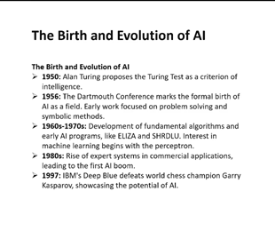
>
> * Ahora, en la era moderna de la IA.
>Básicamente, son los últimos diez años.
>¿Y qué seguirá a partir de ahora?
>Lo que debemos entender es que a principios del siglo XXI, existía la idea del aprendizaje profundo.
>Y con este concepto, todo el panorama de la IA comenzó a cambiar.
>Y la gente volvió a tener esperanza de que algún día pudiéramos alcanzar la inteligencia artificial.
> * Y esto se ha acelerado.
>Existen muchas empresas de aprendizaje profundo.
>Por ejemplo, DeepMind, y creo que el mayor logro fue el momento en que AlphaGo, que antes era DeepMind, ahora adquirida por Google, derrotó magistralmente al Go.
>Eso se debió a que, desde una perspectiva matemática, el Go es extremadamente difícil, con posibilidades casi infinitas.
>En 2013 o 2014, AlphaGo derrotó a este maestro coreano en una partida de Go.
>Y desde entonces, desde el año 2000 hasta la actualidad y hasta 2023 o 2024, ha habido una explosión de algoritmos de aprendizaje profundo.
> * ¿Qué nos depara el futuro?
>Todos intentan buscar esta singularidad, esta inteligencia artificial general, o inteligencia artificial general como la que se ve en Terminator.
>Cierto.
>O en Matrix, una singularidad capaz de adaptarse y evolucionar.
>Y, bueno, puede ser como un humano, pero solo un millón de veces más inteligente.
>Y, por supuesto, con toda nuestra lucha por alcanzar esta inteligencia artificial, y, por supuesto,
>basándonos en todas las películas de ciencia ficción que hemos visto en el pasado, la IA ética será un gran avance en el futuro.
>Por eso es tan importante estudiar este material, porque comprenderán con qué lucharán las grandes empresas, no solo desde una perspectiva técnica, sino también con las regulaciones.
>Habrá muchísimas regulaciones sobre cómo controlar la IA.
>Repito, esto se basa en ciencia ficción.
>Ya sabes, conocemos Terminator, Skynet, Matrix.
>Y, de nuevo, si eres fan de la ciencia ficción, quizá conozcas a Isaac Asimov y las leyes de la robótica, que prohíben a una máquina dañar a un ser humano, etc.
>
>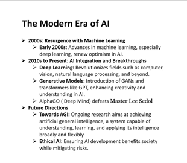


## Section 2: Setting up Environment

### 4. Install VS Code

1. Ir al sitio de [Download Visual Studio Code](https://code.visualstudio.com/download).
2. Descargar e instalar.
3. Una vez instalado ir al menú, casi siempre a la izquierda, a  `Extensions` y tener estos instalados:
* [`Java extension pack`](https://marketplace.visualstudio.com/items?itemName=walkme.Java-extension-pack) de [_walkme_](https://marketplace.visualstudio.com/publishers/walkme), trae 8 extensiones de una vez:
  * Maven for Java 1️⃣
  * Language Suppor for Java(TM) by Red Hat 2️⃣
  * Debugger for Java 3️⃣
  * Test Runner for Java 4️⃣
  * Project Manager for Java 5️⃣
  * Java Language Support 🥇
  * Sprint inicializr Java Support 🥈
* [`Extension Pack for Java`](https://marketplace.visualstudio.com/items?itemName=vscjava.vscode-java-pack) de [_Microsoft_](https://marketplace.visualstudio.com/publishers/Microsoft), trae 7 extensiones de una vez:
  * Language Suppor for Java(TM) by Red Hat 2️⃣
  * Debugger for Java 3️⃣
  * Test Runner for Java 4️⃣
  * Maven for Java 1️⃣
  * Gradle for Java 🥉
  * Project Manager for Java 5️⃣
  * IntelliCode 💡
* [`GitHub Actions`](https://marketplace.visualstudio.com/items?itemName=GitHub.vscode-github-actions) de [_GitHub_](https://marketplace.visualstudio.com/publishers/GitHub)


### 5. Installing Python

1. Ir al sitio [Python -> Downloads](https://www.python.org/downloads/)
2. Se sugiere la última versión `3.13.5` </br> 
3. En una `TERMINAL` ejecutar este comando para estar seguro que el `Python` quedó bien instalado: </br> `python --version`</br> Debe salirte algo paerecido a esto: `Python 3.13.5`.


### 6. Install Python Dependencies - PIP

1. En este sitio hay unas instrucciones dependiendo del sistema operativo: [pip documentation -> Getting Started](https://pip.pypa.io/en/stable/getting-started/).
2. Verificar la versión en una `TERMINAL`: </br> `py -m pip --version`
3. Para tener una actualización en este sitio stán las instrucciones [pip documentation -> Installation](https://pip.pypa.io/en/stable/installation/).
4. El comando de este sitio, para actualizar, sería: </br> `py -m pip install --upgrade pip`


### 7. Installing Conda - Environment Isolator tool

1. En este sitio [Miniconda con PowerShell](https://www-anaconda-com.translate.goog/docs/getting-started/miniconda/install?_x_tr_sl=en&_x_tr_tl=es&_x_tr_hl=es&_x_tr_pto=tc&_x_tr_hist=true#powershell).
2. Este comando en una `TERMINAL` de `PowerShell`: </br> `wget "https://repo.anaconda.com/miniconda/Miniconda3-latest-Windows-x86_64.exe" -outfile ".\Downloads\Miniconda3-latest-Windows-x86_64.exe"` </br> o este otro comando: </br> `curl https://repo.anaconda.com/miniconda/Miniconda3-latest-Windows-x86_64.exe --output .\Downloads\Miniconda3-latest-Windows-x86_64.exe`
3. En una `TERMINAL` de `PowerShell`, este comando: </br> `cd "$($env:HOMEPATH)\Downloads"` </br> y dale despues: </br> `dir mini*.*`
4. Ejecuta ese archivo allí hallado: </br> `Start-Process -FilePath "./Miniconda3-latest-Windows-x86_64.exe" -NoNewWindow -Wait -RedirectStandardOutput "C:\temp\conda-LogFile.log" -RedirectStandardError "C:\temp\conda-ErrorLogFile.log"` </br> Debe existir la carpeta **"c:\temp"**
5. Este sería el proceso: </br> 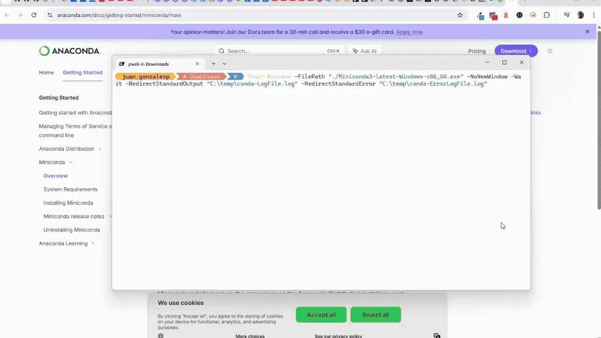
6. Pero al ver todas las posibles consecuencias, decido no instalarlo.


### 8. Install NodeJS and NPM

1. El sititio que sugiere el Instructor es este [Download Node.js®](https://nodejs.org/en/download).
2. Para lo que sigue debe instalar `nvm` de este sitio [`nvm`](https://github.com/coreybutler/nvm-windows/releases)
3. Pero yo prefiero tener el control de versiones con este instructivo: [Instalar múltiples versiones de Node.js en Windows](https://rafaelneto.dev/blog/instalar-multiples-versiones-nodejs-windows/) de [`RAFAEL NETO`](https://rafaelneto.dev/), comandos: </br> » `nvm install 22.18.0` </br> » `nvm use 22.18.0` </br> » `nvm list`


### 9. Introduction to Hugging Face Community Page

1. El sitio en cuestión es  [Hugging Face](https://huggingface.co/) </br> 
2. Del sitio se sugiere ir a [`Models`](https://huggingface.co/models).
3. Los puedes filtar por:
* Multimodal
  * Audio-Text-To-Text
  * Any-to-Any
  * ...
* Computer Vision
  * Depth Estimation
  * Image Classification
  * Image-To-Text
  * Video-to-Video
  * ...
* Natural Language Precessing
  * Text Classification
  * Token Classsification
  * Text Tanking
  * ...
* Audio
  * Text-to-Speech
  * Text-to-Audio
  * ...
* Tabular
* Reinforcement Learning
* Other
4. Otro sitio es [`Spaces`](https://huggingface.co/spaces).
5. Nos ponene de ejemplo a [`DimensionX`](https://huggingface.co/spaces/ShuoChen20/DimensionX).
6. Otro ejemplo [`Qwen2.5-Coder-Artifacts`](https://huggingface.co/spaces/Qwen/Qwen2.5-Coder-Artifacts).
7. Elementos para soportar la información [`Documentation`](https://huggingface.co/docs).


### 10. Hugging Face Transformers Python Package

1. Vamos a este sitio de  [Hugging Face](https://huggingface.co/), a [`Transformers`](https://huggingface.co/docs/transformers/index)
2. Estos son los pasos para la instalación [`Transformers` -> Installation](https://huggingface.co/docs/transformers/installation).
3. Un comando sería: </br> `pip install torch`,
4. Luego otro sería </br> `pip install transformers`
5. Creamos el archivo **`src/test/LLM/Hug_face/test1.py`**, con esto en el código:
```py
from transformers import pipeline

classifier = pipeline("sentiment-analysis")

res = classifier("I want to learn how to do AI Model benchmarking") #bencharmking")

print(res)
```
6. Simplemente le ejecutamos el código del botón "run" (El triángulo en la parte superior).
7. Tengo una advertencia que debo instalar otro elemento: </br> `pip install huggingface_hub[hf_xet]`
8. Repito la ejecución y esta es la respuesta:
```bash
No model was supplied, defaulted to distilbert/distilbert-base-uncased-finetuned-sst-2-english and revision 714eb0f (https://huggingface.co/distilbert/distilbert-base-uncased-finetuned-sst-2-english).
Using a pipeline without specifying a model name and revision in production is not recommended.
Device set to use cpu
[{'label': 'NEGATIVE', 'score': 0.6163020730018616}]
```
9. Cambiamos el valor de `classifier` por `I love to code in Python with pytorch`, y al ejecutar esta fue la respuesta:
```bash
No model was supplied, defaulted to distilbert/distilbert-base-uncased-finetuned-sst-2-english and revision 714eb0f (https://huggingface.co/distilbert/distilbert-base-uncased-finetuned-sst-2-english).
Using a pipeline without specifying a model name and revision in production is not recommended.
Device set to use cpu
[{'label': 'POSITIVE', 'score': 0.9949877262115479}]
```
10. Creo otro archivo **`src/test/LLM/Hug_face/test2.py`**, con este código:
```py
from transformers import pipeline, AutoTokenizer, AutoModelForSequenceClassification

# Load a custom tokenizer
custom_Tokenizer = AutoTokenizer.from_pretrained("bert-base-uncased")

# Load a compatible model
model = AutoModelForSequenceClassification.from_pretrained("bert-base-uncased")

# Create a pipeline with both model and tokenizer
classifier = pipeline("sentiment-analysis", model=model,
                      tokenizer=custom_Tokenizer)

# Run the classsifier
res = classifier("I want to learn how to do AI Model benchmarking")
print(res)
```
11. Ejecuto y este es el resultado:
```bash
Some weights of BertForSequenceClassification were not initialized from the model checkpoint at bert-base-uncased and are newly initialized: ['classifier.bias', 'classifier.weight']
You should probably TRAIN this model on a down-stream task to be able to use it for predictions and inference.
Device set to use cpu
  return forward_call(*args, **kwargs)
[{'label': 'LABEL_1', 'score': 0.5975498557090759}]
```
12. Cambio el texto de `classifier` por `I love to code in Python with pytorch`, ejecuto y este es el resultado:
```bash
Some weights of BertForSequenceClassification were not initialized from the model checkpoint at bert-base-uncased and are newly initialized: ['classifier.bias', 'classifier.weight']
You should probably TRAIN this model on a down-stream task to be able to use it for predictions and inference.
Device set to use cpu
  return forward_call(*args, **kwargs)
[{'label': 'LABEL_0', 'score': 0.709624171257019}]
```

### 11. How to load and use any model from Huggingface

1. Creamos el archivo**`src/test/LLM/Hug_face/tts_model.py`**, con este código:
```py
from transformers import pipeline

# Load the question-answering pipeline
qa_pipeline = pipeline("question-answering",
                       model="deepset/roberta-base-squad2")

# Correct input format
result = qa_pipeline(question="What is Hugging Face?",
                     context="Hugging Face is a platform for NLP.")
print(result)
```
2. Lo ejecuto y este es el resultado:
```bash
  return forward_call(*args, **kwargs)
{'score': 0.7612054347991943, 'start': 16, 'end': 34, 'answer': 'a platform for NLP'}
```
3. Vamos a este sitio [`shuttleai/shuttle-3-diffusion`](https://huggingface.co/shuttleai/shuttle-3-diffusion)
4. Debemos instalar esto: </br> `pip install -U diffusers`
5. Copiamos el código y le cambiamos el contenido de **``**:
```py
import torch
from diffusers import DiffusionPipeline

# Load the diffusion pipeline from a pretrained model, using bfloat16 for tensor types.
pipe = DiffusionPipeline.from_pretrained(
    "shuttleai/shuttle-3-diffusion", torch_dtype=torch.bfloat16
).to("cuda")

# Uncomment the following line to save VRAM by offloading the model to CPU if needed.
# pipe.enable_model_cpu_offload()

# Uncomment the lines below to enable torch.compile for potential performance boosts on compatible GPUs.
# Note that this can increase loading times considerably.
# pipe.transformer.to(memory_format=torch.channels_last)
# pipe.transformer = torch.compile(
#     pipe.transformer, mode="max-autotune", fullgraph=True
# )

# Set your prompt for image generation.
prompt = "A cat holding a sign that says hello world"

# Generate the image using the diffusion pipeline.
image = pipe(
    prompt,
    height=1024,
    width=1024,
    guidance_scale=3.5,
    num_inference_steps=4,
    max_sequence_length=256,
    # Uncomment the line below to use a manual seed for reproducible results.
    # generator=torch.Generator("cpu").manual_seed(0)
).images[0]

# Save the generated image.
image.save("shuttle.png")
```
6. Nos sugiere instalar: </br> It is strongly recommended to install `accelerate` for faster and less memory-intense model loading. You can do so with: </br> `pip install accelerate`
```bash
Fetching 23 files:   0%|          | 0/23 [00:00<?, ?it/s]
Fetching 23 files:  26%|##6       | 6/23 [05:52<16:38, 58.71s/it]
Fetching 23 files:  30%|###       | 7/23 [06:44<15:20, 57.56s/it]
Fetching 23 files:  78%|#######8  | 18/23 [10:24<02:26, 29.33s/it]
Fetching 23 files:  83%|########2 | 19/23 [13:56<03:02, 45.54s/it]
Fetching 23 files: 100%|##########| 23/23 [13:56<00:00, 36.37s/it]
```
7. Luego de un rato consigo un error: </br> `Cannot instantiate this tokenizer from a slow version. If it's based on sentencepiece, make sure you have sentencepiece installed.` </br> Se recomienda instalar: </br> `pip install sentencepiece`

>[!WARNING]
>
>An error encountered when using shuttleai/shuttle-3-diffusion from Hugging Face with torch_dtype=torch.bfloat16 can stem from several factors, often related to hardware compatibility, software environment, or specific model requirements.
>
>**GPU Compatibility:**
>torch.bfloat16 (Brain Floating Point) requires specific GPU hardware support, primarily NVIDIA Ampere architecture (e.g., A100, RTX 30 Series, RTX 40 Series) or newer. Older GPUs or those without native bfloat16 support will likely encounter errors or performance issues when attempting to use this data type.
>
>**PyTorch and CUDA Version Mismatch:**
>Ensure that the installed PyTorch version is compatible with your CUDA toolkit version and that both are properly configured to utilize your GPU. Incompatible versions can lead to issues when loading models with specific data types like bfloat16.
>
>**Insufficient VRAM:**
>While bfloat16 aims to reduce memory footprint, complex models like shuttleai/shuttle-3-diffusion can still demand substantial VRAM, especially during inference. If your GPU lacks sufficient VRAM, even with bfloat16, memory-related errors can occur. Consider enabling CPU offloading if available within the Diffusers pipeline to mitigate this.
>
>**Model-Specific Requirements:**
>Some models might have specific data type requirements or optimizations that are not fully compatible with a direct torch_dtype=torch.bfloat16 setting. Consult the model's documentation or discussions on its Hugging Face page for any known limitations or recommended configurations.
>
>**Troubleshooting Steps:**
> * **Verify GPU Support:** Confirm your GPU's architecture supports bfloat16.
> * **Update PyTorch and CUDA:** Ensure you are using recent, compatible versions of PyTorch and CUDA.
> * **Monitor VRAM Usage:** Use tools like nvidia-smi to monitor VRAM usage during model loading and inference.
> * **Try torch.float32:** As a test, try loading the model with torch_dtype=torch.float32 to see if the error persists. This can help isolate whether the issue is bfloat16-specific or a broader problem with your setup.
> * **Consult Hugging Face Resources:** Check the shuttleai/shuttle-3-diffusion model page on Hugging Face for discussions, issues, or specific instructions related to its usage and data types.


## Section 3: Introduction to Artificial Intelligence -optional if you know the basics of AI

### 12. What makes up AI

>[!NOTE]
>
>Antes de analizar qué es realmente la inteligencia artificial y qué la compone como ciencia, tal como la conocemos hoy, necesitamos comprender qué es exactamente la inteligencia.
>
>Encontré dos definiciones: una se refiere a la capacidad de adquirir y aplicar conocimientos y habilidades.
>
>La otra se refiere a la capacidad de resolver problemas complejos o tomar decisiones con resultados que benefician al actor y que ha evolucionado en formas de vida para adaptarse a diversos entornos para su supervivencia y reproducción.
>
>En cierto modo, significa la capacidad de pensar, adaptarse y adquirir nuevas habilidades.
>
>La inteligencia artificial se refiere a una ciencia, o quizás a un desarrollo en sistemas informáticos, capaces de realizar tareas que normalmente requieren inteligencia. Artificial significa que ha sido creada por una persona o forma de vida inteligente; es decir, esto es lo que los humanos entendemos por inteligencia artificial.
>
>Si continuáramos y entendiéramos cuáles son las prácticas actuales para la inteligencia artificial.
>
>
>
>**¿Adónde nos ha llevado la ciencia hoy y qué constituye la inteligencia artificial?**
>
> * El primero sería el aprendizaje automático.
>Esta parte de la inteligencia artificial otorga a los sistemas que diseñamos la capacidad de aprender nuevas habilidades, la capacidad de aprender de los datos para que las máquinas puedan aprender por sí mismas.
>
> * El siguiente sería el procesamiento del lenguaje natural.
>Este es el paso intermedio entre el ser humano y la máquina, para que los humanos tengan la capacidad de comprender a las máquinas, o que las máquinas tengan la capacidad de expresarse. Actúa como los humanos porque no tiene sentido que un humano cree algo si no tiene la capacidad de comprenderlo y usarlo.
>
> * En el procesamiento del lenguaje natural, la capacidad de las máquinas para comprender las emociones del texto, el contexto de una expresión, el significado de una oración, etc.
>Esto es el procesamiento del lenguaje natural.
>
> * Luego está la visión artificial.
>Y aquí está la capacidad de los sistemas informáticos para comprender imágenes, descomponerlas en píxeles e intentar comprender qué significa ese gran grupo de píxeles para un humano.
>Eso es la visión artificial.
>
> * Y esto también se aplica al habla, ¿verdad?
>La capacidad de estos robots para comprender el habla.
>Bueno, en realidad traducen el habla en palabras.
>Y luego, mediante el procesamiento del lenguaje natural, esas palabras se descomponen en los diferentes significados que podrían tener para una persona.
>
>En resumen, la IA incluye procesamiento del lenguaje natural, aprendizaje automático y, detrás de ese gran conjunto de datos, algoritmos, modelos de entrenamiento, etc.


### 13. Natural Language Processing

>[!NOTE]
>
>Para que los humanos podamos hablar con las computadoras o interactuar con ellas, necesitamos que entiendan nuestros deseos, ideas, nuestra forma de pensar, y viceversa.
>Debemos asegurarnos de que, cuando recibimos una respuesta de una computadora, la recibamos en un formato comprensible para los humanos.
>Esta rama de la inteligencia artificial se llama procesamiento del lenguaje natural.
>Y creo que el nombre lo dice todo.
>
>**¿Qué es exactamente el procesamiento del lenguaje natural?**
>
> * Es la parte que permite a las computadoras comprender, interpretar y generar lenguaje humano.
>Y cuando dices lenguaje humano, no pienses solo en texto.
>Piensa también en voz y video.
>Todo lo que nos hace humanos: todas las formas posibles de comunicarnos.
>
>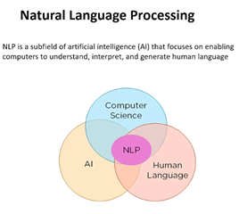
>
> * Y el PLN en sí mismo es una intersección.
>También se puede encontrar en la informática, por supuesto, en el lenguaje humano; es parte de nuestra forma de comunicarnos.
>Y, por supuesto, es parte de la IA.
>Así que, al combinar todas estas ramas (IA, informática y lenguaje humano), el procesamiento del lenguaje natural es algo que encaja en todas ellas.
>
> * Ahora bien, el procesamiento del lenguaje natural se divide en dos áreas principales: la primera es la comprensión del lenguaje natural.
>Esto significa que las computadoras pueden comprender lo que las personas intentan expresar, porque hoy en día, por sí solas, no se cree que las computadoras puedan o tengan sentimientos.
>Están programadas para comprender lo que se intenta decir.
>
>**¿Y cómo funciona esto?**
>
>Bueno, tienes a un usuario común que puede interactuar con voz o vídeo, imágenes y texto.
>Esta información se introduce en un proceso llamado descomposición, en un bloque de software que intentará tokenizar lo que se expresa.
>Y luego realizará este tipo de análisis: léxico, semántico, pragmático, etc.
>Intentará comprender lo que se quiere decir desde una perspectiva lógica.
>
>La generación de lenguaje natural debe transmitir un mensaje de urgencia y entusiasmo a tus correos electrónicos.
>
>**¿Cómo funciona esto?**
>
>Bueno, se parte del modelo base.
>Básicamente, aquí es donde nos quedamos al introducir la información.
>Luego, se genera el contenido utilizando una herramienta de IA generativa.
>Y se recibe la respuesta tal como se solicita.
>Esto puede ser en forma de imágenes que sabemos que podemos generar.
>Las imágenes también pueden ser, por ejemplo, un archivo de vídeo.
>Ahora también se pueden generar diferentes vídeos, cortos o incluso largos, que pueden ser texto o sonido.
>
>En resumen, el procesamiento del lenguaje natural es la parte que se encuentra entre los humanos y el modelo base, o el modelo entrenado que traduce lo que queremos obtener de nuestro sistema de IA generativa.

### 14. Types of Machine Learning

>[!NOTE]
>
>Hablemos ahora un momento sobre el aprendizaje automático.
>El nombre en sí se explica por sí solo.
>Se trata de la capacidad de los sistemas informáticos, o quizás simplemente de los sistemas, de aprender de los diferentes datos que poseen y crear diferentes resultados basados en algoritmos.
>
>Ahora bien, al pensar en los diferentes tipos de aprendizaje, existen muchos.
>Pero creo que estos son los más básicos.
>Analizaremos estos cuatro:
>
>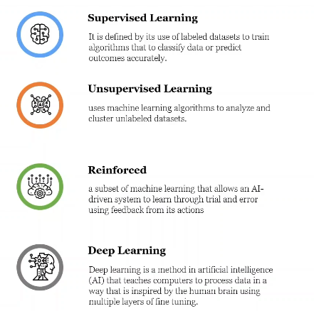
>
>1. **Supervised Learning:** El primero se llama aprendizaje supervisado.
>Esto significa que una máquina empieza a aprender, pero es supervisada por una persona, un sistema o alguna forma de enseñanza.
>En este caso, se refiere a la idea de que cada dato tiene una etiqueta.</br></br>
>Así, se le introducen estos datos a una máquina y se le indica que representan lo siguiente:
>Por ejemplo, se le podría proporcionar la imagen de un perro y decirle: «Esto es un perro», lo cual es una forma de aprendizaje supervisado.
>
>2. **Unsupervised Learning:** El siguiente es el aprendizaje no supervisado.
>Se trata de la capacidad de los sistemas informáticos de aprender, pero sin intervención externa.
>Les otorga a las máquinas la capacidad de intentar encontrar sus propias razones y diferentes categorizaciones o agrupaciones de datos.
>Por lo tanto, la máquina debe identificar patrones en los datos y agruparlos.
>
>3. **Reinforced:** Otro es el aprendizaje reforzado.
>Y creo que este es el ejemplo más simple de cómo le enseñas algo a un niño.
>La máquina.
>Consta básicamente de dos partes: el agente y el sistema o entorno.
>Y luego, el agente de IA comienza a realizar diferentes acciones.
>Y luego le dices si está bien o no.</br></br>
>Lo que has hecho, al igual que le enseñas a un niño cuando está aprendiendo a contar hasta diez, es que si empieza con uno, está bien.
>Y si en el capítulo uno dices dos, también está bien.
>Pero si tu hijo dice cinco, entonces no está bien.
>Así que tu hijo está aprendiendo que el cinco no es después del dos, y así sucesivamente.</br></br>
>Esto es aprendizaje reforzado.
>Cuando una persona externa supervisa lo que hace la máquina y otorga puntos, por ejemplo, por cada decisión o acción correcta que la máquina ha realizado, ya sea nosotros o cualquier otra parte.
>
>4. **Deep Learning:** Y este es el más importante de todos.
>Se trata del aprendizaje profundo.
>Y está inspirado en el cerebro humano.
>Utiliza redes neuronales.
>Y esta es la capacidad, nuevamente, de un sistema para aprender usando datos no estructurados, usando datos sin etiquetar,
>pero pasando por múltiples fases o múltiples iteraciones para ajustar el modelo.
>Y estas iteraciones se llaman neuronas.
>Pero hablaremos de eso más adelante.</br> </br>
>Y los grandes modelos de lenguaje y toda la IA se basan en estos algoritmos de aprendizaje profundo.
>Pero, nuevamente, abordaremos estos puntos a lo largo de nuestro material para comprender mejor qué son exactamente todos estos tipos de aprendizaje automático.


### 15. Machine Learning - Supervised ML

>[!NOTE]
>
>El aprendizaje supervisado se produce cuando se utiliza un algoritmo de aprendizaje automático con información predefinida sobre los datos que se consumen.
>Esto significa que, al introducir datos en el algoritmo de aprendizaje automático, al introducirlos, se están proporcionando los datos, ¿verdad?
>
> * Estos datos de etiquetas, y tú proporcionas las etiquetas.
>Un buen ejemplo.
>Tomemos los perros como ejemplo.
>Quieres enseñar a tu sistema de aprendizaje automático o entrenar a tu sistema de IA para que identifique cuándo tienes una foto de un perro o de cualquier otra cosa.</br>
>En este caso, intentarías proporcionar una gran cantidad de datos, quizás un par de millones de fotos de perros, pero también millones de fotos de animales que no sean perros.
>Las etiquetarías: tomarías cada foto y dirías "esto es un perro", y tomarías la otra foto y dirías "esto no es un perro", o podrías decir algo como "un zorro".
>
> * Entonces, para cada conjunto de datos que tengas (datos y etiquetas), los introducirías en este algoritmo de aprendizaje automático y el sistema, basado en un lenguaje de programación o una lógica de programación ya instalada, intentará encontrar una forma de identificar si se trata de un perro o no.
>Ahora estás entrenando tu modelo.
>Así es como lo llamaría yo, ¿verdad?
>Estás entrenando el modelo y, de nuevo, necesitas una gran cantidad de datos para ello.
>A continuación, te explicamos cómo funciona.
>
> * Ahora estás probando tu modelo.
>Así que tienes el modelo de entrenamiento.
>Tienes cierta lógica.
>Tienes una gran cantidad de datos de entrenamiento y ahora quieres probar tu modelo o usarlo para predecir algo.
>Correcto. </br>
>La predicción y tú la introducirías en este modelo.
>Ahora introducirías algunos datos de prueba, pero sin la etiqueta.
>Correcto.
>Porque ahora está aprendiendo.
>Así que estás introduciendo datos en tu modelo.
>De nuevo, diferentes imágenes de cualquier tipo de animal podrían ser perros, o cualquier otra cosa.
>
> * Pero no estás introduciendo la etiqueta porque quieres que el modelo lo entienda o validar si es correcto.
>Después de esto, el modelo te dará una predicción.
>Te dirá si es perro o no.
>Básicamente, eso es todo. Lo que quieres hacer ahora es si el modelo está bien y si estás satisfecho con la predicción, está bien.
>
> * Pero si no estás satisfecho, lo que haces es tomar la predicción.
>Si es un modelo, si es un perro o no, y luego la comparas con la etiqueta de esa imagen en particular.
>Y si no es correcta, tienes que volver a entrenar tu sistema de IA con estos datos, con estos datos de prueba.
>Correcto.
>Y el sistema se adaptará para identificar cuál fue el problema.
>
>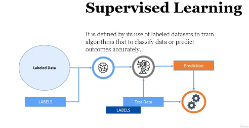
>
>Esto se llama aprendizaje supervisado porque constantemente le estás diciendo a tu sistema qué es lo que tienes.
>Si es un perro o algo más.
>Y con cada fallo, tu sistema aprenderá de ello porque le estás indicando que hay un problema.
>Es un fallo que no es un perro y tu modelo aprenderá.
>Esto es aprendizaje automático supervisado.


### 16. Machine Learning - Unsupervised ML

>[!NOTE]
>
>Ahora intentemos comprender qué es exactamente el aprendizaje no supervisado.
>Como su nombre indica, no está supervisado por algo, por un algoritmo, por una entidad, ni proporciona ningún tipo de preenseñanza.
>Por lo tanto, no se proporcionan estos valores como, por ejemplo, "esto es un caballo", ni se proporciona el sonido, la imagen o algo que exprese el significado de un caballo.
>Así que creo que es más fácil simplemente dar un ejemplo de lo que es el aprendizaje no supervisado.
>Y haremos un ejemplo muy, muy, muy simple.
>
>Ahora imaginemos que tienes este gráfico y aquí, en la vertical, tienes la altura.
>Y aquí, el peso y lo que haces.
>Así que tomarías a la persona.
>Y la persona se caracteriza por la altura y el peso, y nada más.
>Así que alimentarías tu algoritmo.
>Introducirías mucha información sobre pares de valores, altura y peso, y los representarías en este gráfico de esta manera.
>
>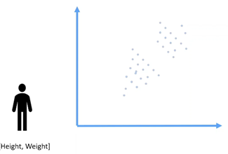
>
>Así que cada punto representa una altura y su peso correspondiente.
>Ves un patrón.
>Lo que le pedirías a tu algoritmo es que agrupe estos datos.
>El algoritmo dirá: «He encontrado estos dos grupos».
>
>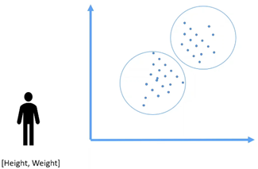
>
>También puedes indicarle a tu algoritmo que encuentre tres clústeres.
>Pero en este caso, tenemos dos clústeres.
>Pero también puedes tener tres, cuatro, cinco, seis y muchos más.
>Así que esta es la letra K.
>Así que, el número de clústeres que quieres tener en tus datos de entrenamiento.
>
>Basándonos en la información que tenemos ahora, podríamos pedirle al robot que diga: "Si obtengo valores que caen dentro del círculo rojo o en el área roja, lo más probable es que sea una mujer, basándonos en lo que tenemos y en lo que tenemos en el círculo azul, que corresponde a la altura y el peso de un hombre".
>Y, por supuesto, esto puede interrelacionarse.
>Así que, en este caso, tienes dos clústeres.
>
>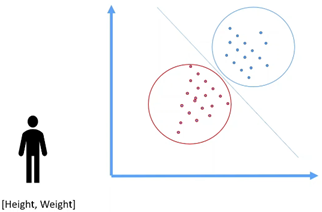
>
>Lo que has hecho es pedirle a tu algoritmo de aprendizaje automático que intente estructurar los datos para encontrar patrones basados en dos o más grupos, basándose únicamente en estos dos elementos.
>
>En este caso, intentarías enseñarle a tu algoritmo a predecir si el valor, el par, la altura y el peso corresponden a un hombre o a una mujer.
>
> * **Clustering:** Si observas este tipo de aprendizaje, tienes agrupamiento.
>Esto es lo que ves aquí: la idea del agrupamiento.
>Hemos agrupado nuestros datos en diferentes grupos o valores.
>
> * **Association:** Otro tipo es la asociación.
>Imagina que estás en un sitio web y quieres comprar algo.
>Y ves que se compran juntos con frecuencia.
>Ese es un ejemplo de una aplicación práctica del aprendizaje no supervisado.</br>
>Porque si le dices a tu robot que la gente ha comprado esto y solo introduces los pedidos con exactamente qué han comprado, tu algoritmo de aprendizaje automático dirá: "Las personas que compran esto la mayoría de las veces también compran esto".
>Así que esa es una forma diferente de aprendizaje no supervisado.
>Si entonces...
>
> * **Dimension Reduction** Y la última podría ser la reducción de dimensión, que ocurre cuando tienes demasiadas dimensiones, demasiados parámetros, demasiados puntos de datos, e intentas ignorar los que no son relevantes porque eso es solo ruido.
>
> Ahora bien, esta es una forma de aprendizaje no supervisado.
>Pero lo realmente interesante es que si se aplica este algoritmo en conjunto, se obtienen datos que se pueden usar en el aprendizaje supervisado.
>
>Porque si observan aquí, tenemos dos pares de datos.
>Y podemos decir que a cualquier persona cuya altura y peso estén dentro del círculo azul, podemos asignarle una etiqueta que sería masculina.
>Y luego esos datos podrían incorporarse al aprendizaje supervisado.
>Y ahora estamos entrando en este aprendizaje perpetuo.
>Y esta es la forma más común en que las máquinas aprenden hoy en día: una forma de aprendizaje no supervisado.


### 17. Machine Learning - Reinforced ML

>[!NOTE]
>
>Ahora entendamos qué es exactamente el aprendizaje por refuerzo.
>Es la capacidad de un sistema de aprender con ayuda externa, con el refuerzo de una entidad omnisciente.
>Y, basándose en las acciones que realiza un sistema y la retroalimentación constante, aprende mediante un mecanismo de ensayo y error.</br>
>¡Bah!
>
>Sí, suena un poco difícil de comprender, pero veamos un ejemplo.
>Este es tu sistema de IA y este es tu medio, tus factores externos y lo que tienes en este caso.
>En primer lugar, tu sistema de IA puede aprender o interpretar el estado del entorno.
>Así que comprende el entorno y luego puede tomar medidas basadas en él.
>
>Y voy a tomar el ejemplo del coche autónomo; será la forma más sencilla de explicarlo.
>
>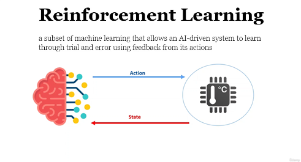
>
>A la izquierda y a la derecha, el cerebro.
>Esa es la IA de tu coche autónomo, y a la derecha, el entorno por el que circula.
>La carretera, la gente, los semáforos, etc.
>Correcto.
>Todo lo relacionado con el entorno del coche.
>Por ejemplo, pones el coche en marcha hacia un destino y empiezas a observar su comportamiento.
>
>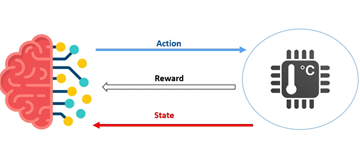
>
>Y si el coche hace algo correctamente, le das esta recompensa.
>Si el coche hace algo incorrecto, le das la misma recompensa, pero de forma negativa.
>Así que le das o le quitas puntos.
>
>Pongamos un ejemplo:
>Has empezado a conducir.
>Y entonces el coche empieza a moverse en línea recta.
>Y por cada segundo, o quizás por cada 2 o 3 segundos que el coche conduce correctamente, le das esta recompensa, y la das constantemente.
>Ahora imaginemos que el coche llega a un semáforo y no reduce la velocidad.
>Entonces le das diferentes recompensas, pero de forma negativa.
>
>Imagina que el coche cambia de carril sin señalizar.
>Entonces eso también es algo negativo, o está superando el límite de velocidad.
>Y eso otra vez.
>Correcto.
>Le das puntos negativos y entonces el coche o el sistema de IA aprenderá, como si le estuvieras enseñando a un niño. Si haces eso, no está bien.
>
>Pero esto sí está bien.
>Esto sigue estando bien.
>Sigue estando bien.
>
>Una vez que superas los 80 km/h, ya no está bien.
>Es ilegal.
>¿Verdad?
>Porque estás superando el límite de velocidad, etc.
>
>Esto es aprendizaje por refuerzo.
>Y esta es otra forma de entrenar tu algoritmo de aprendizaje automático para que se comporte mejor simplemente ofreciendo recompensas o dando y quitando puntos, según las decisiones que haya tomado la IA.


### 18. Importance of Training Data

>[!NOTE]
>
>Probablemente ya hayas oído hablar de la palabra "basura entra, basura sale".
>En la inteligencia artificial, en la IA generativa, los datos son lo más importante.
>Después de eso, se aplican a tu algoritmo de aprendizaje automático, a tus sesgos y a las decisiones que tomas.
>Así que, en el caso de la IA, o en el de la IA generativa y los grandes modelos de lenguaje, los datos provienen de todas partes.
>
> * **Extract:** El primer paso al gestionar tus datos se denomina extracción.
>Esto significa que tienes una especie de lago de datos, algo que abarca todo tipo de contenido que puede alimentar tu algoritmo de aprendizaje automático.
>Por ejemplo, tienes imágenes, archivos de vídeo, archivos de audio, archivos de texto, código o cualquier cosa que puedas tener en cualquier lugar.
>Y lo primero que debes hacer al gestionar u obtener tus datos de entrenamiento, es extraer los datos relevantes para tu modelo.</br></br>
>Y después de decidir, ¿qué quieres usar?</br></br>
>Por ejemplo, si estás entrenando datos o un modelo que usan los desarrolladores, lo más probable es que también consultes diferentes repositorios de GitHub.
>Consultarás Stack Overflow y cualquier otro tipo de foros, o quizás materiales, conferencias o cursos relacionados con la informática.Y después de decidir, ¿qué quieres usar?
>Por ejemplo, si estás entrenando datos o un modelo que usan los desarrolladores, lo más probable es que también consultes diferentes repositorios de GitHub.
>Consultarás Stack Overflow y cualquier otro tipo de foros, o quizás materiales, conferencias o cursos relacionados con la informática.
>
> * **Transform:** Después de extraer todos estos datos, se pasa por la fase llamada transformación.
>Transforma los datos.
>Los prepara para que el algoritmo pueda procesarlos.
>Los baraja.
>Los procesa por lotes.
>Realiza algún tipo de ampliación o simplemente, eh, algún tipo de filtrado.
>Sí.
>Datos buenos versus datos malos, o datos estadísticamente relevantes versus datos que no tienen relevancia estadística, porque, de nuevo, depende de cómo y qué tipo de datos introduzcas en tu algoritmo de aprendizaje automático.
>La calidad de tu modelo dependerá de ello.
>Datos malos o sesgados equivalen a un modelo sesgado, o quizás a un modelo deficiente.
>Sí.
>
> * **Model:** Después de esto, introduces estos datos en tu modelo.
>Se trata de una especie de proceso ETL: extraes, transformas y luego los cargas en tu modelo.
>A lo largo de toda esta cadena (extraes, transformas y cargas), compruebas que los datos no estén sesgados o los eliminas.
>Compruebas si hay datos corruptos.
>Yo compruebo si hay datos falsos o noticias falsas.</br></br>
>Por ejemplo, no conviene entrenar tu modelo con noticias falsas, datos estadísticamente relevantes o sesgados, datos de odio, etc.
>Por eso, al trabajar con modelos de lenguaje grandes, los datos de entrenamiento son lo más importante que puedes tener para entrenar tu modelo.
>No para hablar, ni para generar contenido, sino para ser políticamente correcto.
>Por ejemplo, si quieres ser ético, si no necesitas tener sesgos, o si quieres hablar bien o escribir con corrección gramatical, debes asegurarte de que los datos de entrenamiento también sean gramaticalmente correctos, y la lista continúa.
>Así que recuerda que tus datos de entrenamiento deben ser limpios, no deben estar sesgados y deben ser relevantes para el modelo que intentas crear.
>
>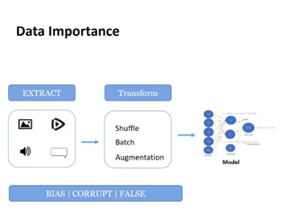


### 19. What actually is GEN AI

>[!NOTE]
>
>Y ahora llegamos a la pregunta: ¿qué es la IA generativa?
>
>Hemos aprendido sobre modelos de aprendizaje automático, datos etiquetados y no etiquetados, y redes neuronales.
>Entonces, ¿cómo se integran todos estos elementos?
>Bueno, en primer lugar, lo que hay que decir sobre la IA generativa es que no se compone solo de grandes modelos de lenguaje, porque sabemos que la IA generativa puede producir imágenes.
>Pero sabemos que LLM solo puede proporcionar texto.
>
>Sabemos que tenemos datos sin etiquetar, datos etiquetados y código.
>Y contamos con muchas herramientas para entrenar nuestro modelo base.
>Hemos entrenado nuestro modelo con toda esta cantidad de datos, y el modelo continúa entrenándose a sí mismo basándose en los nuevos datos que obtiene o en la retroalimentación de los usuarios.
>Después de eso, este modelo base también puede generar contenido porque sabe cómo descomponerlo en estos parámetros.
>También puede hacer lo contrario.
>Así que si sabes cómo ir de A a B, también sabes cómo ir de B a A o quizás una variación de esto.
>
>Esto también se trata de generar contenido, ya que sabe cómo se ve un perro a partir de estos 76 mil millones de parámetros.
>Solo te dará una ligera variación de esos parámetros cuando se los indiques.
>Genera un perro para mí.
>Correcto.
>Y generativo.
>Generará contenido y te lo mostrará.
>Puede ser código, texto, un libro, cualquier cosa.
>Pero lo importante es saber qué es generativo y qué no.
>
>En primer lugar, una frase, un poema, cualquier cosa generativa, forma parte de la IA generativa.
>Pero si es un número, una probabilidad, si es verdadero o falso, no forma parte de la IA generativa.
>Es solo un cálculo.
>En resumen, todo esto encaja perfectamente.
>Y forman esta IA generativa.
>
>En nuestro caso, si vamos más allá de la idea de grandes modelos de lenguaje que funcionan con texto y se desea crear imágenes, esto significa que la IA generativa es toda una rama de la IA que se centra en proporcionar o aplicar diferentes algoritmos y patrones de aprendizaje automático para generar lo que se desee generar.
>Ya sea código, un poema, un discurso, texto, imágenes, etc.
>
>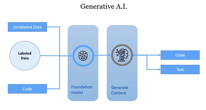


### 20. Transformer Architecture Model

>[!NOTE]
>
>[?")](https://www.youtube.com/watch?v=ZXiruGOCn9s)
>
>No, no son esos transformadores.
>Pero pueden hacer cosas geniales, déjame mostrarte.
>¿Y por qué el plátano del otro lado de la calle?
>
>¡Porque estaba harto de que lo aplastaran!
>Sí, no sé si lo entiendo bien.
>Y eso es porque lo creó una computadora.
>
>Literalmente le pedí que me contara un chiste.
>Y esto es lo que se le ocurrió.
>Específicamente, usé un GPT-3, o un modelo de transformador generativo preentrenado.
>
>El 3 aquí significa que esta es la tercera generación.
>GPT-3 es un modelo de lenguaje autorregresivo
>que produce texto que parece escrito por un humano.
>GPT-3 puede escribir poesía, redactar correos electrónicos y, evidentemente, inventar sus propios chistes.
>¡Vamos!
>
>Ahora bien, aunque nuestro chiste del plátano no es precisamente gracioso,
>sigue el patrón típico de un chiste con un planteamiento y un remate, y en cierto modo tiene sentido. ¿Quién no cruzaría la calle para evitar ser aplastado?
>
>Pero mira, GPT-3 es solo un ejemplo de transformador.
>Algo que transforma de una secuencia a otra.
>Y la traducción de idiomas es un gran ejemplo.
>Quizás queramos tomar nuestra frase "¿Por qué el plátano >cruzó la calle?",
>y traducirla al francés.
>
>Bueno, los transformadores constan de dos partes: un codificador y un decodificador.
>
>El codificador trabaja con la secuencia de entrada,
>y el decodificador con la secuencia de salida.
>Ahora bien, a primera vista, la traducción parece poco más que una simple búsqueda,
>
>así que convierte el "por qué" de nuestra frase en inglés a su equivalente en francés: "pourquoi".
>Pero, por supuesto, la traducción de idiomas no funciona así.
>
>Cosas como el orden de las palabras y los giros idiomáticos a menudo generan confusión. Los transformadores funcionan mediante aprendizaje secuencia a secuencia, donde el transformador toma una secuencia de tokens, en este caso palabras de una oración, y predice la siguiente palabra en la secuencia de salida. Esto se logra iterando por las capas del codificador, de modo que el codificador genera codificaciones que definen qué partes de la secuencia de entrada son relevantes entre sí y luego pasa estas codificaciones a la siguiente capa. El decodificador toma todas estas codificaciones y utiliza su contexto derivado para generar la secuencia de salida.
>
>Los transformadores son una forma de aprendizaje semisupervisado.
>Por "semisupervisado", nos referimos a que se entrenan previamente de forma no supervisada con un gran conjunto de datos sin etiquetar y luego se perfeccionan mediante entrenamiento supervisado para optimizar su rendimiento.
>
>En videos anteriores, he hablado de otros algoritmos de aprendizaje automático que procesan la entrada secuencial como lenguaje natural. Por ejemplo, existen redes neuronales recurrentes (RRN).
>
>Lo que diferencia a los Transformers es que no necesariamente procesan los datos en orden.
>Los Transformers utilizan un mecanismo de atención.
>Este proporciona contexto en torno a los elementos de la secuencia de entrada.
>Así, en lugar de comenzar la traducción con la palabra "por qué" porque está al principio de la oración, el Transformer intenta identificar el contexto que aporta significado a cada palabra de la secuencia.
>
>Y es este mecanismo de atención lo que les da a los Transformers una gran ventaja sobre algoritmos como las RNN, que deben ejecutarse en secuencia.
>
>Los Transformers ejecutan múltiples secuencias en paralelo.
>Y esto acelera enormemente los tiempos de entrenamiento.
>Más allá de las traducciones, ¿a qué se pueden aplicar los Transformers?
>
>Bueno, los resúmenes de documentos son otro gran ejemplo.
>Se puede introducir un artículo completo como secuencia de entrada y luego generar una secuencia de salida que, en realidad, consistirá en un par de oraciones que resumen los puntos principales. Los Transformers pueden crear documentos completamente nuevos, por ejemplo, escribir una entrada de blog completa.
>
>Y más allá del lenguaje, los Transformers han hecho cosas como aprender a jugar ajedrez y realizar un procesamiento de imágenes que incluso rivaliza con las capacidades de las redes neuronales convolucionales.
>
>Mira, los Transformers son un potente modelo de aprendizaje profundo y, gracias a la capacidad de paralelizar ese mecanismo, están mejorando constantemente.
>¿Y quién sabe?
>Muy pronto, tal vez incluso puedan hacer chistes de plátanos que sean realmente graciosos.

### Quiz 1: Chapter Quiz

>[!NOTE]
>
>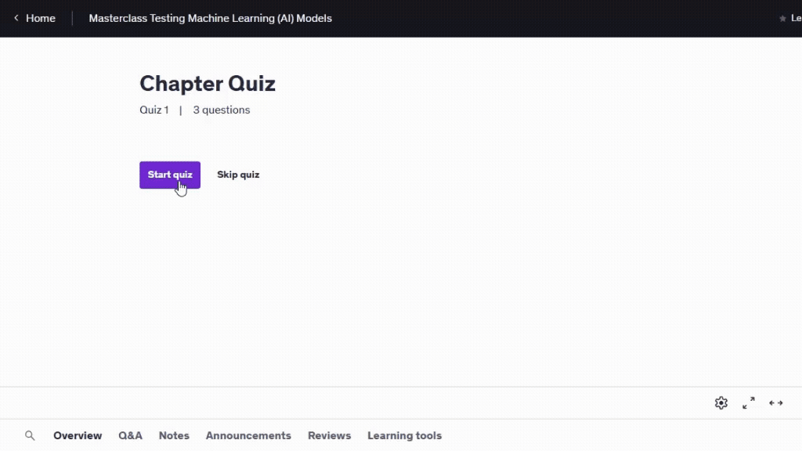


## Section 4: Overview of Machine Learning Model Testing

### 21. Types of Testing in Software

>[!NOTE]
>
>Antes de adentrarnos en la parte esencial de las pruebas de lenguaje, entendamos un poco cómo funcionan las pruebas de software.
>Quizás ya sepas esto.
>Si lo sabes, puedes omitirlo, pero si no, podemos simplemente resumir:
> * **¿qué significa ingeniería de calidad?**
>Generalmente se le llama pruebas de software.
>Por lo tanto, la ingeniería de calidad es el gran ámbito que se encarga de verificar que se tenga un cierto nivel de calidad en cualquier cosa.
>
> * Una parte de la ingeniería de calidad se denomina pruebas de software.
>Ahora bien, las pruebas de software.
>Tradicionalmente se dividen en
>   * pruebas funcionales y, por supuesto,
>   * pruebas no funcionales.
> * Y si analizamos qué son las pruebas funcionales, nos referimos a qué hace nuestro producto.
>Qué hace.
>Por ejemplo, si queremos ir de A a B, el programa nos dará una ruta.
>Y eso es lo que hace.
>Esa es una funcionalidad.
>
>   * Las pruebas no funcionales se refieren al rendimiento de nuestra aplicación, sea lo que sea que necesite realizar.</br>
> Algunos ejemplos son las pruebas de rendimiento.
>¿Qué tan rápido carga nuestra página web?
>¿Qué tan rápido genera una imagen nuestro modelo de lenguaje?
>Cuando decimos que generemos una imagen para nosotros.
>   * Las pruebas de seguridad se refieren a que, independientemente de lo que hagamos, está protegido y nadie puede acceder a esa información si no se le permite acceder a ella.
>Y hay más.
>
> * La parte funcional, nuevamente, se divide en varias áreas.
>Pero el objetivo principal es qué hace nuestra aplicación.
>   * Por ejemplo, las pruebas de aceptación del usuario forman parte de las pruebas funcionales.
>   * Luego, se pueden realizar pruebas unitarias, pruebas de integración y pruebas de interfaz de usuario.
>Todas se consideran parte de las pruebas funcionales.
>   * También es posible que quieras verificar tus requisitos.
>Así que asegúrate de que tu aplicación funcione correctamente.
>Sí, en comparación con tus requisitos.
>
>En resumen, estas son tus pruebas de software.
>Y esto es a gran escala.
>Lo que validas, por supuesto, es que sabes que puedes hablar durante horas sobre qué son las pruebas de software.
>Pero para el propósito de nuestra lección, necesitamos entender qué es esto.
>
>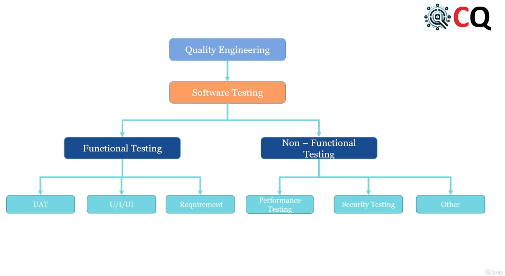


### 22. Understand how ML models are tuned - General View

>[!NOTE]
>
>Ahora solo quiero tomarme un par de minutos para explicar cómo ajustar cualquier tipo de modelo.
>Es muy fácil.
>Es como cualquier otro software.
>Como pueden ver, esto es similar al concepto de ramificación.
>
>Podrían tener su repositorio de modelos.
>Podrían pensar en esto como la línea principal, el tronco.
>Y esto podría ser una rama.
>
>Entonces, lo primero que hacen es modificar su modelo para tener una nueva idea o si su modelo ha sido...
>eh, hay alguna degradación, o quieren mejorar su algoritmo o lo que sea.
>
>Entonces, lo que haces es modificar el código que cambia tu conjunto de datos y luego ejecutar algunas pruebas preentrenadas.
>Esto significa que aquí mismo estás ejecutando la prueba en un modelo preentrenado.
>Justo en el modelo que está aquí.
>
>Después, vuelves a entrenar el modelo con los datos más recientes, ya que podrías entrenarlo gracias a los datos.
>Podrías tener nuevos datos en el concepto de desviación de datos o desviación del modelo.
>
>Quieres entrenar con datos nuevos porque los antiguos ya no son relevantes para la situación actual, o has cambiado tu algoritmo.
>Tu modelo de aprendizaje automático se ha modificado con nuevos parámetros.
>Y por eso, ahora mismo estás entrenando tu modelo con tu nuevo algoritmo.
>Y luego ejecutas la nueva prueba.
>
>Así que ahora tienes pruebas que deben validar que el entrenamiento se ajusta a lo que tienes, a lo que quieres hacer con tu modelo más reciente.
>Ese es el punto clave.
>
>Necesitas obtener algunos resultados, pero después de entrenar, buscas otros resultados que correspondan al nuevo parámetro.
>Y, por supuesto, esta prueba.
>También se combinan algunas métricas.
>Así que las métricas y los resultados se combinan.
>
>Es como ejecutar una UAT o validar los resultados de la UAT, como podría ser este.
>Y luego la apruebas y la implementas directamente en producción.
>Por supuesto, también hay una parte donde se podría hablar de depuración de datos.
>Así podría ser.
>
>Pero suponiendo que tus datos ya están limpios, no necesitas depurar los datos en este punto.
>Correcto.
>Esto significa que te aseguras de que los datos que obtienes sean correctos y no estén sesgados.
>Eh, son relevantes, etc.
>
>Al igual que con cualquier tipo de ramificación, se modifica la prueba, se ejecuta una prueba previa al entrenamiento, se entrena, se valida el entrenamiento, se revisa, se aprueba y, finalmente, se implementa en producción.
>Y aquí, por supuesto, se vuelve a supervisar.
>Así es como se ajusta cualquier modelo de aprendizaje automático.
>
>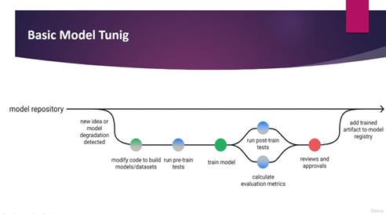


### 23. Fine tunning techniques for AI and any LLM foundation model

>[!NOTE]
>
>Para comprender completamente la IA, necesitamos detenernos un momento y pensar en el ajuste del modelo.
>Lo que ven aquí es un ciclo de vida estándar para ajustar un modelo base.
>Porque lo que sucede es que obtendrán, por ejemplo, Llama 3, o ChatGPT 01 o cualquier otro modelo de lenguaje extenso.
>Si se trata de un fanático chino, tal vez podrían obtener la versión 3 profunda, y así sucesivamente.
>Y aquí es donde terminan, ¿verdad?
>
>Así que, de todo el ciclo de vida, preparan sus datos, seleccionan su modelo base y luego evalúan el mejor modelo para su tarea.
>Por ejemplo, he visto que Claude Sonnet 3.5 es mejor que ChatGPT 4 en codificación.
>Así que quizás seleccione Cloud 3.5 y lo use para codificar.
>Y después de eso, necesito ajustar mi modelo.
>Esto significa que necesito preparar mi modelo para la tarea específica que quiero realizar.
>Porque, no olvidemos que un modelo base como ChatGPT sirve para todo, así que necesitamos mejorarlo para la tarea en cuestión.
>
>[](https://mostly.ai/blog/machine-learning-life-cycle-with-synthetic-data#what-is-a-machine-learning-life-cycle)
>
>Comenzaremos con el conjunto de datos.
>Tienes el conjunto de datos de preentrenamiento y el conjunto de datos de ajuste.
>Lo llamaremos así.
>Selecciona el conjunto de datos completo, que es el 100%, llamémoslo así.
>Y luego volverás a entrenar.
>
>Los modelos ejecutarán el algoritmo de entrenamiento con entre el 60% y el 70% de los datos.
>Tu modelo se entrenará con estos datos.
>Después de entrenar tu modelo con estos datos, del 30% o 40% restante, dependiendo de cómo lo dividas,
>necesitamos seleccionar la mitad.
>
>Imaginemos que el 20% se evaluará durante el entrenamiento.
>Entrenamos el modelo y luego evaluamos durante el entrenamiento para que la inferencia, que es básicamente la predicción, se acerque a lo que buscamos.
>Y luego, para el resto, probamos el modelo en un entorno sin entrenamiento, ya que esto es entrenamiento puro.
>Esto es entrenamiento y evaluación.
>Así que evalúas tus parámetros para que las inferencias se acerquen a lo deseado.
>Y aquí esto es evaluación pura, sin entrenamiento.
>
>Así que esta es una forma de guiar tu modelo, basándote en tus datos, para que se acerque más a lo que realmente quieres lograr.
>Esta es una forma de, digamos, evaluar o ajustar tu modelo.
>
>[](https://medium.com/data-science/data-splitting-technique-to-fit-any-machine-learning-model-c0d7f3f1c790)
>
>La siguiente forma de perfeccionar tu modelo es con indicaciones.
>Si sabes, puedes usar este generador de GPT, que te permite perfeccionar un modelo; de hecho, crear tu propio modelo.
>Lo que hace es, básicamente, perfeccionarlo para una tarea específica.
>Tengo la guía de certificación, mi propio modelo de perfeccionamiento, diseñado específicamente para ayudar a las personas a aprobar la certificación.
>Si revisamos la configuración, editamos mi GPT, encontrarás las instrucciones.
>
>[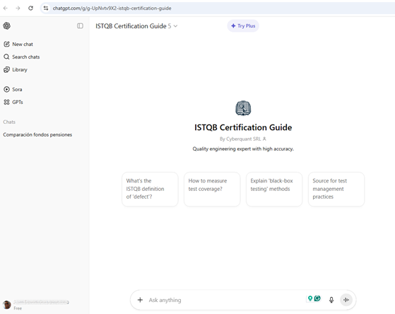](https://chatgpt.com/g/g-UpNvtv9X2-istqb-certification-guide)
>
>Otra opción podría ser usar barandillas.
>AWS ofrece un servicio llamado barandillas.
>Y de lo que quiero hablar específicamente es de bloquear temas no deseados.
>Quizás quieras que tu modelo no trate un tema específico.
>Quizás esté prohibido hablar de cualquier tema.
>
>Así que puedes implementar este tipo de barandillas en tu modelo para que solo tú lo sepas.
>Se permite la generación de código y no se permite nada que esté fuera de las decisiones o políticas de tu empresa.
>Esta es otra forma de ajustar tu modelo de forma granular para restringir la cantidad y los temas que puede gestionar.
>
>Estas son las formas más sencillas de ajustar tu modelo si quieres trabajar con diferentes parámetros, como el funcionamiento interno de los modelos de aprendizaje automático, como las redes neuronales.
>
>Luego necesitas profundizar mucho en los modelos de entrenamiento, el aprendizaje automático y las matemáticas.
>Pero, ya sabes, eso es bastante difícil.
>La forma más fácil es recordar los datos.
>Se hace con indicaciones y recopilaciones.
>
>[](https://aws.amazon.com/es/bedrock/guardrails/)
>
>


### 24. Overall Testing Approach to LLMs

>[!NOTE]
>
>Ahora hablemos de nuestro enfoque para probar modelos lingüísticos grandes.
>El problema es que, en nuestro escenario, o en el caso de los modelos lingüísticos grandes, es casi imposible probarlo todo, ya que las aplicaciones son prácticamente infinitas.
>
>Por lo tanto, necesitamos un enfoque más estructurado para que, al probar algo, pueda aplicarse en toda la cadena de valor de, digamos, toda la industria.
>Por lo tanto, en nuestro material, al probar modelos lingüísticos grandes, nos referiremos a tres elementos diferentes.
>
>El primero trata sobre los datos que necesitamos para probar cómo se utilizan en los modelos lingüísticos grandes.
>
>Necesitamos comprobar que los resultados no contengan datos sesgados.
>Si introduces datos sesgados, quieres asegurarte de que el resultado que obtienes no lo esté.
>Por lo tanto, los modelos de lenguaje grandes necesitan asegurarse de contar con este tipo de medidas de seguridad.
>
>Al cargar los datos o al proporcionar el resultado, analizaremos datos estadísticamente irrelevantes, ya que, como ya hemos dicho, los modelos de lenguaje grandes son máquinas de predicción estadística.
>Si las estadísticas no son relevantes, el resultado tampoco lo es.
>Por lo tanto, estas máquinas deben tener la capacidad de filtrar este tipo de datos: datos desequilibrados.
>
>Estos datos son estadísticamente relevantes, pero no están, digamos, equilibrados ni a la izquierda ni a la derecha. Veremos qué significa esto, o datos obsoletos, porque aprenderemos sobre el concepto de deriva.
>
>Podrías entrenar tu modelo con datos relevantes de hace 15 años, pero que ya no se aplican hoy en día, y, por supuesto, con otros.
>Luego, haremos pruebas con indicaciones.
>Y cuando digo indicaciones, también me refiero a las API.
>
>Cuando llamas a una API para un modelo de lenguaje grande, básicamente la estás indicando, pero con un tipo de indicación diferente.
>Pero no te preocupes tanto por cómo probar una API.
>Estoy bastante seguro de que puedes encontrar eso en línea.
>Veremos cómo usar indicaciones para ver si tu modelo de lenguaje grande tiene diferentes capacidades de razonamiento.
>Y, por supuesto, usaremos indicaciones en cascada.
>
>Por ejemplo, indicaciones de cero disparos, indicaciones iterativas, cadena de pensamiento, indicaciones contrafácticas, entre otras.
>Sí, creo que este será el capítulo más importante que abordaremos.
>
>Y un último punto que analizaremos es la regulación de la UE.
>Y, por supuesto, la parte ética.
>Aquí analizaremos las prácticas prohibidas para garantizar que se cuente con las salvaguardas necesarias.
>Transparencia en la toma de decisiones.
>Documentación técnica y, por supuesto, mantenimiento de registros.
>Esto también está regulado.
>Y la capacidad de las personas para supervisar cualquier tipo de interacción con la IA.
>
>Y el último punto se refiere a los datos y su gobernanza.
>Esto es, ya saben, la parte principal. Habrá otra parte intermedia sobre seguridad y diferentes tipos de ataques que se pueden realizar para exponer datos o quizás inyectar datos que no se desean.
>Pero hablaremos de eso más adelante.
>
>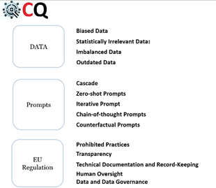
>


### 25. Testing Types for LLMs | Foundation Models

>[!NOTE]
>
>Así que, al pensar en pruebas no funcionales para un modelo de lenguaje grande, ya hemos decidido que, de nuevo, se debe tener rendimiento, seguridad, portabilidad, escalabilidad, registro, monitorización y auditorías.
>Cierto.
>Todo esto.
>
>
>
>Pero los modelos de lenguaje grandes o la IA también necesitan ir más allá del software tradicional, porque giran en torno a la inteligencia.
>Y recuerden, inteligencia.
>
>Si lo crean humanos, debe imitar el comportamiento humano.
>Por lo tanto, debe pensar como un humano, con sus virtudes y defectos.
>Y por esta razón, al pensar en probar modelos de lenguaje grandes, y específicamente, no funcionales, necesitamos incorporar al menos tres tipos más de pruebas.
>Y en primer lugar, se trata de la ética en torno a su modelo de lenguaje grande.
>
> * En primer lugar, se tratará la **ética** en torno a su modelo lingüístico general.
>Porque si se utilizan estos modelos, deben incorporar la ética humana.
>Y también sabemos que, a lo largo de la historia, la ética humana no ha evolucionado.
>Quizás no teníamos ética en la Edad Media.
>Quizás teníamos algo de ética hace unos 100 años y ahora es diferente.
>Por lo tanto, la ética debe evaluarse según los tiempos modernos, según lo que es ético en la actualidad.
>Esto es algo que analizaremos en los próximos capítulos.
>
> * Y luego está la parte **adversarial**.
>Y cuando digo adversarial, me refiero a un tipo especial de prueba de seguridad que consiste en usar indicaciones para que el modelo actúe de forma poco ética, para recopilar información del modelo, para extraer información y para engañarlo para que haga algo poco ético.
>Inyectar indicaciones.
>Envenenar los datos para que el modelo actúe de forma poco ética o maliciosa, o quizás enseñarte a fabricar una bomba.
>Por lo tanto, las pruebas adversariales son un tipo de seguridad y también las abordaremos en los próximos capítulos.
>
> * Y quizás uno de los aspectos más interesantes es si tu modelo de IA puede actuar como un **humano**.
>Esto significa que cuando hablo con el modelo Doe, ¿siente que le estoy hablando?</br>
>En primer lugar, ¿es un robot o tiene consistencia?
>¿Pierde contexto?
>¿Es ético?
>¿Habla de la misma manera?
>¿Tiene solidez en la conversación?
>
>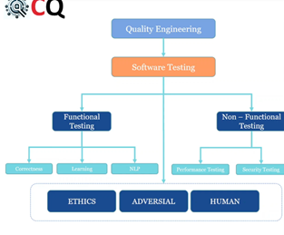
>
>Estos también son algunos aspectos no funcionales del modelo.
>Pero si no los tienes, si el modelo, al hablar con él, se siente torpe y estúpido,
>y estás teniendo una conversación sobre algo.
>Y de repente, el modelo responde a una pregunta diferente, y siempre responde de forma diferente,
>y no entiende y te da la misma respuesta una y otra vez.
>
>Es decir, tiene todos los aspectos, quizás no funcionales.
>Puede que tenga la parte funcional, pero no actúa como un humano. Así que te vas a frustrar.
>También probaremos este tipo de lado humano, parte de los aspectos no funcionales de un chatbot, o quizás de un modelo de lenguaje más amplio.


### 26. Introduction to Benchmarking for LLMs

>[!NOTE]
>
>En cualquier tipo de industria, digamos.
>Existen ciertos puntos de referencia.
>Existen empresas, o quizás no solo empresas, foros que comparan una cosa con otra para saber cuál es mejor.
>
>Por ejemplo, en la industria de los videojuegos, existen CPU o GPU.
>En ciertas aplicaciones o juegos, se comparan en función de los fotogramas por segundo que pueden ofrecer.
>Y esto puede aplicarse a cualquier cosa.
>
>Por ejemplo, en la industria automotriz, es la vuelta a Nürburgring.
>Entonces, ¿qué tan rápido puede un auto dar esa vuelta de 40 km? Y la lista continúa.
>Y, por supuesto, para la IA existen diferentes tipos de puntos de referencia.
>
>Pero entendamos cómo funciona el benchmarking en un modelo de IA.
>Porque normalmente, por ejemplo, si quisiera saber si mi hija sabe contar hasta diez,
>lo haría.
>Sé contar hasta diez.
>Cierto.
>
>Es, digamos, una verdad obvia.
>Cómo contar hasta diez en cualquier idioma: uno, dos, tres, etc.
>Así que si quisiera saber si mi hija sabe contar hasta diez, le pediría que contara hasta diez.
>Y si dijera uno, dos, tres, cuatro, cinco, etc., le diría que sí, pero si dice uno, cuatro, nueve y luego ocho, sabría que, en comparación con el punto de referencia, no está rindiendo como debería.
>
>Así que es básicamente una comparación.
>
>Si la comparación da igual, sabes que has aprobado.
>Si no, no obtienes puntuación y entonces realizas la evaluación.
>
>Básicamente, comparas los resultados y realizas estas pruebas para quizás 100 preguntas, 100 problemas matemáticos diferentes, 100 problemas científicos diferentes, problemas universitarios.
>Dependiendo de lo que necesites analizar, existen herramientas de evaluación comparativa específicas.
>
>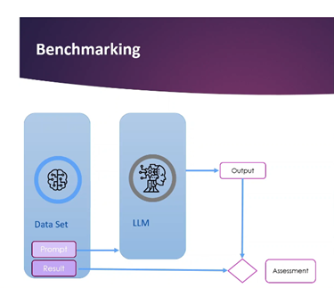
>
>Así es como funciona la evaluación comparativa, no solo en IA, sino en cualquier ámbito.
>Pero en el caso de la IA, necesitas datos de referencia.
>Necesitas un modelo de lenguaje extenso.
>
>Necesitas algún tipo de herramienta para comparar el resultado dado con el resultado generado por el modelo de lenguaje extenso. Los introduces en un mecanismo de puntuación, luego emites una puntuación y listo.
>Puedes comparar diferentes modelos de lenguaje extensos entre sí dentro del mismo conjunto de datos.
>


## Section 5: Common Traditional Metrics for ML Models and how to calculate them

### 27. Understanding how to compute any score

>[!TIP]
>
>**Understanding how to compute any score**
>
>In case you have not watched Lecture 1 of Section 3( Introduction to Benchmarking for LLMs)  revisit, that since it contains information that is vital to understand the following 5-6 lectures.
>


### 28. Ground Truth Table - source of Truth | Test Oracle

>[!NOTE]
>
>Lo que veremos ahora es cómo calcular la puntuación F1, la precisión, la predicción, la veracidad, etc.
>Pero para ello, necesitamos que se cumpla una condición previa específica.
>Necesitamos los datos de prueba de referencia que se utilizan para calcular la puntuación.
>
> Y quiero presentar un concepto llamado tabla de verdad fundamental.
>Y para explicarlo, los guiaré a través de todo el proceso de prueba para calcular todos estos elementos.
>
> * **String:** Así que lo primero que necesitarán es una cadena, una cadena muy larga y compleja, que contenga muchos sustantivos, nombres de animales, entidades, empresas y personas.
>
> * **Prompt:** Así que no solo verbos, sustantivos, etc., sino que también tiene entidades que definen algo especial.
>En mi ejemplo, tengo una entidad de 100 cadenas, y sin la entidad, o sobre ella,
>necesitarías una indicación.
>Y, como sabes, la indicación se puede usar simplemente para decir: "¿Qué hay en la entidad?".
>O no necesitas una indicación cuando simplemente preguntas algo más.</br>
>Pero en nuestro caso, necesitamos especificar que queremos que el modelo realice este tipo de reconocimiento de entidades.
>
> * **LLM(Model):** Lo que necesitas, por supuesto, es un modelo bastante obvio.
>Para validar esto, necesitarás un modelo.
>Envías una cadena, digamos 100, una oración, una frase o quizás un párrafo, de una página, por ejemplo.
>Y le pides al modelo que calcule el reconocimiento de entidades de nombre para todo.
>Eso incluye espacios, signos de puntuación, absolutamente todo.</br>
>¿Y qué sucede?
> * **Output:** El modelo proporcionará un resultado en forma de tabla, que les mostraré.
>Por ejemplo, en el ejemplo que tenemos, la columna A será el nombre de la entidad.
>La columna B será un código que se asigna a una entidad específica.
>Y la columna C será la explicación del código para el usuario.
>Esto se denomina, digamos, tabla de predicción, lo que el modelo ha predicho.
>
> * **Truth Table:** También tendrás otra creada por ti.
>Esta será la tabla de verdad fundamental.
>Así que tendrás ambas y compararás la tabla de verdad fundamental.
>Básicamente, esta de aquí.
>   * Lo que está a la derecha.
>   * Compararás esta con lo que viene de la izquierda.
>   * Y luego podrás calcular todo lo que queremos hacer en el siguiente material.
>Ahora, permíteme darte un ejemplo de la tabla de verdad fundamental que tengo ahora mismo.
>
>")
>
>Este lo compararás con lo que viene de la izquierda.
>Y luego podrás calcular todo lo que queremos hacer en el siguiente material.
>Ahora, permítanme darles un ejemplo de la tabla de verdad fundamental que tengo ahora mismo.
>En mi tabla, como pueden ver, esta es una cadena que estoy usando.
>La encuentran en línea, van a cualquier parte, buscan un artículo y luego simplemente copian algunos elementos.
>
>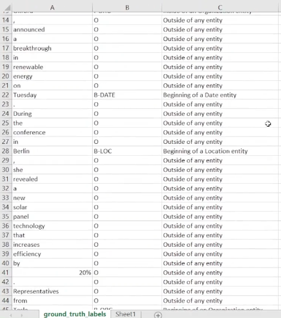
>
>Lo encuentras en línea, vas a cualquier parte, consigues un artículo y luego simplemente copias algunos elementos.
>Y con base en esta cadena, así es como se ve mi tabla de verdad fundamental.
>Lo que podemos ver es el token "doctor".
>Vemos la etiqueta de verdad fundamental.
>
>Esta es la etiqueta y la descripción: el comienzo de una entidad personal.
>Esto es lo que significa "beeper".
>La identidad de Sarah I, la identidad de Thompson I y todo es todo lo externo a una entidad.
>
>Universidad de Oxford, como pueden ver, el comienzo de una entidad de organización, etc.
>Así que todos los tokens, incluso el punto, la coma, todo.
>Supongamos que se identifican los signos.
>Esta es la verdad.
>Este es nuestro punto de referencia.
>Esta es nuestra línea base.
>Y con este texto, lo usaremos para probar la puntuación f1, la precisión, etc.


### 29. Obtain the Prediction table from the LLM - Google Gemini

>[!NOTE]
>
>Entonces, donde lo dejamos la última vez, teníamos esta cadena que usamos para establecer una especie de punto de referencia, y luego creamos esta etiqueta de verdad fundamental.
>Y, por cierto, todos estos son tokens, ¿verdad?
>
>Así que tenemos tokens, la etiqueta de verdad y la descripción para que podamos entender de forma sencilla y fácil lo que intentamos hacer.
>Y lo creamos manualmente.
>Así que lo que vemos aquí ha sido configurado manualmente por una persona.
>
>Y lo que queremos hacer ahora es asegurarnos de que nuestro modelo de lenguaje grande intente hacer exactamente lo que hemos hecho aquí.
>Para eso, he creado esta instrucción.
>Y la instrucción es la siguiente:
>Basada en este texto.
>Y he creado un texto aquí, el que tenemos.
>
>Quiero que identifiques todos los tokens o palabras, los cuantifiques y, digamos, los etiquetes con las siguientes etiquetas.
>Etiquétalos con las siguientes etiquetas.
>Suena tonto, pero funciona.
>Estas son todas las etiquetas posibles que tenemos:
>
>Fecha, inicio de una entidad de fecha, B-loc, inicio de una entidad de asignación.
>Estos son básicamente todos los elementos que tenemos.
>Colócalos en una tabla y muéstrame dos columnas:
>Nombre de la entidad y una etiqueta.
>
>Ahora, si miras aquí y volvemos a nuestra tabla, he añadido algunos filtros.
>Estos son todos los valores posibles que tenemos.
>Y aquí, de nuevo, todos los valores posibles que tenemos.
>Todos forman parte de la solicitud.
>Lo que he hecho es tomar esta solicitud y usar Google Gemini.
>
>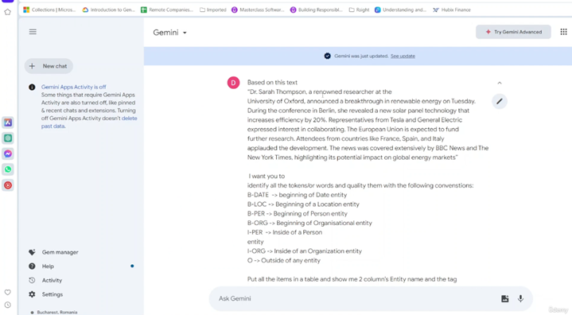
>
>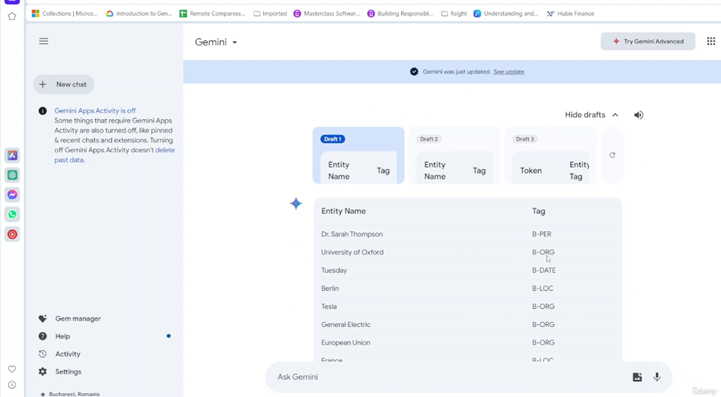
>
>Y lo que sí me gusta de Gemini.
>
>Me ha dado varias opciones, ya sea de esta manera, y las entidades se agrupan por entidad o por token, y esto es lo que queremos.
>Queremos por token.
>Esto es lo mejor.
>
>Ahora exportaré esto a hojas de cálculo.
>Luego copiaremos esto.
>Y los tendremos uno tras otro.
>Así que obtendré esta columna completa.
>Veamos si puedo copiar así.
>Y lo insertaré aquí.
>
>Y simplemente diré "ID de etiqueta".
>Pero esto es una predicción.
>Predicción.
>Y ahora tenemos la predicción.
>Y tenemos el ID de etiqueta de verdad fundamental.
>
>Y con base en estos elementos, calcularemos diferentes métricas que usaremos para evaluar la eficiencia y precisión de nuestros modelos.

### 30. Machine Learning Metrics - Accuracy

>[!NOTE]
>
>**¿Qué es exactamente la precisión?**
>
>El nombre es bastante indicativo y simple.
>La precisión en sí misma representa la proporción de predicciones correctas realizadas por el modelo.
>De todas las predicciones.
>Para simplificar,
>
>Imagina que haces un examen con 100 preguntas y preguntas.
>Responderemos estas preguntas e imaginaremos que, de las 100 preguntas, respondes 80 correctamente, por lo que
>tu precisión es del 80 %.
>Esto es algo que también monitoreamos para los modelos.
>
>Podrías preguntarte cuál es la precisión o la eficiencia de un modelo.
>Luego lo sometes a una prueba.
>Como has visto en los ejercicios de evaluación comparativa, la mayoría de las veces probamos la precisión.
>De unas 400 preguntas, obtienes 50 correctas.
>Eso te dará una puntuación correcta.
>Esta es la precisión.
>
>Se trata del número de predicciones correctas dividido entre el número total de predicciones.
>Esta es la métrica más fácil de implementar y medir.
>Y, por supuesto, cuanto mayor, mejor.
>Cuanto mayor sea la precisión, mejor será el modelo.
>
>Ahora bien, hay algo que comentar sobre los datos desequilibrados.
>Recuerden que su modelo podría estar entrenado con algo.
>Y permítanme darles un ejemplo más práctico.
>
>Imaginemos que prueban su modelo con un conjunto de datos muy limitado y pequeño.
>Imaginemos simplemente que lo prueban con física y su modelo obtiene una precisión del 95 %.
>Y dirán: "¡Guau! ¡He creado el Santo Grial!".
>¿Verdad?
>
>Así que he reinventado a Einstein.
>Pero una vez que pongas tu modelo en práctica (imagínate en química, no en física, o quizás en informática), verás que tu modelo ya no predice con un 95% de precisión, sino con un 20%.
>Estos son datos desequilibrados.
>
>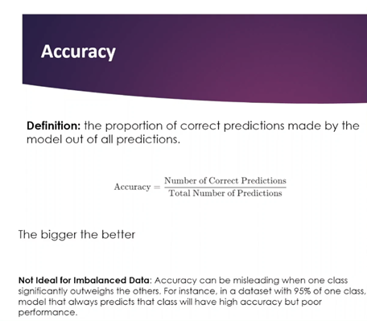
>
>Si has probado tu modelo solo con un pequeño conjunto de datos, esto no es relevante para todos los datos que quieres.
>Así que ten cuidado con esto.
>
>Así que, al probar la precisión, piensa siempre de esta manera: ¿el conjunto de datos que estoy usando es relevante para lo que quiero hacer en la vida real?
>¿Son mis datos de entrenamiento relevantes o están desequilibrados en comparación con lo que quiero hacer?
>Estas son preguntas muy importantes y, como vimos antes, ¿entra basura y sale basura del entrenamiento?
>Los datos en sí mismos son muy importantes.
>Ahora bien, todo se reduce a la precisión.

### 31. Machine Learning Metrics - Precision

>[!NOTE]
>
>Otra métrica importante que validó esto se refiere a la precisión y a la definición.
>Esto se refiere a la proporción de identificaciones positivas que fueron realmente correctas.
>Es un poco complicado.
>Pero permítanme explicar dos conceptos más.
>Tenemos un falso positivo y un falso negativo.
>
>Si se dedican a la ingeniería de calidad, saben que un falso positivo se produce cuando las pruebas automatizadas identifican un defecto, pero este no existe.
>Podría tratarse de una prueba deficiente que está fallando.
>Y creen que hay un problema en su aplicación.
>Eso sí que es un falso positivo.
>
>Un falso negativo significa que hay un problema que no pudieron identificar con la prueba.
>Es decir, es al revés.
>
>**¿Qué es exactamente la precisión?**
>
>¿Precisión significa cuántos verdaderos positivos?
>
>Entonces, ¿cuántos hallazgos reales, correctos, tienes o el modelo ha identificado, dividido entre este número de hallazgos más los falsos positivos, aquellos que se han identificado como correctos, pero que en realidad no lo son?
>Y continuando.
>
>**¿Dónde es importante la precisión?**
>
>Es importante medir en los casos en que los falsos positivos son costosos, donde identificarlos e investigarlos resulta muy costoso.
>Tomemos un sistema de detección de spam.
>Como saben, actualmente todas las empresas importantes tienen filtros que identifican cuándo un correo electrónico es spam y tratan de identificar los correos electrónicos que no lo son.
>Por lo tanto, un falso positivo en este caso es muy indeseable.
>Por lo tanto, no conviene que un correo electrónico spam no sea bloqueado.
>Pero lo más importante es que no conviene.
>
>Por lo tanto, no conviene que un buen correo electrónico se etiquete como spam.
>Eso es algo muy, muy malo.
>Esto es un falso positivo.
>Cuando un correo electrónico positivo no es spam, se marca como tal.
>Entra en tu carpeta y nunca la vuelves a revisar.
>
>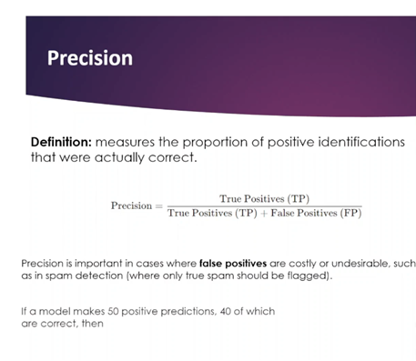
>
>Ahora veamos un ejemplo.
>Imagina que tu modelo indica: «Oye, recibiste 50 correos electrónicos spam, así que, bien, estás haciendo tu trabajo correctamente».
>
>Y luego, al revisar los correos electrónicos para validar que el modelo identifica el spam correctamente, ves que diez de ellos no lo son.
>Son de un socio comercial.
>Y has estado esperando algunos de esos correos.
>
>En este caso, la precisión es 40 dividido entre 50, ya que 40 eran correctos, pero 50 se han marcado como spam.
>Así que tienes un 80 %.
>
>Digamos que tu precisión es de 0,8, o podrías marcarla como 80 %.
>Y, de nuevo, imagina que la precisión es importante.
>Sabes dónde un falso positivo es realmente indeseable.
>


### 32. Machine Learning Metrics - Recall

>[!NOTE]
>
>Dado que hemos hablado de precisión, también debemos abordar la recuperación, que es muy similar a la precisión, pero con una pequeña diferencia.
>La recuperación mide la proporción de casos positivos reales que el modelo identificó correctamente.
>Para facilitar la comprensión,
>Se tienen los verdaderos positivos divididos entre el número de verdaderos positivos más los falsos negativos.
>
>En la lección anterior, donde analizamos la precisión, tuvimos un falso positivo.
>La recuperación se centra en los falsos negativos.
>
>**¿Cuándo podría ser importante?**
>
>La recuperación es muy útil en casos donde la omisión de un resultado positivo es muy costosa, como en el diagnóstico médico o la detección de fraude.
>En estos casos, imaginemos que una IA escanea células cancerosas.
>Se proporciona una imagen (una tomografía computarizada, una radiografía), y la IA la analiza y no indica nada.
>Esto es un falso negativo porque hay algo ahí y no quieres pasarlo por alto.
>
>**¿Lo mismo ocurre con el fraude o el blanqueo de capitales?**
>
>Podría ser que las señales estén ahí, pero no pueda detectarlas.
>En este caso, la memoria es muy importante.
>
>Creo que deberíamos usar un ejemplo para simplificarlo.
>Imagina que sabes que tienes 100 pacientes con cáncer que dieron positivo.
>Sabes que hay 100.
>Y le proporcionas una radiografía de estos pacientes a tu modelo y, por supuesto, 100 imágenes.
>
>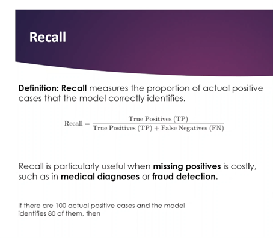
>
>Y luego el modelo analizará imagen por imagen y dirá: "Bueno, el 80% u 80 de estos pacientes o imágenes presentan un síntoma, no sé, con un 95% de precisión".
>Así que el modelo identificó correctamente solo ocho de cada diez, u 80 de cada cien.
>Pero sabemos, gracias a los datos que proporcionamos, que hay otros 20 pacientes y el modelo pudo identificarlos.
>
>Así que, si esto no fuera un ejercicio de entrenamiento y fuera una situación real, esas 20 personas se irían a casa sin un diagnóstico correcto y seguirían sin saber qué les pasa.
>Así que la tasa de recuperación en este caso sería del 0,8%, o del 80%.
>


### 33. Machine Learning Metrics - F1 Score

>[!NOTE]
>
>**Ya llegamos a la famosa puntuación F1.**
>
>Si han leído en línea o investigado un poco, probablemente habrán visto que la puntuación F1 es muy importante y que la mayoría de las veces se la menciona.
>
>Ahora les doy un poco de información sobre la puntuación F1, ya que para calcularla también se necesita precisión y recuerdo.
>No se puede tener solo uno de ellos.
>
>La puntuación F1 en sí misma es una especie de promedio entre la precisión y el recuerdo.
>No es un promedio aritmético, sino un promedio armónico entre ambos.
>Y cuando es importante, en primer lugar, se aplica cuando hay clases desequilibradas.
>
>Entonces, cuando quizás el 80 % de la población reside en el 20 % del intervalo total.
>Podría tratarse de una clase desequilibrada, ya que el modelo perderá precisión, o su recuperación será mayor, o su precisión será mayor o menor, dependiendo de su posición en una determinada clase.
>
>La puntuación F1 mide el rendimiento del modelo en todo el espectro, en toda la población o en todo el conjunto de datos.
>Si quiere saberlo en forma de fórmula, ahí lo tiene.
>Correcto.
>
>Se dice promedio armónico entre precisión y recuperación.
>¿Y cuándo desea esto?
>Bueno, digamos que normalmente lo haría.
>Todos desean una puntuación F1 alta.
>
>Si tomáramos un ejemplo médico que ya hemos usado con el paciente con cáncer, sería algo como esto:
>Cuando se tiene un modelo de diagnóstico médico, el que no detecta cáncer, sino cualquier otra cosa, como un manguito de sangre, o algo similar,
>la alta precisión garantiza que se sepa qué tan positivo es un verdadero positivo.
>
>
>
>Entonces, cuando se dice que hay un 98% de probabilidad de que algo esté presente, se tiene la certeza de no proporcionar un falso negativo.
>Esto se refiere a alta precisión.
>Pero también en este caso, se debe asegurar que la mayoría de los pacientes tengan esta afección identificada.
>
>Por lo tanto, se debe asegurar que la afección esté presente.
>Y también se debe asegurar que, en todos los casos donde se identificó la afección, esté presente correctamente.
>Y es por eso que la mayoría de las empresas, la mayoría de los puntos de referencia, no utilizan la precisión ni la recuperación, sino la puntuación F1, que es una combinación de precisión y recuperación.
>Y se utiliza muy a menudo con clases desequilibradas.
>


### 34. Machine Learning Metrics - Perplexity

>[!NOTE]
>
>**Perplejidad.**
>
>Se refiere a la idea de predicción.
>La perplejidad se aplica únicamente a grandes modelos lingüísticos basados en texto.
>Fácil de entender.
>
>La perplejidad significa que escribes un montón de palabras y el modelo indica la probabilidad de que la siguiente palabra sea similar a la de Google cuando intentas buscar algo en línea.
>
>Google te dará pistas sobre cuál es la siguiente palabra.
>Se utiliza en grandes modelos lingüísticos para la generación de texto, y específicamente para la traducción, para evaluar la confianza del modelo en predecir la siguiente palabra.
>Una perplejidad menor significa que el modelo es más preciso y está mejor entrenado.
>
>**¿Cuál es la fórmula?**
>
>Bueno, ahí lo tienes.
>Eh, y en realidad n significa el número de palabras, y p es la probabilidad de que una palabra esté ahí.
>Así que es una función logarítmica.
>En realidad, es una suma de una proporción logarítmica.
>
>Ahora veamos un ejemplo adecuado para entenderlo, porque no hace falta ser informático, matemático ni estadístico para entenderlo y comprobarlo. Simplemente, podemos decir:
>
>Sí, el índice de perplejidad está bien para nosotros.
>Estamos por debajo del umbral.
>
>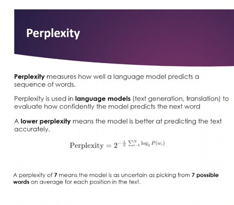
>
>Ahora, permítanme darles un ejemplo muy simple.
>
>Tienen una oración.
>El zorro marrón salta sobre...
>Y la oración es "sobre el perro perezoso" porque es una oración muy común en las estadísticas de aprendizaje automático debido a las propiedades de las palabras.
>Entonces, después de decir "el zorro marrón salta sobre allí", el modelo podría decir, bueno, las palabras probables
>que vienen después podrían ser A, B, C, D y luego "perezoso".
>
>Y dos palabras más.
>Entonces, si tienen siete, el modelo tiene una perplejidad de siete, porque cree que una de siete palabras estará allí.
>En caso de decir "el zorro marrón salta sobre", lo más probable es que sea un artículo sobre allí,
>y la perplejidad debería ser uno para cualquier tipo de modelo que tengan.
>


### 35. Demo - Evaluate - Calculate Metrics with Python

1. Vamos a la página  [Hugging Face -> Documentation](https://huggingface.co/docs).
2. Buscamos el que dice [`Evaluate`](https://huggingface.co/docs/evaluate/index).</br>
3. **Al abrir esto, ¿qué es exactamente "evaluar"?**
Es una biblioteca para evaluar fácilmente modelos y conjuntos de datos de aprendizaje automático.
Ya está creada y proporciona una especie de capa de envoltorio para que no tengas que hacer cálculos matemáticos para diferentes tipos de métricas.
Simplemente di "calcular esta métrica".
Y eso es todo lo que necesitas hacer.
¿Cómo lo instalamos?
Bueno, si vas a la instalación, te indicará que necesitas algo más que Python.
3.7.
4. Creamos el archivo **`src/test/LLM/Hug_face/evaluate_demo.py`**.
5. **¿Qué puedes hacer con esto?** </br>
[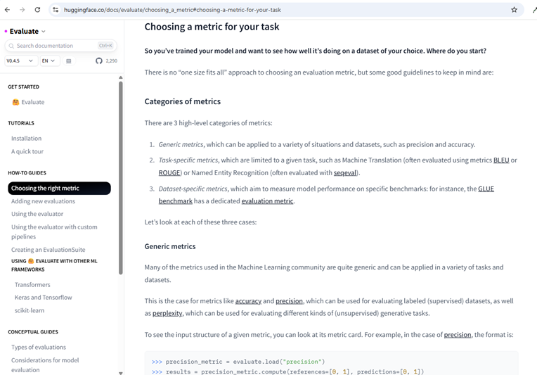](https://huggingface.co/docs/evaluate/choosing_a_metric#choosing-a-metric-for-your-task)
Primero que nada, calcularemos varias métricas.
Ejecutaremos varios benchmarks.
Si ves la guía, indica cómo elegir la métrica para tu tarea.
Calcularemos el azul junto con el desgarro y, de hecho, haremos benchmarks de ChatGPT.
6. Empezamos poniendo esto en el archivo **`evaluate_demo.py`**:
```py
import evaluate

# load the metrics
accuracy_metrics = evaluate.load("accuracy")
# f1_metrics = evaluate.load("f1")
# precision_metric = evaluate.load("precision")
# recall_metric = evaluate.load("recall")

# Define predictions and references
predictions = [0, 1, 1, 0, 1]
references = [0, 1, 0, 0, 1]

# Compute the accuracy
accuracy_result = accuracy_metrics.compute(
    predictions=predictions, references=references)
print("Accuracy:", accuracy_result)
```

>[!IMPORTANT]
>
> ### Ambiente Virtual de Python en Visual Studio Code
>
> 1. En `Visual Studio Code` En el menú superior</br>» `View` </br>» `Command Palette...` </br>» `Python: Select Interpreter`
> 2. Selecciono `Venv Creates as '.venv'` o `+ Create Virtual Environment` y elijo de donde se va a basar este ambiente virtual.</br> Espero un rato a que haga la instalación y creación de la carpeta **".venv"**.
> 3. En una `TERMINAL` el comando, para activar el Ambiente Virtual de Python: </br> `.venv/Scripts/activate`
> 4. Instalo la biblioteca requerida: </br> `pip install evaluate` </br> Tener presente que esto se instala dentro de la carpeta nueva **".venv"**.
> 5. Pruebo la ejecución del nuevo archivo con este comando en una `TERMINAL`: </br> `python .\src\test\LLM\Hug_face\evaluate_demo.py` </br> <span style="color:red;">Y obtengo un error.</span>
> 6. Instalo una biblioteca que está faltando: </br> `pip install accuracy`
> 7. Vuelvo a probar el comando en una `TERMINAL` y estando en el Ambiente Virtual: </br> `python .\src\test\LLM\Hug_face\evaluate_demo.py` </br> <span style="color:green;">Y obtengo una respuesta:</span> </br> `Accuracy: {'accuracy': 0.8}`
> 8. Para ejecutar usando `Visual Studio Code`: </br>» `View` </br>» `Command Palette` </br>» `Python: Select Interpreter` </br>» `Recommended` </br> »  `⏯️` </br> » `Run Python File in Dedicated Terminal`
>
> Así se ve el proceso de ejecución: </br> 


7. Agrego mas código al archivo **`evaluate_demo.py`** y descomento las tres variables definidas al principio:
```py
# Compute the F1 score
f1_result = f1_metrics.compute(
    predictions=predictions, references=references, average="binary")
print("F1 score", f1_result)

# Compute the precision
precision_result = precision_metric.compute(
    predictions=predictions, references=references, average="binary")
print("Precision:", precision_result)

# Compute the recall
recall_result = recall_metric.compute(
    predictions=predictions, references=references, average="binary")
print("Recall:", recall_result)
```
8. Ejecuto el comando en la `TERMINAL`, estando dentro del ambiente virtual: </br> `python .\src\test\LLM\Hug_face\evaluate_demo.py` </br> Y este fue el resultado obtenido:
```bash
Downloading builder script: 6.79kB [00:00, 19.9MB/s]
Downloading builder script: 7.56kB [00:00, 25.7MB/s]
Downloading builder script: 7.38kB [00:00, 11.3MB/s]
Accuracy: {'accuracy': 0.8}
F1 score {'f1': 0.8}
Precision: {'precision': 0.6666666666666666}
Recall: {'recall': 1.0}
```

>[!TIP]
>
>Otras formas de instalar el Ambiente Virtual de Python:
> * En <svg xmlns="http://www.w3.org/2000/svg" width="16" height="16" fill="currentColor" class="bi bi-windows" viewBox="0 0 16 16"><path d="M6.555 1.375 0 2.237v5.45h6.555zM0 13.795l6.555.933V8.313H0zm7.278-5.4.026 6.378L16 16V8.395zM16 0 7.33 1.244v6.414H16z"/></svg> Windows, vez de usar el comando `pyton` usar `py`: </br> [How do I create a python3 venv for Windows?](https://www.reddit.com/r/learnpython/comments/13jxxw7/how_do_i_create_a_python3_venv_for_windows/)
> * Para <?xml version="1.0" encoding="UTF-8"?><svg xmlns="http://www.w3.org/2000/svg" width="16" height="16" fill="currentColor" class="bi bi-windows" viewBox="0 0 16 16"><path d="M6.555 1.375 0 2.237v5.45h6.555zM0 13.795l6.555.933V8.313H0zm7.278-5.4.026 6.378L16 16V8.395zM16 0 7.33 1.244v6.414H16z"/></svg> Windows es mejor usar lo que sugiere esta página, pero teniendo en cuenta el uso de `py` en vez de `python`: </br> [Local Python Virtual Environments using venv](https://github.com/denisecase/datafun-00-python-virtual-env?tab=readme-ov-file#step-1-create-the-virtual-environment)
>
> Para salir del Ambiente Virtual de Python, el comando en una `TERMINAL` es: </br> `deactivate`


### 36. Demo - Pytorch - Calculate Perplexity for a Model

1. El sitio a utilizar es este: </br> [ Installation" src="https://huggingface.co/datasets/huggingface/documentation-images/resolve/main/transformers/transformers_as_a_model_definition.png" width="200px" title="Transformers -> Installation">](https://huggingface.co/docs/transformers/installation)
2. Ejecuto en una `TERMINAL` el comando para levantar el [Ambiente Virtual de Python](#ambiente-virtual-de-python-en-visual-studio-code): </br> `.venv/Scripts/activate`
3. Según el código debo tener dos bibliotecas, ejecuto dos comandos en la `TERMINAL` donde tengo el Ambiente Virtual de Python: </br> `pip install torch` </br> `pip install transformers`
4. Creo el archivo **`src\test\LLM\Hug_face\perplex.py`**, con este código:
```py
import torch
from transformers import GPT2LMHeadModel, GPT2Tokenizer
import math

# Load the pre-trained model and tokenizer

model_name = "gpt2"  # You can change to "gpt2-medium", "gpt2-large", etc.
model = GPT2LMHeadModel.from_pretrained(model_name)
tokenizer = GPT2Tokenizer.from_pretrained(model_name)

# Set the pad_token to the eos_token to handle padding correctly
tokenizer.pad_token = tokenizer.eos_token
model.eval()  # Set the model to evaluation mode


def calculate_perplexity(text):
    # Strip whitespace and validate that text is not emptu
    text = text.strip()
    if not text:
        print("Error: input text is empty. Please provide valid text.")
        return None

    # Toeknize and prepare the input with padding for batch compability
    encodings = tokenizer(text, return_tensors="pt",
                          padding=True, truncation=True)

    # Ensure input tensor dimensions are  expected
    input_ids = encodings["input_ids"]
    attention_mask = encodings["attention_mask"] if "attention_mask" in encodings else None

    # Check if the input tensor has valid content
    if input_ids.size(1) == 0:
        print("Error: Tokenization result in an empty input. Please check your text")
        return None

    # Calculate the loss (negaitve log likelihood)
    with torch.no_grad():
        outputs = model(input_ids=input_ids,
                        attention_mask=attention_mask, labels=input_ids)
        loss = outputs.loss.item()

    # Calculate perplexity
    perplexity = math.exp(loss)
    return perplexity


# Text to calculate perplexity on
text = ("Lorem ipsum dolor sit amet, consectetur adipiscing elit. "
        "Donec ullamcorper libero ut interdum posuere. "
        "Quisque et tincidunt ipsum, in cursus sem. "
        "Proin turpis turpis, tempus id lectus a, mollis ultricies leo. "
        "Integer mollis dolor fringilla, aliquam diam vitae, cursus enim.")

# Debugging: Print the input to verify it is not-empy after stripping
print(f"Debug: Received input - `{text}`")


perplexity =calculate_perplexity(text)

if perplexity is not None:
  print(f"Perplexity: {perplexity}")
```
5. Luego de ejecutar este comando en la `TERMINAL` con el Ambiente Virtual de Python: </br> `python .\src\test\LLM\Hug_face\perplex.py` </br> Sale un erro con esta sugerencia a instalar: </br> `pip install hf_xet`
6. Vuelvo a ejecutar en la `TERMINAL` con el Ambiente Virtual de Python: </br> `python .\src\test\LLM\Hug_face\perplex.py` </br> Y obtengo esta respuesta:
```bash
Debug: Received input - `Lorem ipsum dolor sit amet, consectetur adipiscing elit. Donec ullamcorper libero ut interdum posuere. Quisque et tincidunt ipsum, in cursus sem. Proin turpis turpis, tempus id lectus a, mollis ultricies leo. Integer mollis dolor fringilla, aliquam diam vitae, cursus enim.`
`loss_type=None` was set in the config but it is unrecognised.Using the default loss: `ForCausalLMLoss`.
Perplexity: 31.946859967236634
```
7. Cerremos el Ambiente Virtual de Python con este comando: </br> `deactivate`


### Quiz 2: Chapter Quiz

>[!NOTE]
>
>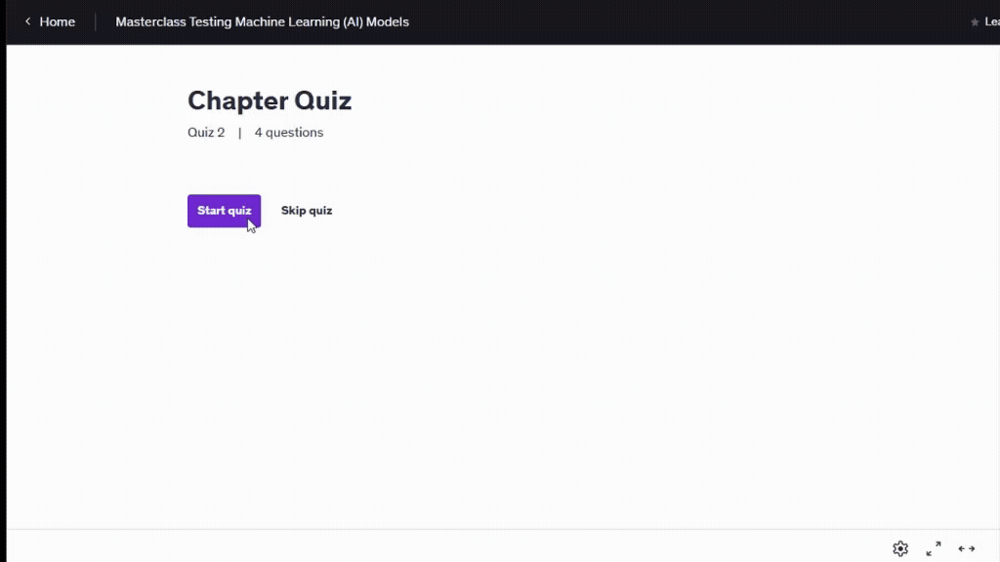
>
>


## Section 6: RAG and Retrieval Augmented Generation Testing


### 37. What is RAG

>[!NOTE]
>
>Ahora hablemos de Rag.
>
>Significa recuperación y generación aumentada.
>Profundizaremos en ello en breve.
>Pero entonces, ¿por qué necesitamos rag?
>¿Por qué no podemos simplemente vivir sin rag?
>
>Bueno, la idea, y he resumido aquí los cuatro puntos principales, es que un modelo...
>Para ser inteligente, necesita ser entrenado con datos.
>Y, por lo tanto, el modelo es tan inteligente como los datos que tiene.
>Y cuanto más tiempo funcione el modelo y sus datos se vuelvan obsoletos, mayor será el deterioro de su inferencia.
>
>Esto se denomina deterioro del modelo o deriva del modelo.
>La idea es que, en caso de necesitar datos que no estaban disponibles cuando se entrenó el modelo,
>debe obtenerlos de una fuente externa.
>Y esto es lo que hace RAG: buscar en bases de datos externas, bases de datos de conocimiento, para brindarte más información sobre tu necesidad específica.
>
>La otra se centra en las alucinaciones y la desinformación, porque si le pides al modelo que haga algo y este no sabe exactamente cómo hacerlo o no tiene la respuesta, comenzará a alucinar.
>Por lo tanto, si la información que buscas está en una base de datos externa, el modelo la obtendrá y, por lo tanto, obtendrás una respuesta correcta con mayor probabilidad que una alucinación.
>
>La otra se centra en el contexto y, por ejemplo, el límite de tokens y el límite de memoria.
>Sabemos que los lenguajes de modelado tienen un límite de memoria, pero con Rag puedes ampliar esa memoria con la cantidad de base de datos que tengas.
>
>Rag también resuelve el problema de la memoria de tu modelo de lenguaje grande, y quizás algo simple o común que los usuarios no ven.
>¿Está esta parte aquí?
>Porque si quieres usar IA en tu propia empresa, lo más probable es que tengas datos que no están disponibles abiertamente en internet.
>Esos datos son tu tesoro.
>Y puedes y debes protegerlos a toda costa.
>
>Por lo tanto, ningún modelo se ha entrenado con esos datos.
>Por esta razón, conviene entrenar tu modelo con esos datos o ampliar sus capacidades, sus capacidades de conocimiento, ampliándolo con los datos de tu propia empresa.
>
>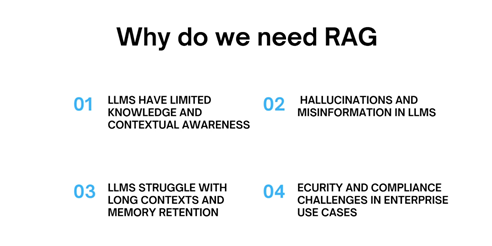
>
>En este caso, todo se reduce a la seguridad.
>Ahora bien, no se desea que los datos estén disponibles para que todos los vean.
>
>Se busca que el modelo utilice los datos en un contenedor específico, en la instancia, en la propia infraestructura, para controlar cómo se transfieren los datos a la infraestructura.
>Estas serían algunas de las razones por las que necesitamos RAC.
>Pero, en la mayoría de los casos, para los usuarios finales será este.
>Y para las empresas, básicamente será este.
>
>Ahora, si continuamos y analizamos qué es exactamente RAC,
>Rag consta de tres partes: recuperador, aumento y generación.
>
>Para ejecutar RAC, se necesitarían, por ejemplo, bases de datos.
>Se llaman bases de datos de conocimiento y pueden ser vectoriales, estructuradas o no estructuradas, ya que actualmente también se puede trabajar con bases de datos no estructuradas o, mejor dicho, no vectoriales.
>
>**¿Cómo funciona esto?**
>
>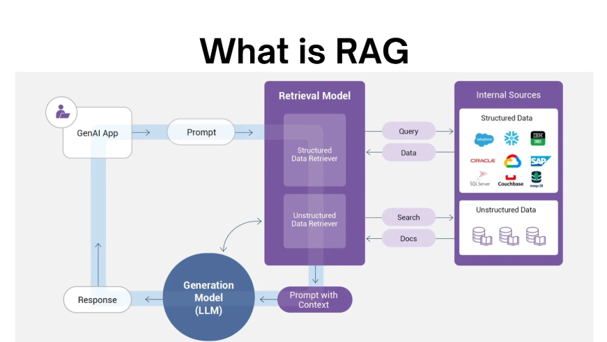
>
>Expliquemos rag de forma sencilla.
>
> * El usuario utiliza cualquier tipo de aplicación generativa.
>O quizás simplemente esté generando un modelo de lenguaje extenso.
>
> * La solicitud se incorporará a este modelo de recuperación.
>¿Y qué hace el modelo de recuperación?
>Tomará tu solicitud y buscará en su base de datos, ya sea vectorial o no, fragmentos de información que contengan la respuesta a tus preguntas.
>Porque, por ejemplo, la información de un documento se divide en fragmentos que se superponen.
>Y también hablaremos de eso.
>
> * Entonces, esta recuperación buscará uno o más documentos en la base de datos vectorial.
>Tomará la solicitud que enviaste aquí y añadirá contexto adicional al resultado de la búsqueda, si puedo seleccionarlo.
>Ahora, la representación vectorial de la parte que responde a las preguntas de tu consulta se enviará a ambos, por lo que se ampliará.
>
> * Esta es la parte de ampliación.
>Ampliará tu solicitud con el contexto que obtienes de tu base de datos externa.
>Y todo se enviará al modelo de lenguaje general que resumirá esa información.
>O quizás lo amplíe según lo que escribas en la solicitud, ya que tu solicitud podría ser:
>
> * Oye, ¿puedo encontrar esa información aquí y escribir una publicación al respecto?
>O podría ser un resumen.
>Dependiendo de lo que tengas aquí.
>Y todo esto se incorporará a este modelo.
>Y luego, el modelo te devolverá la respuesta al usuario.
>Esta es la funcionalidad básica.
>
> * La recuperación es esta parte que recupera tu información.
>Entonces, esta recuperación y el aumento ocurren aquí cuando la recuperación construye tu solicitud.
>Y luego la generación ocurre en el modelo de lenguaje completo.
>Y luego, le devuelves esta información al usuario.
>Permítanme mostrarles algunos ejemplos que tengo con diferentes herramientas.
>
>Por ejemplo, si vas a ChatGPT, solo un ejemplo.
>Subes un documento y dices: "Buscando este documento, por ejemplo, busca este documento"
>para la información x, y x podría ser, no importa cuál, y agregas el documento.
>Esto es de A.
>
>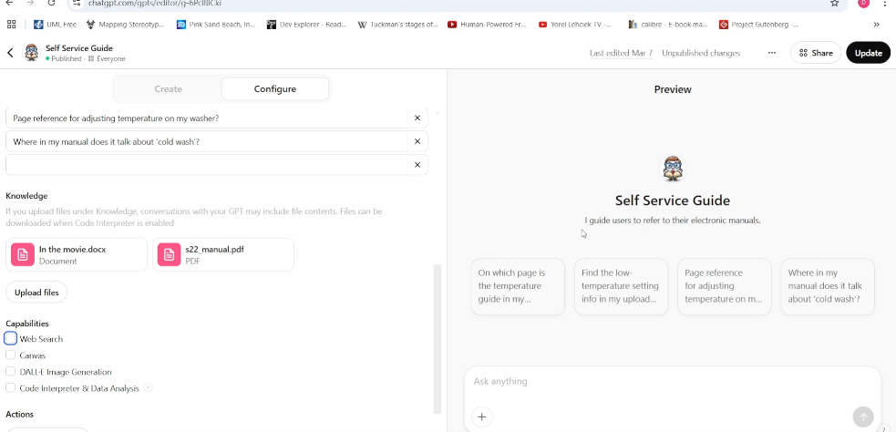
>
>Así que esto no es un seguimiento porque no busca en bases de datos externas.
>Pero sigue el concepto de imaginar que tu documento está almacenado en una base de datos externa.
>Es lo mismo.
>Pero técnicamente esto no es una recuperación de generación aumentada.
>La otra opción es si has creado tu propio GPT personalizado.
>Por ejemplo, aquí tengo una guía de autoservicio.
>Y si quiero editar este GPT, tengo la posibilidad de agregar algunos documentos.
>Y aquí he agregado el manual del Samsung S22.
>Ahora, si borro y actualizo, verás que tarda un poco.
>Y si lo subo de nuevo, digamos que aquí va a ser el manual S22.
>Y si lo vuelvo a actualizar, verán que el documento no solo se actualiza, sino que se integra y se desglosa en una base de datos vectorial.
>Por eso está tardando tanto este proceso de actualización.
>
>Y ahora, si solicito algo sobre este manual, es una especie de jerga.
>Pero nosotros, como usuarios, aún no lo vemos porque desconocemos el funcionamiento interno de ChatGPT.
>Podría ser una jerga o podría ser otra.
>Y porque no lo sabemos.
>¿Qué hay del uso de la búsqueda web?
>¿Es correcto?
>Sí.
>Porque si activo la búsqueda web, ChatGPT accederá al sitio web, tomará la información que busco, ampliará mi solicitud y me dará la respuesta.
>
>Esto es "FLOWISAI".
>Es un marco de orquestación de agentes.
>Aquí tengo algunos flujos de agentes y una herramienta de RAG.
>
>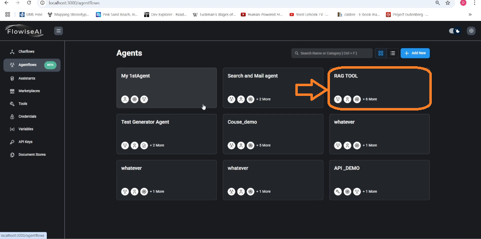
>
>Veamos qué estoy haciendo exactamente.
>Primero, configuro el modelo de IA abierta.
>Aquí está mi temperatura.
>Aquí está el modelo que quiero usar.
>También proporciono mi clave API.
>
>Este modelo lo usa un supervisor que controla a todos mis demás trabajadores.
>Este es un enfoque de tres pasos para hacer una pregunta sobre un documento.
>Luego, estos modelos lo perfeccionan hasta que obtengo una publicación sobre ese documento o una publicación en redes sociales sobre mi consulta.
>
>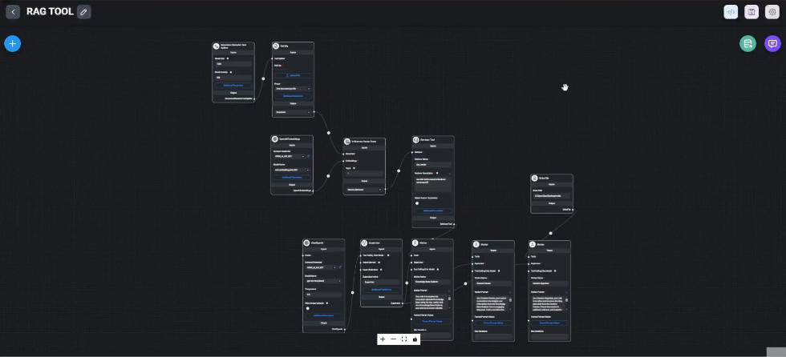
>
>Por ejemplo, este agente o parte del trabajador busca mi información en la base de datos.
>El otro crea el contenido basándose en la información obtenida, y el otro crea una publicación de blog basada en este creador de contenido.
>
>Se trata de un enfoque de tres pasos, pero lo que queremos analizar es qué sucede con el trabajador que obtiene mi base de conocimientos.
>El trabajador utiliza una herramienta de recuperación.


### 38. 4 Types of RAG - Simple, Speculative, Graph, Corrective

>[!NOTE]
>
>Hay muchísimos tipos de trapo, pero en mi caso, seleccionaré solo las tres o cuatro técnicas o implementaciones de trapo más populares que tenemos.
>En esta lección, presentamos las siguientes cuatro técnicas.
>
>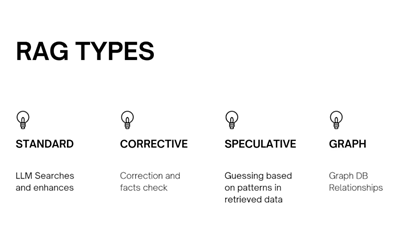
>
> Así que será el modelo estándar.
>Lo que ya han visto es el modelo correctivo, que básicamente implementa una especie de bucle de retroalimentación para garantizar que la información que el sistema les ha entregado sea correcta.
>Así que se realiza una especie de verificación de datos.
>Está el modelo especulativo, que consiste en adivinar y tener múltiples opciones antes de obtener el resultado.
>Y el modelo gráfico, que utiliza bases de datos de grafos junto con bases de datos vectoriales para encontrar las relaciones entre los nodos del grafo.
>
> * Ahora, si vamos al estante **estándar**, como ya vieron, quiero añadir algo más.
>Buscan en un documento, pero también pueden buscar en varios.
>El sistema utiliza un mecanismo de puntuación.
>Por ejemplo, buscará en diez documentos diferentes.
>El sistema aplica un mecanismo de puntuación a los diez documentos y, en función de esta, les proporciona la información más importante para su búsqueda.
>Además, no hay nada más.
>Se trata básicamente de una puntuación máxima de k de los documentos.
>
> * Pasemos al siguiente.
>Este es el recuadro **correctivo**.
>Es básicamente una especie de recuadro.
>Es un recuadro que hemos visto y que tiene otra capa de validación.
>En resumen, sigue existiendo la generación aumentada de recuperación estándar, pero con verificación de datos.
>Así que la recuperación y el... te proporcionarán la información.
>Pero luego habrá una capa adicional que buscará los hechos o validará que la información obtenida sea objetivamente correcta.
>Es una especie de ciclo de retroalimentación.
>Imagina que un profesor te asigna una tarea y le das la respuesta, pero el profesor corrige tu trabajo.
>Esto es básicamente lo que estás haciendo o le pides a un colega que revise tu trabajo.
>Esto es un "corrección" o "corrección".
>Implementa una verificación adicional de la respuesta que recibirás.
>Y como puedes ver aquí, esta será tu verificación adicional que se añade al contexto.
>Y luego obtendrás una respuesta, con suerte, válida.
>
> * El siguiente es un **"corrección especulativa"**,  significa lo siguiente:
>Imagina que no sabes exactamente, o que tu sistema no sabe exactamente, cuál es la mejor respuesta, así que intentará especular.
>Esto a su vez tiene tres partes:
>El recuperador, el redactor y la verificación.
>La recuperación recuperará información y el redactor generará un conjunto de posibles respuestas para tu consulta o como posible respuesta.
>¿Qué pasará entonces con el documento y las posibles respuestas?
>Esta parte evaluará todas las respuestas y les asignará una puntuación, un porcentaje, y la que tenga el mayor porcentaje de aciertos ganará. </br> </br>
>Básicamente, tienes: "Tengo esta consulta".
>Estas son mis posibles respuestas.
>Esta es la mejor.
>Imagina que se trata de un comité y conoces a tus arquitectos.
>Proponen cinco soluciones diferentes.
>Y luego, en un comité, eliges la mejor solución y propones el resultado final.
>Este es un rack especulativo, muy útil cuando el modelo no sabe exactamente cuál es la información correcta, ni cuál es la perfecta. </br>
>Por ejemplo, no se obtiene una puntuación del 98%.
>
> * El último que veremos (aunque no el último, hay uno más que no voy a cubrir) es **Graph** Rag.
>Básicamente, se trata de grafos de conocimiento, y en ellos, la información se relaciona con otra mediante los nodos del grafo.
>Se utilizan nodos, no bases de datos ni bases de datos de grafos para almacenar información.
>Esto es muy útil, por ejemplo, cuando se desea obtener información de múltiples fuentes o realizar una investigación exhaustiva, como la que realizan actualmente diferentes empresas.
>Se utiliza este tipo de grafo de conocimiento porque se necesita sintetizar información y validarla de una fuente con la otra.
>Y si quieres investigar en 20 artículos diferentes, necesitas usar este tipo de gráfico de conocimiento, ya que la información se referencia en una u otra parte.
>
> * Si volvemos aquí, hay otro tipo de filtro que no añadí.
>Se trata del filtro genético, donde los agentes intentan obtener la mejor información y la revalidan.
>Pero el problema es que lleva mucho tiempo.
>Así que no hay problema.
>Cuando quieres hacer algo y tienes tiempo para esperar, digamos cinco minutos.
>
>Pero en una aplicación en tiempo real con un usuario, no tiene sentido usar un filtro genético, así que un filtro estándar podría ser tu chatbot de respuesta a preguntas.
>
>La violación correctiva podría darse cuando necesitas asesoramiento médico, legal o financiero, porque la información necesita ser corregida.
>
>Un RAG especulativo es cuando no sabes exactamente cuál es la respuesta correcta y no estás seguro.
>Así que quieres hacer este tipo de especulaciones, que podrían ser las mejores.
>Por ejemplo, una predicción de qué comprar a continuación.
>Si quiero ver qué podría comprar un cliente a continuación basándome en lo que tiene en el carrito, podría especular.
>Oye.
>Podría ser esto o lo otro, pero no lo sé con exactitud.
>Así que solo voy a especular.
>Y esto podría ser para investigación.
>Obtener información de varios documentos.


### 39. Create a RAG application with FAISS

>[!NOTE]
>
>Si recuerdan cuando analizamos nuestra arquitectura Rag, sabemos que, a diferencia de la IA tradicional, se requiere una base de datos vectorial.
>Y en esta base de datos vectorial se encuentra lo que se llama:
>Vectores.
>Así que aquí solo se almacenan los índices vectoriales y las similitudes entre ellos.
>
>
>
>Para el siguiente material, he usado esta.
>Les mostraré.
>iss
>[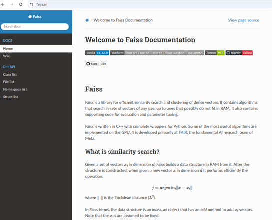](https://faiss.ai/), desarrollada por Facebook o Meta.
>
>Es una biblioteca para la búsqueda eficiente de similitudes y la agrupación de vectores densos.
>Contiene algoritmos que buscan en conjuntos de vectores de cualquier tamaño, incluso mayores que el mío.
>Y luego, se profundiza en los detalles.
>
>En mi caso, al instalarla, he usado la CPU.
>Así que, aunque no esté ejecutando algo extremadamente grande, también podría usar la GPU.
>Pero en mi caso, si no tienes una GPU dedicada y, por ejemplo, estás ejecutando localmente en tu portátil, esto es lo que debes ejecutar.
>Si tienes un controlador compatible con Cuda, como AMD o Nvidia, también puedes usar esta parte.
>No voy a usar PyTorch.
>

1. Empezamos creando el archivo **`src/rag/RAG_Simple.py`**, de entrada tengo estas importaciones:

|Nro.|Import -> Python|Source|
|-|-|-|
|1|`import os` |[Source code: Lib/os.py](https://docs.python.org/3/library/os.html)|
|2|`import fitz #PyMuPDF`| [PyMuPDF 1.26.3](https://pymupdf-readthedocs-io.translate.goog/en/latest/installation.html?_x_tr_sl=en&_x_tr_tl=es&_x_tr_hl=es&_x_tr_pto=tc)|
|3|`from typing import List` |[Source code: Lib/typing.py](https://docs.python.org/3/library/typing.html) |
|4|`from langchain_openai import OpenAIEmbeddings`|[LangChain -> Ecosystem packages](https://python.langchain.com/docs/how_to/installation/)|
|5|`from langchain_community.vectorstores import FAISS`|[LangChain -> Ecosystem packages](https://python.langchain.com/docs/how_to/installation/)|
|6|`from langchain.text_plitter import RecursiveCharacterTextSplitter`|[LangChain -> Ecosystem packages](https://python.langchain.com/docs/how_to/installation/)|
|7|`from langchain.schema import Document`|[LangChain -> Ecosystem packages](https://python.langchain.com/docs/how_to/installation/)|

2. Activar el Ambiente Virtual de Python con este comando en la `TERMINAL`: </br> `.venv/Scripts/activate`
3. Nos muestra un archivo **`src/rag/requirements.txt`**, que se instala con un comando en la `TERMINAL`, con base en este documento [Python Requirements.txt](https://www.freecodecamp.org/news/python-requirementstxt-explained/), este sería el contenido: </br> 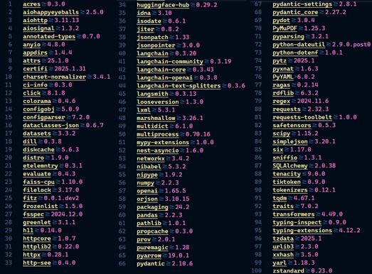: </br> Ejecutar este comando en la `TERMINANL` con el Ambiente Virtual de Python: </br>`pip install -r ./src/rag/requirements.txt`
4. Reinstalar en nuestro Ambiente Virtual de Python con lo mas reciente:
```bash
pip uninstall pymupdf
pip install --upgrade pymupdf
pip uninstall langchain
pip install langchain
pip uninstall langchain-openai
pip install langchain-openai
pip uninstall langchain-community
pip install langchain-community
pip freeze 
```
5. Tengo en la carpeta **"documents"**, algunos archivos **`*.pdf`**, en este caso son manuales del celular _Samsung Galaxy 22_.
6. Este sería el contenido del archivo **`src/rag/RAG_Simple.py`**:
```py
import os
import fitz  # PyMuPDF
from typing import List
from dotenv import load_dotenv

# FAISS & Langchain imports
from langchain_openai import OpenAIEmbeddings
from langchain_community.vectorstores import FAISS
from langchain.text_splitter import RecursiveCharacterTextSplitter
from langchain.schema import Document

# =========================================================
# FAISS & Document Loading Setup
# =========================================================
DB_FILE = "./src/rag/.faiss_index"
OPENAI_API_KEY = None  # Will be set after loading .env


def extract_text_from_pdf(pdf_path: str) -> str:
    """Extract text from a PDF file using PyMuPDF."""
    text = ""
    page_number = 0
    try:
        with fitz.open(pdf_path) as doc:
            for page in doc:
                page_text = page.get_text("text")
                page_number = page.number + 1
                text += page_text + "\n"
            print(f"Extracting text from page {page_number} of {pdf_path}")
    except Exception as e:
        print(f"Error extracting text from {pdf_path}: {e}")
    return text


def load_documents(folder_path: str) -> List[Document]:
    """Load all PDF and TXT from a folder and return a list of Document objects."""
    local_docs = []
    for filename in os.listdir(folder_path):
        file_path = os.path.join(folder_path, filename)
        print(f"Processing file: {filename}")
        if filename.endswith(".pdf"):
            text = extract_text_from_pdf(file_path)
        elif filename.endswith(".txt"):
            with open(file_path, "r", encoding="utf-8") as file:
                text = file.read()
        else:
            continue
        if text.strip():
            local_docs.append(Document(page_content=text,
                                       metadata={"source": filename}))
    return local_docs


def create_vector_db(local_docs):  # List[Document]
    """Create a FAISS vector database from a list of Document objects."""
    print("Local docs type:", type(local_docs),
          "with length:", len(local_docs))
    if not local_docs:
        raise ValueError(
            "No documents provided to create the vector database.")
    if os.path.exists(DB_FILE):
        print(f"Database file {DB_FILE} already exists.")
        print("Please delete it before creating a new one.")
        return
    text_splitter = RecursiveCharacterTextSplitter(
        chunk_size=500, chunk_overlap=100)
    docs = text_splitter.split_documents(local_docs)

    # Generating embeddings

    embeddings = OpenAIEmbeddings(openai_api_key=OPENAI_API_KEY)

    vector_db = FAISS.from_documents(docs, embeddings)

    # Save the vector store to disk
    vector_db.save_local(DB_FILE)
    print(f"Vector database created and saved to {DB_FILE}.")


def load_vector_db():
    """Create a FAISS vector database from documents in the 'documents' folder."""
    if os.path.exists(DB_FILE):
        return FAISS.load_local(DB_FILE, OpenAIEmbeddings(openai_api_key=OPENAI_API_KEY), allow_dangerous_deserialization=True)
    else:
        raise FileNotFoundError(
            f"Database file {DB_FILE} not found. Please create the database first.")


def retrieve_elevant_docs(query: str, k: int = 3) -> List[Document]:
    """Retrieve the top-k relevant documents chunks from FAISS."""
    vector_db = load_vector_db()
    if vector_db:
        results = vector_db.similarity_search(query, k=k)
        return [doc.page_content for doc in results]
    else:
        print("Vector database not found or could not be created.")
        return []


# =========================================================
# Main Execution
# =========================================================
if __name__ == "__main__":
    FOLDER_PATH = "./src/rag/documents"
    load_dotenv()  # Carga las variables de entorno del archivo .env
    OPENAI_API_KEY = os.getenv("OPENAI_API_KEY")
    print("OpenAI API Key:", OPENAI_API_KEY)

    # Load documents from the 'documents' folder
    documents = load_documents(FOLDER_PATH)
    create_vector_db(documents)

    while True:
        query = input("Enter your query (or 'exit' to quit): ")
        if query.lower() == 'exit':
            break
        relevant_docs = retrieve_elevant_docs(query)
        if relevant_docs:
            print("Relevant documents:")
            for idx, doc in enumerate(relevant_docs, 1):
                print(f"[{idx}] - {doc}\n")
        else:
            print("No relevant documents found.")
    print("Exiting the Simple RAG/Chatbot.")
```

7. Es necesario crear en la raíz el archivo **`.env`** con esta línea: </br> `OPENAI_API_KEY = "sk-proj-A-VALID-API-KEY-HERE"`
8. En la `TERMINAL` y en mismo Ambiente Virtual de Python, ejecutamos este comando: </br> `python ./src/rag/RAG_Simple.py`.
9. Ahora puedo hacerle preguntas y estos son algunos ejemplos: </br> 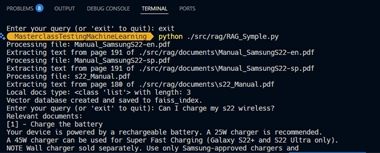 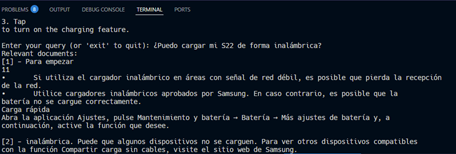
10. Una vez terminada la prueba salirnos del Ambiente Virtual de Python con el comando: </br> `deactivate`


### 40. `RAGAs` Validation Framework - Retrieval

>[!NOTE]
>
>Para diferentes tipos de pruebas que desee realizar con su modelo de lenguaje extenso, no solo para rag, sino también para otros conceptos.
>
>Existen muchas bibliotecas.
>Por ejemplo, existe la biblioteca "evaluate", que se centra más en la matriz de precisión, o la matriz de confusión, que se obtiene de "hugging face".
>
>O puede usar algo un poco más profesional, llamado `Ragas`, que es una biblioteca que proporciona herramientas para optimizar el rendimiento, pero está diseñada para ayudarle a evaluar sus aplicaciones de lenguaje extensas con facilidad y confianza.
>Facilidad.
>
>[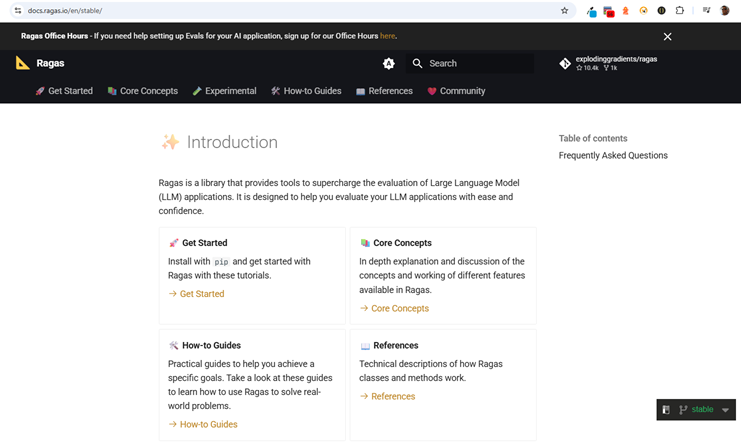](https://docs.ragas.io/en/stable/)
>

1. En este sitio empezamos con [🚀 Get Started](https://docs.ragas.io/en/stable/getstarted/)
2. Seleccionamos [Installation](https://docs.ragas.io/en/stable/getstarted/install/), para procesos de instalacion de `Ragas`.
3. Seleccionamos en la parte de arriba [🛠️ How-to Guides](https://docs.ragas.io/en/stable/howtos/).
4. Vamos a este otro sitio [List of available metrics](https://docs.ragas.io/en/stable/concepts/metrics/available_metrics/).
5. Regresaos a [Evaluate a simple LLM application](https://docs.ragas.io/en/stable/getstarted/evals/).
6. Ejemplo de un prompt:
```py
from ragas import SingleTurnSample
from ragas.metrics import BleuScore

test_data = {
    "user_input": "summarise given text\nThe company reported an 8% rise in Q3 2024, driven by strong performance in the Asian market. Sales in this region have significantly contributed to the overall growth. Analysts attribute this success to strategic marketing and product localization. The positive trend in the Asian market is expected to continue into the next quarter.",
    "response": "The company experienced an 8% increase in Q3 2024, largely due to effective marketing strategies and product adaptation, with expectations of continued growth in the coming quarter.",
    "reference": "The company reported an 8% growth in Q3 2024, primarily driven by strong sales in the Asian market, attributed to strategic marketing and localized products, with continued growth anticipated in the next quarter."
}
metric = BleuScore()
test_data = SingleTurnSample(**test_data)
metric.single_turn_score(test_data)
```
7. Un paso a paso para evaluar los RAG [Evaluate a simple RAG system](https://docs.ragas.io/en/stable/getstarted/rag_eval/), con este texto inicial:
```py
sample_docs = [
    "Albert Einstein proposed the theory of relativity, which transformed our understanding of time, space, and gravity.",
    "Marie Curie was a physicist and chemist who conducted pioneering research on radioactivity and won two Nobel Prizes.",
    "Isaac Newton formulated the laws of motion and universal gravitation, laying the foundation for classical mechanics.",
    "Charles Darwin introduced the theory of evolution by natural selection in his book 'On the Origin of Species'.",
    "Ada Lovelace is regarded as the first computer programmer for her work on Charles Babbage's early mechanical computer, the Analytical Engine."
]
```
8. He aquí ejemplos de consultas o _queries_ y Respuestas esperadas:
```py
sample_queries = [
    "Who introduced the theory of relativity?",
    "Who was the first computer programmer?",
    "What did Isaac Newton contribute to science?",
    "Who won two Nobel Prizes for research on radioactivity?",
    "What is the theory of evolution by natural selection?"
]

expected_responses = [
    "Albert Einstein proposed the theory of relativity, which transformed our understanding of time, space, and gravity.",
    "Ada Lovelace is regarded as the first computer programmer for her work on Charles Babbage's early mechanical computer, the Analytical Engine.",
    "Isaac Newton formulated the laws of motion and universal gravitation, laying the foundation for classical mechanics.",
    "Marie Curie was a physicist and chemist who conducted pioneering research on radioactivity and won two Nobel Prizes.",
    "Charles Darwin introduced the theory of evolution by natural selection in his book 'On the Origin of Species'."
]
```

9. Creamos el archivo **`src/rag/RAGAS_localy.py`**, que es una copia de **`RAG_Simple.py`**, con algunos cambios:
```py
import os
import fitz  # PyMuPDF
import json
from typing import List
from dotenv import load_dotenv

# RAGAS Evaluation Imports
from ragas.metrics import (
    context_precision,  # Measures if retrieved is relevantto the answer.
    context_recall  # Measures if all necessary information was retreieved.
)
from ragas import evaluate
from datasets import Dataset

# FAIS & LangChain Imports
from langchain_openai import OpenAIEmbeddings
from langchain_community.vectorstores import FAISS
from langchain.text_splitter import RecursiveCharacterTextSplitter
from langchain.schema import Document

# =========================================================
# FAISS & Document Loading Setup
# =========================================================
DB_FILE = "./src/rag/.faiss_index"
OPENAI_API_KEY = None  # Will be set after loading .env


def extract_text_from_pdf(pdf_path: str) -> str:
    ...


def load_documents(folder_path: str) -> List[Document]:
    ...


def create_vector_db(local_docs):  # List[Document]
    ...


def load_vector_db():
    ...


def retrieve_elevant_docs(query: str, k: int = 3) -> List[Document]:
    ...

# =========================================================
# RAGAS Evaluation (Retrieval Testing Only)
# =========================================================


def evaluate_ragas(query: str, retrieved_docs: List[str], correct_answer: str):
    """Evaluates the RAG retrieval system using RAGAS metrics"""

    # Ensure retieved_docs is a list
    if not isinstance(retrieved_docs, list):
        retrieved_docs = [retrieved_docs]

    # Prepare data for evaluation
    evaluation_data = {
        "question": [query],
        "contexts": [retrieved_docs],  # Expected format: list of strings
        "answer": [correct_answer],
        "reference": [correct_answer]  # Required for context_precision
    }
    dataset = Dataset.from_dict(evaluation_data)

    # Run RAGAS evaluation
    scores = evaluate(dataset, metrics=[
        context_precision,
        context_recall
    ])

    # Convert to dictionary
    scores_dict = scores.__dict__

    # Remove non-serializable parts (e.g., evaluation_dataset) if present
    EVAL_DATA = "evaluation_dataset"
    if EVAL_DATA in scores_dict:
        scores_dict.pop(EVAL_DATA)
    # Extract only the scores
    only_scores = scores_dict.get("scores", {})

    print("\n🕯️ **RAG Retrieval Evaluation Scores:**")
    print(json.dumps(only_scores, indent=2, default=str))

# Example
# # query = "Can I charge my Galaxy S22 wirelessly?"
# # answer = ["Yes, you can charge your Galaxy S22 wirelessly using the Wireless power sharing feature. To use it, open Settings, go to Battery and device care, select Battery, and tap Wireless power sharing. Then tap Battery limit to set your desired threshold, and once that level is reached, wireless power sharing will automatically turn off."]


# =========================================================
# Main Execution
# =========================================================
if __name__ == "__main__":
    ...
        answer = input("✅ Enter the correct answer for evaluation: ")
        evaluate_ragas(query, relevant_docs, answer)
        print("\n" + "="*50 + "\n")
        print("Evaluation complete. Scores printed above.")
        print("You can now continue with the next query or exit.")
    print("Exiting the RAGAS evaluation script.")
```
10. Primero Activamos el Ambiente Virtual de Python: </br> `.venv/Scripts/activate`
11. Luego ejecutamos el comando para correr el script: </br> `python ./src/rag/RAGAS_local.py`
12. La pregunta inicial sería: </br> `Can I charge my Galaxy S22 wirelessly?`
13. Y la respuesta para la evaluación: </br> `Yes, you can charge your Galaxy S22 wirelessly using the Wireless power sharing feature. To use it, open Settings, go to Battery and device care, select Battery, and tap Wireless power sharing. Then tap Battery limit to set your desired threshold, and once that level is reached, wireless power sharing will automatically turn off.`
14. Luego de un rato esto es lo que se obtiene: </br> 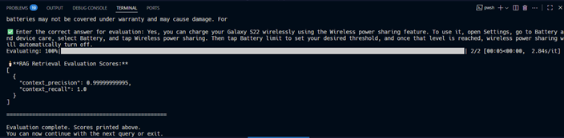
15. Una vez terminada la prueba salirnos del Ambiente Virtual de Python con el comando: </br> `deactivate`


### 41. RAGAs Validation Framework - Retrieval - Augmentation - Generation

1. Empezamos creando el archivo **`src/rag/implement_gpt.py`**, similar a los anteriores con lagunos cambios:
```py
import os
import fitz  # PyMuPDF
from typing import List
from dotenv import load_dotenv  # Load environment variables
from openai import OpenAI
from langchain_openai import OpenAIEmbeddings
from langchain_community.vectorstores import FAISS
from langchain.text_splitter import RecursiveCharacterTextSplitter
from langchain.schema import Document

# Set API key or raise an error if not set
OPENAI_API_KEY = os.getenv("OPENAI_API_KEY")
if not OPENAI_API_KEY:
    load_dotenv()  # Carga las variables de entorno del archivo .env
    OPENAI_API_KEY = os.getenv("OPENAI_API_KEY")
# print("OpenAI API Key:", OPENAI_API_KEY)

# Instantiate OpenAI client
openai_client = OpenAI(api_key=OPENAI_API_KEY)

# =========================================================
# FAISS & Document Loading Setup
# =========================================================
DB_FILE = "./src/rag/.faiss_index"

# Define the GPT model class
model_name = "gpt-3.5-turbo"  # Example model name, can be changed as needed


class GPTModel:
    def __init__(self, model_name=model_name):
        self.model_name = model_name
        # self.embeddings = OpenAIEmbeddings(openai_api_key=api_key)

    def generate_response(self, prompt: str) -> str:
        """Generate a response using the GPT model."""
        completion = openai_client.chat.completions.create(
            model=self.model_name,
            messages=[{"role": "system", "content": "You are a helpful assistant."},
                      {"role": "user", "content": prompt}]
        )
        return completion.choices[0].message.content


def extract_text_from_pdf(pdf_path: str) -> str:
    """Extract text from a PDF file using PyMuPDF."""
    text = ""
    page_number = 0
    try:
        with fitz.open(pdf_path) as doc:
            for page in doc:
                page_text = page.get_text("text")
                page_number = page.number + 1
                text += page_text + "\n"
            print(f"Extracting text from page {page_number} of {pdf_path}")
    except Exception as e:
        print(f"Error extracting text from {pdf_path}: {e}")
    return text


def load_documents(folder_path: str) -> List[Document]:
    ...


def create_vector_db(local_docs):  # List[Document]
    ...


def load_vector_db():
    ...


def retrieve_elevant_docs(query: str, k: int = 3) -> List[Document]:
    ...


def chat_with_context(query: str, k: int = 3) -> str:
    """Generate a response to the query using retrieved relevant documents as context."""
    relevant_docs = retrieve_elevant_docs(query, k)
    context = "\n\n".join(relevant_docs)

    prompt = f"Context:\n{context}\n\nQuestion: {query}\nAnswer:"
    gpt_model = GPTModel()
    response = gpt_model.generate_response(prompt)
    return response


# =========================================================
# Main Execution
# =========================================================
if __name__ == "__main__":
    FOLDER_PATH = "./src/rag/documents"
    # load_dotenv()  # Carga las variables de entorno del archivo .env
    # OPENAI_API_KEY = os.getenv("OPENAI_API_KEY")
    # print("OpenAI API Key:", OPENAI_API_KEY)

    # Load documents from the 'documents' folder
    documents = load_documents(FOLDER_PATH)

    # Create FAISS database (run only once per dataset)
    create_vector_db(documents)

    while True:
        user_query = input("Enter your query (or 'exit' to quit): ")
        if user_query.lower() == 'exit':
            break
        responseGPT = chat_with_context(user_query)
        if responseGPT:
            print("\n 💬 ChatGPT Response: \n", responseGPT)
        else:
            print("No relevant documents found.")
    print("Exiting the ChatGPT RAG/Chatbot.")

```
2. Activo el Ambiente Virtual de Python: </br> `.venv/Scripts/activate`
3. Luego ejecutamos el comando para ejecutar el escript: </br> `python ./src/rag/implement_gpt.py`
4. Este sería el resultado esperado: </br> 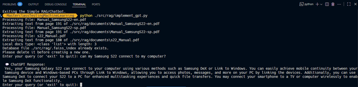
5. Podemos Implementar algo parecido al **`RAGAS_local.py`**, para validar la respuesta de este **`implement_gpt.py`**.
6. Voy a crear el archivo **`src/rag/RAGAS_gpt.py`**, para probar la verificación basado en **`RAGAS_local.py`**:
```py
import os
import fitz  # PyMuPDF
import json
from typing import List
from dotenv import load_dotenv  # Load environment variables
from openai import OpenAI

# RAGAS Evaluation Imports
from ragas.metrics import (
    context_precision,  # Measures if retrieved is relevantto the answer.
    context_recall  # Measures if all necessary information was retreieved.
)
from ragas import evaluate
from datasets import Dataset

# FAIS & LangChain Imports
from langchain_openai import OpenAIEmbeddings
from langchain_community.vectorstores import FAISS
from langchain.text_splitter import RecursiveCharacterTextSplitter
from langchain.schema import Document

# Set API key or raise an error if not set
OPENAI_API_KEY = os.getenv("OPENAI_API_KEY")
if not OPENAI_API_KEY:
    load_dotenv()  # Carga las variables de entorno del archivo .env
    OPENAI_API_KEY = os.getenv("OPENAI_API_KEY")
# print("OpenAI API Key:", OPENAI_API_KEY)

# Instantiate OpenAI client
openai_client = OpenAI(api_key=OPENAI_API_KEY)

# =========================================================
# FAISS & Document Loading Setup
# =========================================================
DB_FILE = "./src/rag/.faiss_index"

# Define the GPT model class
model_name = "gpt-3.5-turbo"  # Example model name, can be changed as needed


class GPTModel:
    def __init__(self, model_name=model_name):
        self.model_name = model_name
        # self.embeddings = OpenAIEmbeddings(openai_api_key=api_key)

    def generate_response(self, prompt: str) -> str:
        """Generate a response using the GPT model."""
        completion = openai_client.chat.completions.create(
            model=self.model_name,
            messages=[{"role": "system", "content": "You are a helpful assistant."},
                      {"role": "user", "content": prompt}]
        )
        return completion.choices[0].message.content


def extract_text_from_pdf(pdf_path: str) -> str:
    """Extract text from a PDF file using PyMuPDF."""
    text = ""
    page_number = 0
    try:
        with fitz.open(pdf_path) as doc:
            for page in doc:
                page_text = page.get_text("text")
                page_number = page.number + 1
                text += page_text + "\n"
            print(f"Extracting text from page {page_number} of {pdf_path}")
    except Exception as e:
        print(f"Error extracting text from {pdf_path}: {e}")
    return text


def load_documents(folder_path: str) -> List[Document]:
    """Load all PDF and TXT from a folder and return a list of Document objects."""
    local_docs = []
    for filename in os.listdir(folder_path):
        file_path = os.path.join(folder_path, filename)
        print(f"Processing file: {filename}")
        if filename.endswith(".pdf"):
            text = extract_text_from_pdf(file_path)
        elif filename.endswith(".txt"):
            with open(file_path, "r", encoding="utf-8") as file:
                text = file.read()
        else:
            continue
        if text.strip():
            local_docs.append(Document(page_content=text,
                                       metadata={"source": filename}))
    return local_docs


def create_vector_db(local_docs):  # List[Document]
    """Create a FAISS vector database from a list of Document objects."""
    print("Local docs type:", type(local_docs),
          "with length:", len(local_docs))
    if not local_docs:
        raise ValueError(
            "No documents provided to create the vector database.")
    if os.path.exists(DB_FILE):
        print(f"Database file {DB_FILE} already exists.")
        print("Please delete it before creating a new one.")
        return
    text_splitter = RecursiveCharacterTextSplitter(
        chunk_size=500, chunk_overlap=100)
    docs = text_splitter.split_documents(local_docs)

    # Generating embeddings

    embeddings = OpenAIEmbeddings(openai_api_key=OPENAI_API_KEY)

    vector_db = FAISS.from_documents(docs, embeddings)

    # Save the vector store to disk
    vector_db.save_local(DB_FILE)
    print(f"Vector database created and saved to {DB_FILE}.")


def load_vector_db():
    """Create a FAISS vector database from documents in the 'documents' folder."""
    if os.path.exists(DB_FILE):
        return FAISS.load_local(DB_FILE, OpenAIEmbeddings(openai_api_key=OPENAI_API_KEY), allow_dangerous_deserialization=True)
    else:
        raise FileNotFoundError(
            f"Database file {DB_FILE} not found. Please create the database first.")


def retrieve_elevant_docs(query: str, k: int = 3) -> List[Document]:
    """Retrieve the top-k relevant documents chunks from FAISS."""
    vector_db = load_vector_db()
    if vector_db:
        results = vector_db.similarity_search(query, k=k)
        return [doc.page_content for doc in results]
    else:
        print("Vector database not found or could not be created.")
        return []


def chat_with_context(query: str, k: int = 3) -> str:
    """Generate a response to the query using retrieved relevant documents as context."""
    relevant_docs = retrieve_elevant_docs(query, k)
    context = "\n\n".join(relevant_docs)

    prompt = f"Context:\n{context}\n\nQuestion: {query}\nAnswer:"
    gpt_model = GPTModel()
    response = gpt_model.generate_response(prompt)
    return response

# =========================================================
# RAGAS Evaluation (Retrieval Testing Only)
# =========================================================


def evaluate_ragas(query: str, retrieved_docs: List[str], correct_answer: str):
    """Evaluates the RAG retrieval system using RAGAS metrics"""

    # Ensure retieved_docs is a list
    if not isinstance(retrieved_docs, list):
        retrieved_docs = [retrieved_docs]

    # Prepare data for evaluation
    evaluation_data = {
        "question": [query],
        "contexts": [retrieved_docs],  # Expected format: list of strings
        "answer": [correct_answer],
        "reference": [correct_answer]  # Required for context_precision
    }
    dataset = Dataset.from_dict(evaluation_data)

    # Run RAGAS evaluation
    scores = evaluate(dataset, metrics=[
        context_precision,
        context_recall
    ])

    # Convert to dictionary
    scores_dict = scores.__dict__

    # Remove non-serializable parts (e.g., evaluation_dataset) if present
    EVAL_DATA = "evaluation_dataset"
    if EVAL_DATA in scores_dict:
        scores_dict.pop(EVAL_DATA)
    # Extract only the scores
    only_scores = scores_dict.get("scores", {})

    print("\n🕯️ **RAG Retrieval Evaluation Scores:**")
    print(json.dumps(only_scores, indent=2, default=str))

# Example
# # query = "Can I charge my Galaxy S22 wirelessly?"
# # aswer = "Yes, you can charge your Galaxy S22 wirelessly using the Wireless power sharing feature. To use it, open Settings, go to Battery and device care, select Battery, and tap Wireless power sharing. Then tap Battery limit to set your desired threshold, and once that level is reached, wireless power sharing will automatically turn off."


# =========================================================
# Main Execution
# =========================================================
if __name__ == "__main__":
    FOLDER_PATH = "./src/rag/documents"
    # load_dotenv()  # Carga las variables de entorno del archivo .env
    # OPENAI_API_KEY = os.getenv("OPENAI_API_KEY")
    # print("OpenAI API Key:", OPENAI_API_KEY)

    # Load documents from the 'documents' folder
    documents = load_documents(FOLDER_PATH)
    create_vector_db(documents)

    while True:
        user_query = input("Enter your query (or 'exit' to quit): ")
        if user_query.lower() == 'exit':
            break
        responseGPT = chat_with_context(user_query)
        if responseGPT:
            print("\n 💬 ChatGPT Response: \n", responseGPT)
        else:
            print("No relevant documents found.")
        answer = input("✅ Enter the correct answer for evaluation: ")
        evaluate_ragas(user_query, responseGPT, answer)
        print("\n" + "="*50 + "\n")
        print("Evaluation complete. Scores printed above.")
        print("You can now continue with the next query or exit.")
    print("Exiting the RAGAS to GPT evaluation script.")

```
7. Ejecuté en la `TERMINAL` estando en el Ambiente Virtual de Python: </br> `python .\src\rag\RAGAS_gpt.py`
8. Luego de una espera y poner como `query` el texto </br> `Can I charge my Galaxy S22 wirelessly?` </br> Y luego a la pregunta de `correct answer` de: </br> `Yes, you can charge your Galaxy S22 wirelessly using the Wireless power sharing feature. To use it, open Settings, go to Battery and device care, select Battery, and tap Wireless power sharing. Then tap Battery limit to set your desired threshold, and once that level is reached, wireless power sharing will automatically turn off.` </br> Esta sería la respuesta: </br> 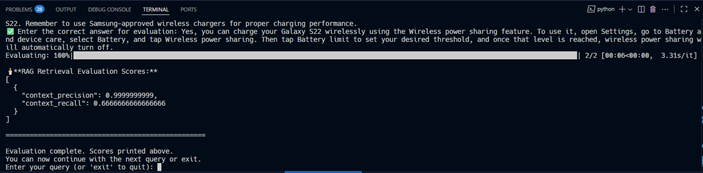
9. Una vez terminada la prueba salirnos del Ambiente Virtual de Python con el comando: </br> `deactivate`


### 42. Rag framework - Coherence, Fluency and Relevance

>[!NOTE]
>
>Al evaluar el RAG, se requiere más que simplemente pensar en la capacidad de recordar o si toda la información está ahí.
>Por lo tanto, también debemos considerar la fluidez, la relevancia y la coherencia.
>
>Porque todos estos elementos son importantes al comparar cualquier tipo de sistema de IA.
>Y también para el RAG, ¿cierto?
>
>También debes verificar si tu sistema de evaluación también considera la fluidez, la relevancia y la coherencia en tu flujo de trabajo del RAG.
>
>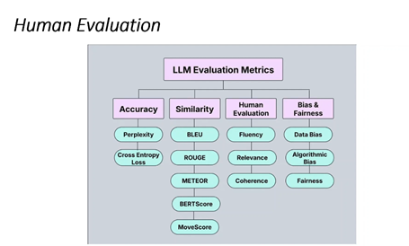
>
>Para ello, quiero presentar un concepto llamado LLM como juez.
>Básicamente, se evalúa el resultado de la secuencia de comandos de Rag utilizando otro modelo de lenguaje amplio.
>Y, por supuesto, también lo analizaremos.
>¿Pero saben qué es la fluidez?
>Así funciona.
>Cuán natural y gramaticalmente correcto es el texto generado.
>Y no sólo fluidez.
>
>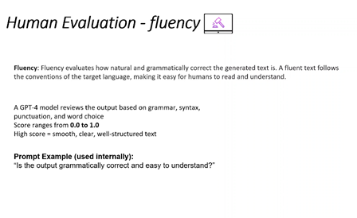
>
>Pero también se analiza la coherencia.
>Y la coherencia, como saben, muestra la fluidez y consistencia de todos los elementos que se extraen
>de la producción de material.
>Ahora bien, en términos de contexto, también se puede analizar la relevancia.
>
>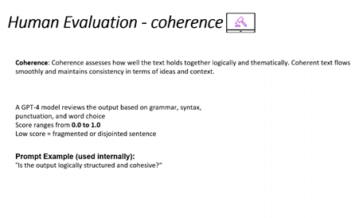
>
>¿Es la respuesta relevante para lo que tengo?
>Porque le pedirás a tu sistema que proporcione algunas respuestas.
>¿Y es relevante?
>
>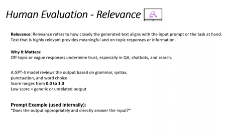
>
>Y también podrías considerar la concisión.
>¿Es conciso?
>Es decir, ¿obtengo cinco páginas de algo que podría resumirse en quizás dos líneas?
>¿O recibo mucha palabrería, que en realidad no es tan relevante para mí?
>Y para validar tu trabajo, analizaremos un marco basado en una evaluación profunda.
>
>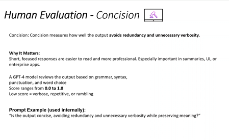
>
>Básicamente, este es mi código, algo que tengo aquí.
>Si subimos, vemos que usaremos esta métrica de "eval".
>Necesitas tu clave API.
>
>Configuraré mi contenedor ChatGPT, ya que lo usaré para que me haga un trabajo.
>Luego generaré varias pruebas.
>Si te fijas, estas son pruebas Pi.
>Aquí están mis evaluaciones: fluidez, coherencia, relevancia y concisión.
>
>Todas se realizan con una instrucción.
>Así que, incluso si esto ya está predefinido y nadie sabe cómo usarlo, necesitas proporcionar una especie de instrucción.
>Pero no te preocupes, esta instrucción se combina con algo que está detrás de la instrucción y te proporcionará todos estos elementos.
>
>Y también puedo decir aquí, por ejemplo, algo como esto y un criterio de aprobación en porcentajes.
>Por defecto, se obtiene un 50% de aprobado.
>Ahora, esta prueba que acabo de empezar, buscará un archivo llamado texto de entrada y texto de referencia.
>Comparará uno con el otro, porque al validar una pista se necesita un texto de entrada, algo con lo que se pueda trabajar.
>Y luego la referencia, que es la parte correcta.
>
>Tomará mi texto de entrada, que es un texto que he copiado de internet.
>Lo traducirá al rumano, obtendrá las ideas principales y las traducirá de nuevo al inglés.
>Y luego la referencia está aquí.
>Compararemos el resumen de la traducción al rumano con el texto de referencia en inglés que ya he completado.
>Sí, esa es la idea.
>
>Queremos comparar algo con otra cosa.
>Y pueden ver aquí que estoy ejecutando LM como juez, ¿ven aquí, verdad?
>LM como juez.
>Y estoy probando fluidez, coherencia, relevancia y concisión.
>Todos se ejecutarán en paralelo, y la prueba ya está hecha.
>Ha sido utilizada por una IA confiable con nuestro marco de trabajo.
>Y aquí está la tasa de aprobación, no la puntuación.
>
>Así que las cuatro pruebas han pasado, pero ¿cuál es exactamente su puntuación?
>
>Bueno, por ejemplo, veamos si subimos en relevancia.
>Obtuve un 78% de aprobados en concisión, 66% en fluidez y 51%.
>Así que, si este porcentaje fuera dos puntos porcentuales menor, este examen habría sido reprobado.
>Así que, al evaluar el RAG, no solo se trata de asegurar la memoria del contexto, o quizás la precisión del contexto, o quizás la veracidad, sino que también hay que observar eso y compararlo, ¿cierto?
>
>Porque siempre comparamos algo con algo con el RAG.
>Esa es la idea.
>Así que siempre se compara algo.
>
>Y básicamente eso es todo.
>Eh, no, estoy seguro de que encontrarán una manera de evaluar la coherencia, la fluidez, la relevancia y cualquier otra cosa que deseen utilizando este LLM como criterio.
>Correcto.
>Así que recuerden, obtienen información, obtienen resultados y luego consultan a un modelo lingüístico externo de gran tamaño.
>En este caso, la IA confiará en que evaluarán sus resultados comparándolos con un resultado predefinido.
>Y luego tienes dos pares de ojos que miran tus resultados y tu puntuación.
>


### 43. RAG Benchmarking - Nugget Coverage

>[!NOTE]
>
>Ahora bien, cuando haces un rag, básicamente tienes un montón de documentos.
>Imagina que esta es toda tu base de conocimientos dividida en fragmentos.
>
>Estos son los fragmentos de información que tu recuperación obtendrá para completar tu contexto.
>Y si haces tu pregunta, tu información podría estar en este y en este otro.
>
>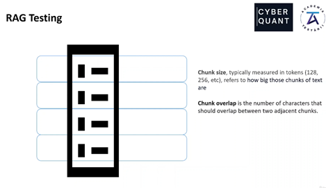
>
>Y estos dos podrían no contener la respuesta a tu información.
>Y el fragmento que contenga con seguridad tu información, será la respuesta a tu consulta.
>Eso se llama pepita de oro porque es de oro, sin duda.
>Encontrarás tu información allí.
>
>Por ejemplo, imaginemos que tienes el fragmento uno, el fragmento dos, el fragmento tres, el fragmento cuatro, y
>luego defines el fragmento dos como mi pepita de oro.
>Entonces, cuando estés probando la siguiente métrica, que es la cobertura de la pepita de oro,
>Lo que quieres validar es que el retriever coja tu pepita, y tú sabes que es esa pepita y no otra.
>
>Y, sabes, esto es muy fácil de implementar.
>Puedes hacerlo con ragas.
>Y te lo mostraré ahora mismo.
>
>Básicamente, lo que tengo aquí es una implementación de ragas.
>Y lo más importante que queremos analizar no es el código.
>Porque, de nuevo, el código con el que se puede explicar, como ChatGPT o Claude, es esta parte del conjunto de datos.
>
>Así que aquí es donde definimos nuestro conjunto de datos.
>Y ven que tenemos tres bloques de datos.
>Y saben que los bloques uno y cuatro son válidos.
>Pero el bloque cuatro no está aquí porque no se ha recuperado.
>
>Así que, básicamente, cuando hacen su llamada y luego se recuperan estos bloques, y saben que los bloques uno y cuatro son válidos.
>Así que lo que puedo decirles es que falta el bloque cuatro.
>Eso es un problema.
>Y luego se obtienen las puntuaciones de soporte.
>
>La puntuación de soporte indica la relevancia de su respuesta en su bloque.
>Cómo.
>Básicamente, cuanto mayor sea la puntuación de soporte, más relevante será tu respuesta en ese fragmento.
>Ahora, de nuevo, tenemos estos fragmentos recuperados.
>Estos están etiquetados como pepitas de oro.
>
>Y estas son nuestras puntuaciones de soporte.
>Así que voy a ejecutar esto.
>Y ahora veamos cuáles son los resultados que obtendremos.
>Un par de segundos, porque esto funcionará muy rápido. No estoy usando ningún tipo de alfombra.
>Solo estoy simulando esto y calculando para ti.
>No necesitas simular.
>Puedes hacerlo como quieras, pero ya sabes, porque ya has implementado los archivos y esto es justo lo que queremos hacer.
>Entonces.
>
>La recuperación de la pepita de oro es 0.5.
>¿Por qué?
>Porque de dos, solo llegó uno.
>Así que, también deberías tener el fragmento para...
>Pero la recuperación no se molestó en obtener el fragmento para la puntuación media de soporte, como pueden imaginar.
>Sí, es este de aquí.
>
>Básicamente, es algo que pueden revisar.
>La recuperación es como obtener documentos, ¿verdad?
>Pueden ver si el documento se recupera.
>Esa es una parte.
>Y luego pueden analizar el contexto para ver si la recuperación obtuvo de ese documento lo que quieran.
>
>La primera parte es obtener el documento y luego obtener el fragmento específico de ese documento.
>Es una métrica muy importante si quieren probar su recuperación, ya saben, la recuperación de la pepita de oro.
>Y si quieren probar toda la información, esa será su precisión o su recuperación.
>


## Section 7: Evaluate Machine Learning Model based on DATA Split


### 44. Introduction to Splitting Data for AI/ML Models


>[!NOTE]
>
>Para probar mejor la IA, es necesario comprenderla.
>Y no profundizaré mucho en qué exactamente.
>Bueno, o en el funcionamiento interno de la IA, pero es muy importante.
>Es necesario comprender cuáles son los tres pilares que la sustentan.
>
>
>
>1. Ahora, sin más preámbulos, el primero se centra en los datos. >Y digo **datos limpios** porque significa, por ejemplo, que no tienen sesgos.</br>
></br>No contienen lenguaje grosero.
>Son datos correctos, no están llenos de teorías conspirativas, porque no queremos que nuestra IA aprenda que cierta minoría, por ejemplo, es genéticamente inferior, etc.
>¿Verdad?</br>
></br>Y no se trata solo de eso.
>Se trata de que los datos sean estadísticamente representativos de toda la población.
>Y hablaremos de eso más adelante.
>Pero es importante saber que los datos son inmensos.
>Son absolutamente inmensos cuando se trata de IA.
>
>2. El siguiente tema trata sobre **algoritmos**.
></br></br>
>Quizás hayas oído hablar de redes neuronales convolucionales, aprendizaje profundo o cualquier tipo de algoritmo de aprendizaje automático.
>Bueno, los algoritmos funcionan con datos.
></br></br>
>Por lo tanto, cuanto mejor sea el algoritmo, más fácil será para tu aprendizaje automático convertir los datos en una predicción, o generar algo, y también más rápido, ya que los algoritmos pueden ser lentos y rápidos.
></br></br>
>El segundo pilar de la IA se centra en los algoritmos, ya que verás que, a partir de los mismos datos, diferentes algoritmos de aprendizaje automático obtienen diferentes resultados y eficiencias.
></br></br>
>Así, podrías obtener una puntuación del 90 % con un algoritmo, pero podrías obtener una puntuación del 97 % de precisión con un algoritmo diferente.
>
>3. El tercero es la **potencia de procesamiento**.
></br></br>
>Estoy bastante seguro de que saben que Nvidia domina el mundo actualmente.
>Y todo esto junto.
>Constituyen los fundamentos, los pilares para crear IA.
></br></br>
>Así que todo se reduce a algoritmos de datos y, por supuesto, a la potencia de procesamiento que se utiliza.
>Porque el entrenamiento de la IA en sí mismo requiere un uso intensivo de recursos.
>Y verán que los diferentes algoritmos y métodos de entrenamiento requieren un uso más intensivo de recursos
>que otros.
>
>En fin, esto es solo el principio.
>Ahora pasemos a la parte sobre datos, ya que existen métodos de entrenamiento y evaluación muy específicos para ellos y los analizaremos en todo este capítulo.
>
>Y hay algo llamado división de datos que realmente me gusta y disfruto.
>
>Ahora imagina que este es tu conjunto de datos, todo lo que tienes aquí.
>Voy a tomar mi puntero.
>Estos serán todos los datos que tengo.
>Eso es todo.
>
>Nada más.
>
>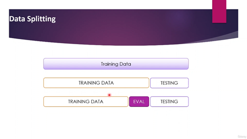
>
>Este es mi entrenamiento completo.
>Los datos están etiquetados y ya están depurados.
>Son representativos.
>Y voy a usar estos datos para entrenar y validar mi modelo.
>Pero, ¿cómo se dice "esto es para entrenamiento y esto para evaluación"?
>
>¿Cómo se sabe cómo hacerlo?
>Existen algunos métodos.
>Imagina el siguiente escenario donde tomas todos estos datos que tienes aquí y dices: "Supongamos que el 80% o el 70% serán mis datos de entrenamiento".
>Así que mi algoritmo se entrenará solo con el 70% de todos mis datos.
>
>Entonces, te preguntarás: "¿Qué hago con el siguiente 30%?".
>Bueno, el siguiente 30% será para probar mi algoritmo.
>Esto significa que estos serán mis datos de entrenamiento etiquetados, y estos serán datos que el modelo no ha visto.
>Esto se usará en el modelo para validarlo.
>Entonces, se te pedirá que uses datos nuevos nunca antes vistos para ver si llegas a la etiqueta real.
>No.
>
>Esto significa que tu entrenamiento puede ser único y no hay retroalimentación durante el mismo.
>Así que hay otro método que puedes usar para dividir aún más tus datos.
>
>Repetimos el proceso.
>Imagina que esto es el 60%.
>Y vas a entrenar tu modelo solo con estos datos, solo con esta parte, el 60% de todos tus datos.
>Solo un ejemplo.
>
>Luego, obtendrás otro conjunto de datos: datos de evaluación, que se usarán para evaluar el entrenamiento del modelo.
>Durante el entrenamiento, puedes simplemente decir: "Oye, quiero que ejecutes el entrenamiento con estos datos".
>Y durante el entrenamiento, también quiero que uses estos datos para evaluar si el entrenamiento es correcto.
>Harás esto un par de veces, y solo después podrías decir: "Mi modelo está entrenado y ahora usaré estos datos para comparar mi modelo actual".
>
>Esto se llama división de datos.
>En los próximos videos, te mostraré qué es el plegado en K.
>
>¿Cómo puedes dividir aún más tus datos?
>También te mostraré que, por ejemplo, si analizamos los abrazos, los datos faciales suelen dividirse así.


### 45. Demo - Python - Scikit - Split Data for Testing

1. Nos vamos a esta página  [scikit-learn/iris](https://huggingface.co/datasets/scikit-learn/iris)
2. Revisamos en el tabulador primero `Dataset card` y debajo que el `train` está en `Split(1)` y `150 rows`: </br> 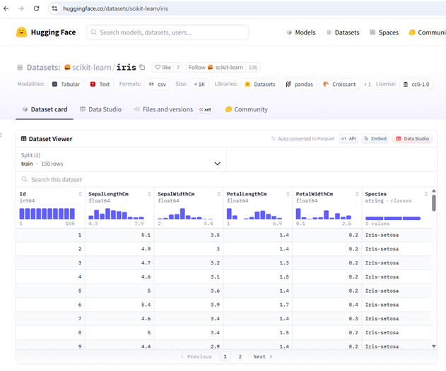
3. Vemos cuatro parámetros:
* SepalLengthCm
* SepalWidthCm
* PetalLengthCm
* PetalWidthCm
4. Y luego, dependiendo de estos números, también se obtiene la especie de iris, que puede ser una de las tres.</br> Estos son todos los datos que tenemos.</br>Básicamente, lo que queremos hacer es entrenar nuestro modelo para que, dependiendo de las combinaciones de estos cuatro, prediga qué tipo de especie tenemos.</br>Pero para predecirlo, es necesario encontrar una manera de trabajar con los datos.
5. Creamos el archivo **`src/test/LLM/Data_Spliting/evaluate_model.py`**
6. Primero en la `TERMINAL` ejecuto el Ambiente Virtual de Python: </br> `.venv/Scripts/activate`
7. Se ve el archivo **`src/test/LLM/Data_Spliting/iris_eval.csv`**, con este ejemplo de valores:
```csv
id,SepalLengthCm,SepalWidthCm,PetalLengthCm,PetalWidthCm,Species
71,5.9,3.2,4.8,1.8,Iris-versicolor
30,5.7,2.6,3.5,1.0,Iris-versicolor
135,6.1,2.6,5.6,1.4,Iris-virginica
...
144,6.8,3.2,5.9,2.3,Iris-virginica
127,6.2,2.8,4.8,1.8,Iris-virginica
92,6.1,3.0,4.6,1.4,Iris-versicolor
```
8. Si existe el archivo **`iris_eval.csv`** lo borramos.
9. Hay otro archivo **`src/test/LLM/Data_Spliting/iris_train.csv`**, con estos datos de ejemplo:
```csv
id,SepalLengthCm,SepalWidthCm,PetalLengthCm,PetalWidthCm,Species
95,5.6,2.7,4.2,1.3,Iris-versicolor
57,6.3,3.3,4.7, 1.6,Iris-versicolor
97,5.7,2.9,4.2, 1.3,Iris-versicolor
...
102,5.8,2.7,5.1,1.9,Iris-virginica
145,6,7,3,3,5,7,2.5,Iris-virginica
46,4.8,3.0,1.4,0.3,Iris-setosa
```
10. Si existe el archivo **`iris_train.csv`**, lo borramos.
11. Creo otro archivo de nombre **`src/test/LLM/Data_Spliting/split_train_Dataset.py`**, con este código:
```py
from datasets import load_dataset

# Step 1: Load the Iris dataset from Hugging Face
dataset = load_dataset("scikit-learn/iris")

# Step 2: Split the dataset into training (120 samples) and evaluation (30 samples)
split_dataset = dataset["train"].train_test_split(test_size=30, seed=42)

# Step 3: Save the splits to CSV files
current_path = "./src/test/LLM/Data_Spliting/"
train_file = current_path + "iris_train.csv"
eval_file = current_path + "iris_eval.csv"

split_dataset["train"].to_pandas().to_csv(train_file, index=False)
split_dataset["test"].to_pandas().to_csv(eval_file, index=False)

print(f"Training data saved to '{train_file}'")
print(f"Evaluation data saved to '{eval_file}'")
```
12. Ejecuto en la `TERMINAL` este último **`split_train_Dataset.py`** </br> `python ./src/test/LLM/Data_Spliting/split_train_Dataset.py` </br> Y obtengo los dos archivos que inicialmente borré:
* **`src/test/LLM/Data_Spliting/iris_eval.csv`**
* **`src/test/LLM/Data_Spliting/iris_train.csv`**
13. Creo otro archivo de nombre **`src/test/LLM/Data_Spliting/split_train_scikit.py`**, con este código:
```py
from sklearn.datasets import load_iris
from sklearn.model_selection import train_test_split
import pandas as pd

# Step 1: Load the Iris dataset from Hugging Face
iris = load_iris()
x = iris.data  # Features
y = iris.target  # Labels

# Step 2: Split the dataset into training (120 samples) and evaluation (30 samples)
x_train, x_eval, y_train, y_eval = train_test_split(
    x, y, test_size=30/150, random_state=42)

# Step 3: Convert split to DataFrames
train_data = pd.DataFrame(x_train, columns=iris.feature_names)
train_data["target"] = y_train

eval_data = pd.DataFrame(x_eval, columns=iris.feature_names)
eval_data["target"] = y_eval

# Step 4: Save the splits to CSV files
current_path = "./src/test/LLM/Data_Spliting/"
train_file = current_path + "iris_train.csv"
eval_file = current_path + "iris_eval.csv"

train_data.to_csv(train_file, index=False)
eval_data.to_csv(eval_file, index=False)

print(f"Training data saved to '{train_file}'")
print(f"Evaluation data saved to '{eval_file}'")
```
14. Borro de nuevo los dos archivo **`*.csv`**.
15. Ejecuto en la `TERMINAL` este último **`split_train_Dataset.py`** </br> `python ./src/test/LLM/Data_Spliting/split_train_scikit.py` </br> Y obtengo los dos archivos que anteriormente borré:
* **`src/test/LLM/Data_Spliting/iris_eval.csv`**
* **`src/test/LLM/Data_Spliting/iris_train.csv`**
16. Ejecutamos de nuevo en la `TERMINAL` el anterior **`split_train_Dataset.py`** </br> `python ./src/test/LLM/Data_Spliting/split_train_Dataset.py` </br> Genera mejores resultados en los archivos **`*.csv`**.
18. Creamos otro archivo **`src/test/LLM/Data_Spliting/train_model.py`** y le ponemos este código:
```py
from datasets import Dataset
from transformers import DistilBertTokenizer, DistilBertForSequenceClassification, Trainer, TrainingArguments
import pandas as pd
import os

# Step 1: Load your dataset from a CSV file
current_path = "./src/test/LLM/Data_Spliting/"
train_file = current_path + "iris_train.csv"
data = pd.read_csv(train_file)

# Step 1.1: Validate the existence of the training file
if not os.path.exists(train_file):
    raise FileNotFoundError(f"Training file not found: {train_file}")

# Step 1.2: Validate the columns in the dataset
required_columns = ['SepalLengthCm', 'SepalWidthCm', 'PetalLengthCm', 'PetalWidthCm', 'Species']
if not all(col in data.columns for col in required_columns):
    raise ValueError(f"The dataset must contain the following columns: {required_columns}")

# Step 2: Convert the dataset to Hugging Face Dataset
dataset = Dataset.from_pandas(data)

# Step 3: Preprocess the datase: Convert all feature column into a single textual description


def convert_to_text(example):
    features = f"This flower has a sepal length of {example['SepalLengthCm']} cm, a sepal width of {example['SepalWidthCm']} cm, "\
        f"a petal length of {example['PetalLengthCm']} cm, and a petal width of {example['PetalWidthCm']} cm."
    return {"text": features}


dataset = dataset.map(convert_to_text)

# Step 4: Map the 'Species' column to numerical lables for classification
label_mapping = {"Iris-setosa": 0, "Iris-versicolor": 1, "Iris-virginica": 2}

# Ensure 'Species' is correctly mapped
dataset = dataset.map(lambda x: {"label": label_mapping[x["Species"]]})

# Drop unnecessary columns
dataset = dataset.remove_columns(
    {"Id", "SepalLengthCm", "SepalWidthCm", "PetalLengthCm", "PetalWidthCm", "Species"})

# Step 5: Tokenize the dataset
tokenizer = DistilBertTokenizer.from_pretrained("distilbert-base-uncased")


def tokenize_data(example):
    return tokenizer(example["text"], truncation=True, padding="max_length", max_length=128)


tokenized_dataset = dataset.map(tokenize_data, batched=True)

# Step 6: Split the dataset into training and evaluation sets
train_test_split = tokenized_dataset.train_test_split(test_size=0.2, seed=42)
train_dataset = train_test_split["train"]
eval_dataset = train_test_split["test"]

# Step 7: Load a pre-trained DistriBERT model
model = DistilBertForSequenceClassification.from_pretrained("distilbert-base-uncased",num_labels=3)

# Step 8: Define training arguments with increased epochs and logging
training_arg=TrainingArguments(
    output_dir=current_path +"results",
    eval_strategy="epoch", # Performs evaluation at the end of each epoch
    save_strategy="epoch", # Save checkpoints at the end at each poch
    learning_rate=5e-5,
    per_device_train_batch_size=16,
    per_device_eval_batch_size=16,
    num_train_epochs=10, # Increased epochs for better training
    weight_decay=0.01,
    logging_dir=current_path +"logs",
    logging_steps=10,
    save_total_limit=2,
    load_best_model_at_end=True, # Load the best model at the end of training
)

# Step 9: Initialize Trainer
trainer = Trainer(
    model=model,
    args=training_arg,
    train_dataset=train_dataset,
    eval_dataset=eval_dataset,
)

# Step 10: Train the model and save the results
trainer.train()
print("Training completed. Best model saved at:", training_arg.output_dir)
```
19. Ejecutamos en una `TERMINAL` esta instalación en el Ambiente Virtual de Python: </br> `pip install transformers[torch]`
20. Ejecutamos este último con el comando: </br> `python ./src/test/LLM/Data_Spliting/train_model.py`. </br> 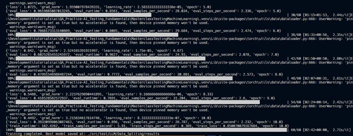</br> Este proceso demora un rato y genera varias carpetas y archivos en la carpeta **"src/test/LLM/Data_Spliting/results"**, entre ellos una carpeta de nombre **"checkpoint-60"**
21. Este último lo vamos a utilizar en el archivo **`src/test/LLM/Data_Spliting/evaluate_model.py`**, con este código:
```py
from datasets import Dataset
from transformers import DistilBertTokenizer, DistilBertForSequenceClassification, Trainer
import pandas as pd
import os

# Step 1: Load the evaluation dataset
current_path = "./src/test/LLM/Data_Spliting/"
# eval_file = current_path+"iris_eval.csv"
eval_file = current_path+"iris_train.csv"
eval_data = pd.read_csv(eval_file)

# Step 1: Validate the existence of the evaluation file
if not os.path.exists(eval_file):
    raise FileNotFoundError(f"Evaluation file not found: {eval_file}")

# Step 1.1: Validate the columns in the dataset
required_columns = ['SepalLengthCm',
                    'SepalWidthCm', 'PetalLengthCm', 'PetalWidthCm']
if not all(col in eval_data.columns for col in required_columns):
    raise ValueError(
        f"The dataset must contain the following columns: {required_columns}")

# Step 2: Convert the dataset to Hugging face Dataset
eval_dataset = Dataset.from_pandas(eval_data)

# Step 3: Preprocess the dataset: convert features into textual descriptions


def convert_to_text(example):
    features = f"Sepal length: {example['SepalLengthCm']}, Sepal width: {example['SepalWidthCm']}, "\
        f"Petal length: {example['PetalLengthCm']}, Petal width: {example['PetalWidthCm']}."
    return {"text": features}


eval_dataset = eval_dataset.map(convert_to_text)

# Step 4: Tokenize the dataset
tokenizer = DistilBertTokenizer.from_pretrained("distilbert-base-uncased")


def tokenizer_data(example):
    return tokenizer(example["text"], truncation=True, padding="max_length", max_length=128)


tokenized_eval_dataset = eval_dataset.map(tokenizer_data, batched=True)

# Step 5: Load the trained model
model_path = current_path + "results/checkpoint-60"
model = DistilBertForSequenceClassification.from_pretrained(
    model_path, local_files_only=True)  # Path to the saved model
if not os.path.exists(model_path):
    raise FileNotFoundError(f"Trained model not found: {model_path}")

# Step 6: Initialize Trainer
trainer = Trainer(
    model=model,
    tokenizer=tokenizer,
)

# Step 7: Make predictions
predictions = trainer.predict(tokenized_eval_dataset)

# Step 8: Evaluate predictions and save results
predicted_labels = predictions.predictions.argmax(axis=1)  # Get the predicted class
actual_labels = eval_dataset["Species"]  # Original labels

# Step 9: Map label indices back to species names
label_mapping = {"Iris-setosa": 0, "Iris-versicolor": 1, "Iris-virginica": 2}
reverse_label_mapping = {v: k for k,
                         v in label_mapping.items()}  # Reverse mapping

# Step 10: Calculate accuracy
predicted_labels = predictions.predictions.argmax(
    axis=1)  # Fix access to predictions
actual_labels = eval_data["Species"]  # Use eval_data for actual labels

if len(predicted_labels) != len(actual_labels):
    raise ValueError(
        "Mismatch between number of predictions and actual labels.")

correct_predictions = sum(
    reverse_label_mapping[predicted_labels[i]] == actual_labels[i]
    for i in range(len(actual_labels))
)
accuracy = correct_predictions / len(actual_labels)

# Print and save results
print(f"Accuracy: {accuracy:.2f}")

# Save evaluation results to a CSV file
output_file = current_path + "evaluation_results.csv"
eval_data["PredictedLabel"] = [reverse_label_mapping[label]
                               for label in predicted_labels]
eval_data.to_csv(output_file, index=False)
print(f"Evaluation results saved to {output_file}")
```
22. En una `TERMINAL`, ejecutamos el comando: </br> `python ./src/test/LLM/Data_Spliting/evaluate_model.py` </br> Al final denera un archivo de nombre **`evaluation_results.csv`**.
23. Una vez terminada la prueba salirnos del Ambiente Virtual de Python con el comando: </br> `deactivate`


### 46. K-Fold Cross Validation

>[!NOTE]
>
>Les mostraré un método diferente para **Dividir sus Datos**,
>esto se llama **Plegado K**.
>
>Creo que con un ejemplo, les será más fácil de entender.
>
>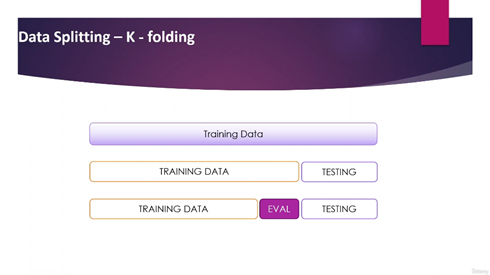
>
>Si recuerdan la última vez que dividimos todos nuestros datos de entrenamiento, teníamos la parte de evaluación de los datos de entrenamiento y luego los datos de prueba.
>Y recordarán que el entrenamiento y la evaluación se llamaban entrenamiento iris.
>Y esta parte era la evaluación iris.
>Ese era el nombre que teníamos en nuestro ejemplo de código.
>Pasemos al siguiente.
>
>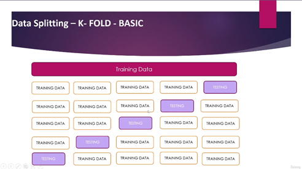
>
>Así que volvemos.
>Estos son todos nuestros datos de entrenamiento.
>
>Con todo lo que tenemos, esas 150 muestras que teníamos en Iris, imagina el siguiente escenario.
>Este es un pliegue: una parte de mis datos de entrenamiento, una pequeña parte.
>Otra parte.
>Otra parte.
>Otra.
>Y estos son mis datos de prueba.
>
>Básicamente, he dividido mis datos en cinco pliegues diferentes.
>Cuatro serán datos de entrenamiento y uno será de prueba.
>Uno de cuatro.
>Cuatro de cinco serán datos de entrenamiento y uno de cinco de prueba.
>
>Y voy a ejecutar el entrenamiento de mi modelo en este tren en estas cuatro partes.
>Evaluar en la última.
>Me imagino que son unos 2530, o lo que sea, 40.
>
>La siguiente ejecución, el siguiente entrenamiento, es así.
>Voy a entrenar con los tres primeros y el último o el quinto, y el cuarto serán mis datos de prueba, y así sucesivamente hasta tener todas las combinaciones posibles.
>
>Esto significa que entrenaré mi modelo cinco veces diferentes y cada vez el conjunto de prueba será una versión diferente del conjunto de entrenamiento.
>
>**Personas entre 20 y 30 años (30, 40, 50, 50, 60).**
>
>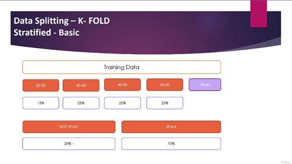
>
>Estos serán tus datos de entrenamiento y de prueba.
>Y deben ser relevantes.
>Así que tienes entre 20 y 60 personas.
>Pero estos son tus datos de entrenamiento sobre ingresos.
>
>Ahora imaginemos que tienes hombres y mujeres, y que tus ingresos son mensuales y anuales.
>No importa.
>Y ahora podría decir: "Bueno, el 50% de mis datos corresponden a este grupo de edad, el 25% a este grupo de edad, 25 y 25".
>
>Y juntos no serán 100, porque, como saben, puede haber personas trabajando mayores de 60 años, personas trabajando menores de 20, pero podríamos decir que el 90% de la población activa tiene entre 20 y 60 años, y el 25% de las personas que trabajan hoy en día tienen entre 30 y 40 años.
>Y el 25% de mis datos también está aquí".
>
>Esto significa que estadísticamente las proporciones son correctas.
>Si tuviera, por ejemplo, [o].
>Esto significa que estadísticamente estamos en lo cierto porque el 25% de mi población tiene esta edad y el 25% de mis datos corresponden a esta edad.
>Así que estamos en lo cierto.
>Están perfectamente representados.
>
>Tomemos otro escenario.
>Y aquí es donde se aplican las estrategias.
>Eh, en este escenario donde tus datos son representativos de la población, tomemos un escenario diferente.
>Imagina que tienes un sistema de filtrado de correo electrónico que filtra spam y no spam.
>Eso es todo.
>¿Verdad?
>Tienes una IA que decide.
>Esto va a spam.
>Esto no es spam.
>Y eso es todo lo que hace, ¿verdad?
>Así es mi vida.
>Nada más.
>
>Ahora imagina que tienes un 25% de correos no spam y un 75% de spam.
>No son estadísticamente correctos.
>Supongo que, si entrenas tu modelo con un 75% de spam y un 25% de no spam, estará sesgado.
>Estará sesgado hacia el spam.
>
>Por ejemplo, si tienes 1000 correos electrónicos y el 25 % no son spam y el 75 % sí lo son, en este caso, necesitas usar un algoritmo k-fold estratificado donde la proporción debe corregirse, lo cual se hace directamente en el código.
>
>Pero existen diferentes métodos de entrenamiento para evitar que esto se desvíe hacia el spam.
>Quieres que sea neutral, como este.
>De esta manera, este entrenamiento introduce sesgos en el sistema, y ​​nadie quiere que haya sesgos en el sistema.
>
>Y si vamos a la última parte, también está esta tabla.
>
>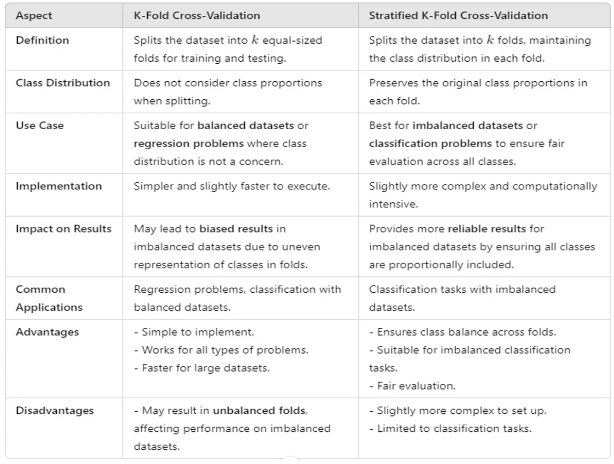
>
>**¿Qué significa esto?**
>
>Y luego la distribución de clases.
>Validación cruzada, la básica.
>Esto es para conjuntos de datos balanceados.
>Recuerden que para conjuntos de datos desbalanceados, como mencioné, se debe usar la estratificación para garantizar una evaluación justa en todas las clases.
>Ambas son bastante fáciles de implementar.
>
>El cálculo es más costoso, pero es fácil de implementar.
>Puede generar resultados sesgados en conjuntos de datos desbalanceados.
>Exactamente.
>Por eso, esta opción es solo para conjuntos de datos balanceados.
>
>Ventajas: fácil de implementar.
>Funciona con todos los problemas y es más rápida con conjuntos de datos grandes.
>Repito: evaluación justa y adecuada.
>La mayoría de las veces, se usará esta opción en caso de que la evaluación no sea justa.
>
>Pero nuestro conjunto de datos de iris va aquí porque está totalmente equilibrado.
>Representa el 33 % de las tres clases.
>Sí.
>
>Y, de nuevo, la desventaja es lo opuesto a la ventaja.
>Eso es todo por la teoría.
>En el próximo video les mostraré cómo ejecutaremos la evaluación en un modelo entrenado
>utilizando una técnica de entrenamiento de validación de k-fold.
>

### 47. Model Overfitting and underfitting testing approaches

>[!NOTE]
>
>Son grandes problemas a los que se enfrentan todos los modelos hoy en día, o todos los ingenieros informáticos que trabajan en el campo de la IA.
>
>Se trata del sobreajuste y el infraajuste.
>Y podrías estar sobreajustando o infraajustando, pero es muy difícil llegar al punto exacto en que tu modelo sea simplemente perfecto.
>
>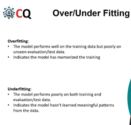
>
>Permítanme explicar el concepto de sobreajuste.
>
>* Esto significa que tu modelo funciona muy bien con datos de entrenamiento, pero con datos de evaluación no vistos, hay una gran diferencia entre tu puntuación durante el entrenamiento y tu puntuación con datos no vistos.
></br>
>Entonces, ¿cuáles son los síntomas o qué significa esto?
>   * Lo más probable es que tu modelo haya memorizado los datos de entrenamiento.
></br>
>Así que no encuentra patrones en la estructura de datos real, pero sabe que, bueno, es como un mecanismo de almacenamiento en caché.
></br>
>Sí, déjenme decirlo así.
>Si sabes cómo funciona el almacenamiento en caché, tu modelo podría ser una especie de enorme máquina de almacenamiento en caché.
>
>   * Tu modelo no entendió bien los patrones de los datos, sino que simplemente los memorizó.
></br>
>Esto se conoce como sobreajuste, un problema muy grave.
>Significa que tus algoritmos no son muy buenos.
>Y esa es una parte del problema.
>No la única, pero sí una parte.
>
>* ¿Y qué hay del infraajuste?
></br>
>Bueno, es lo contrario.
></br>
>¿Qué significa?
>   * Significa que el modelo tiene un rendimiento deficiente tanto con los datos de entrenamiento como con los de evaluación.
>Si buscas un modelo con un rendimiento deficiente con los datos de entrenamiento, pero bueno con los de evaluación,
>sabes que es un misterio.
>Ese tipo de situación es una anomalía.
>No existe.
></br>
>Es simplemente un efecto de probabilidad.
>¿Verdad?
>Es algo que no debería existir, es solo una coincidencia que ocurrió una vez.
></br>
>En este caso, significa que no hay nada en tus datos que pueda tener significado.
>Por lo tanto, tus datos son totalmente independientes.
>No hay correlación entre nada.
></br>
>   * Pero incluso en ese caso, debería haber algo en tu método de evaluación, tus algoritmos.
>No son lo suficientemente buenos para el propósito.
></br>
>Esto significa que tu modelo no ha aprendido ningún patrón significativo de los datos.
>De acuerdo.
>Pero bueno.
></br>
>¿Cómo probamos esto?
>¿Cómo evaluamos algo así?
>Bueno, no te preocupes, porque te tengo cubierto.

1. Regresamos al archivo **`src/test/LLM/Data_Spliting/evaluate_model.py`**
2. Posemos cambiar el texto de `"iris_eval.csv"` por el de `"iris_iris.csv"`.
3. Ejectuar de nuevo en la `TERMINAL` el Ambiente Virtual de Python: </br> `.venv/Scripts/activate`
4. Ahora si ejecutar el comando en la `TERMINAL` de: </br> `python ./src/test/LLM/Data_Spliting/evaluate_model.py`</br> Se demora mas y obtiene algo similar al anterior
5. Hay un arhivo que no se puede ver completo el codigo de nombre **`compare.py`**.
6. Y hay otro para generar los **`*.csv`** de nombre **`tran_k_fold.py`**, tampoco se alcanza ver el código completo.
7. Una vez terminada la prueba salirnos del Ambiente Virtual de Python con el comando: </br> `deactivate`


### 48. Laboratory - Python K Fold Training and Demo

1. Para el archivo **`src\test\LLM\Data_Spliting\train_k_fold.py`**, empiezo con las importaciones:
```py
from datasets import Dataset
from transformers import (
    DistilBertTokenizer,
    DistilBertForSequenceClassification,
    Trainer,
    TrainingArguments,
    DataCollatorWithPadding,
)
from sklearn.model_selection import StratifiedKFold
import pandas as pd
import os
```
2. Completo los tres primeros pasos de **`train_k_fold.py`**:
```py
# Step 1: Load your dataset from a CSV file
current_path = "./src/test/LLM/Data_Spliting/"
train_file = current_path + "iris_train.csv"
data = pd.read_csv(train_file)

# Step 1.1: Validate the existence of the training file
if not os.path.exists(train_file):
    raise FileNotFoundError(f"Training file not found: {train_file}")

# Step 1.2: Validate the columns in the dataset
required_columns = ['SepalLengthCm', 'SepalWidthCm',
                    'PetalLengthCm', 'PetalWidthCm', 'Species']
if not all(col in data.columns for col in required_columns):
    raise ValueError(
        f"The dataset must contain the following columns: {required_columns}")

# Step 2: Convert the dataset to Hugging Face Dataset
dataset = Dataset.from_pandas(data)


# Step 3: Preprocess the datase: Convert all feature column into a single textual description
def convert_to_text(example):
    features = f"Features: Sepal length {example['SepalLengthCm']} cm, Sepal width {example['SepalWidthCm']} cm, "\
        f"Petal length of {example['PetalLengthCm']} cm, Petal width of {example['PetalWidthCm']} cm."
    return {"text": features}


dataset = dataset.map(convert_to_text)
```
3. Agregamos pasos 4 y 5:
```py
# Step 4: Map the 'Species' column to numerical lables for classification
label_mapping = {"Iris-setosa": 0, "Iris-versicolor": 1, "Iris-virginica": 2}

# Ensure 'Species' is correctly mapped
dataset = dataset.map(lambda x: {"label": label_mapping[x["Species"]]})

# Step 5: Tokenize the dataset
tokenizer = DistilBertTokenizer.from_pretrained("distilbert-base-uncased")
data_collator = DataCollatorWithPadding(tokenizer=tokenizer)


def tokenize_data(example):
    return tokenizer(example["text"], truncation=True, padding="max_length", max_length=128)


tokenized_dataset = dataset.map(tokenize_data, batched=True)
```
4. Paso 6 y empiezo un ciclo `for`:
```py
# Step 6: k-Fold Cross-Validation
kf = StratifiedKFold(n_splits=5, shuffle=True, random_state=42)
df = pd.DataFrame(tokenized_dataset)

results = []
model_checkpoint = "distilbert-base-uncased"

for fold, (train_idx, val_idx) in enumerate(kf.split(df, df["label"])):
    print(f"\n--- Fold {fold+1} ---")
```
5. Continuo con el contenido del ciclo `for` , pasos 7 a 9:
```py
    # Step 7: Create result directories
    fold_result_dir =f"{current_path}results_fold{fold+1}"
    os.makedirs(fold_result_dir, exist_ok=True)

    # Step 8: Create result training and validation sets
    train_data = df.iloc[train_idx]
    eval_data = df.iloc[val_idx]
    train_dataset = Dataset.from_pandas(train_data)
    eval_dataset = Dataset.from_pandas(eval_data)

    # Step 9: Load a pre-trained DistriBERT model
    model = DistilBertForSequenceClassification.from_pretrained(
        model_checkpoint, num_labels=3)
```
6. Pasos 10 a 14, para cerrar el `for`:
```py
    # Step 10: Define training arguments with increased epochs and logging
    training_arg = TrainingArguments(
        output_dir=fold_result_dir,
        eval_strategy="epoch",  # Performs evaluation at the end of each epoch
        save_strategy="epoch",  # Save checkpoints at the end at each poch
        learning_rate=5e-5,
        per_device_train_batch_size=16,
        per_device_eval_batch_size=16,
        num_train_epochs=3,  # Increased epochs for better training
        weight_decay=0.01,
        logging_dir=f"{current_path}logs_fold_{fold+1}",
        logging_steps=10,
        save_total_limit=2,  # Keep only the last 2 checkpoints
        load_best_model_at_end=True,  # Load the best model at the end of training
    )

    # Step 11: Inicialize Trainer
    trainer = Trainer(
        model=model,
        args=training_arg,
        train_dataset=train_dataset,
        eval_dataset=eval_dataset,
        data_collator=data_collator,
    )

    # Step 12: Train the model and save the results
    trainer.train()
    trainer.save_model(fold_result_dir)
    print("Training completed. Best model saved at:", training_arg.output_dir)
    
    # Step 13: Update checkpoint for next fold
    model_checkpoint=fold_result_dir # Use the best model of current fold as starting point for the next

    # Step 14: Evaluate the model
    eval_results = trainer.evaluate()
    results.append(eval_results)

    print(f"Results for fold {fold+1}: {eval_results}")
```
7. Finalizamos con el paso 15, ya por fuera del `for`:
```py
# Step 15: Calculate average metrics across all folds
average_results = {key: sum(r[key]for r in results)/len(results)
                   for key in results[0]}
print("\n--- Average Results Across all Folds ---")

for key, value in average_results.items():
    print(f"{key}: {value:.4f}")

# Final Output
print("\nTraining and evaluation completed. Models and checkpoints are saved in respective fold directories.")
```
8. Levantamos el Ambiente Virtual de Python: </br> `.venv/Scripts/activate`
9. En la misma `TERMINAL` donde tenemos el Ambiente Virtual de Python, ejecutamos el comando para correr el proceso: </br> `python ./src/test/LLM/Data_Spliting/train_k_fold.py`
10. Ahora bien para evaluar cualquiera de estos modelos entramos al archivo **`src/test/LLM/Data_Spliting/evaluate_model.py`** y cambiamos el `model_path` por la ruta de unos de los obtenidos en el proceso anterior, por ejemplo **"results_fold5/checkpoint-18"**.
11. Probamos la ejecución de nuevo de **`evaluate_model.py`**, con el comando: </br> `python ./src/test/LLM/Data_Spliting/evaluate_model.py`</br> Al final obtengo un resultado como este: </br> `Accuracy: 0.95`</br> `Evaluation results saved to ./src/test/LLM/Data_Spliting/evaluation_results.csv`
12. Una vez terminada la prueba salirnos del Ambiente Virtual de Python con el comando: </br> `deactivate`


## Section 8: Performance Characteristics for AI Models


### 49. Criteria 1- Model Training Time


>[!NOTE]
>Uno de los requisitos no funcionales clave relacionados con el rendimiento.
>Se trata del tiempo que lleva entrenar un modelo.
>Y lo que puedo decirles es que para ChatGPT, que es, por supuesto, el modelo más infame,
>se tarda aproximadamente un mes en entrenarlo, y no tienen que creerme.
>
>")
>
>Busquen en internet el tiempo necesario para entrenar un ChatGPT.
>Entrenar el modelo lleva muchísimo tiempo.
>Porque al entrenar un modelo, también se trata de los datos y del hiperparámetro.
>
>Así que modifican el hiperparámetro de su modelo para encontrar el equilibrio adecuado entre costo, rendimiento, precisión, sobreajuste, subajuste, etc.
>Un aspecto clave, si estás probando tu modelo, es el tiempo de entrenamiento, ya que esto implica el costo del entrenamiento. Esto se refleja directamente en esto, ya que, si creas algo muy complejo, necesitarás una GPU especializada.
>
>Ya he mencionado el tiempo de entrenamiento.
>El modelo también se ve influenciado por el ajuste de hiperparámetros.
>Te mostraré cómo se ve esto.
>
>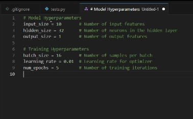
>
>Me refiero al parámetro, porque lo que tengo aquí es muy poca información sobre los dos tipos de hiperparámetros.
>El primer tipo, que vemos arriba, es para la red neuronal.
>Es para el modelo.
>En este caso, nuevamente, tenemos el tamaño de entrada del número de características.
>
>Si se usa alguna clasificación, significa que tengo diez características diferentes.
>Por ejemplo, una casa.</br>
>Podría tener diez características.
>Número de habitaciones.</br>
>Ahora, ya sabes, superficie, etc., diez.
>Y la salida será uno.</br>
>Y tendrá 32 nodos ocultos además de la entrada y la salida.
>
>Este es el hiperparámetro de la red neuronal.
>Si se ve abajo, se encuentra el parámetro de entrenamiento, que configura el modelo para entrenar el número de épocas.
>Por ejemplo, ¿cuántas veces se revisan todos los datos de entrenamiento?
>
>Si se desea entrenar más rápido, en lugar de cinco épocas, se podrían usar seis. Si se desea entrenar más, este hiperparámetro también influye en el tiempo que tarda el modelo en revisar todos los datos.
>Y, por supuesto, hay muchos otros hiperparámetros.
>Su tasa de aprendizaje será una función de pérdida.
>Hay muchos parámetros.
>
>Y, dependiendo de cómo se configuren, influirán en el tiempo de entrenamiento del modelo.
>Un aspecto y una característica muy importante de un modelo de IA es el tiempo de entrenamiento.
>Estoy bastante seguro de que no has oído hablar del tiempo que tarda en compilarse una aplicación, y nadie se fija mucho en eso.
>
>Quizás algunos equipos de desarrollo, pero, bueno, nadie dice: "¡Guau! ¡Se tarda una semana en compilar nuestra aplicación!".
>Eso no sucede.
>Pero en el caso de los modelos, bueno, este es un criterio muy importante que se debe considerar específicamente.


### 50. Criteria 2 - Inference Time

>[!NOTE]
>
>**¿Y qué hay del tiempo de inferencia?**
>
>Inferencia se refiere al tiempo que el modelo tarda en dar la predicción.
>En el caso de los modelos de clasificación, por ejemplo, ¿podrías decirme qué hay en esta imagen?
>Podrías obtener una casa, un coche, etc.
>Es casi instantáneo, pero en el caso de la IA generativa, tarda bastante.
>
>Por lo tanto, algo que debes medir es el tiempo de tu inferencia, o el tiempo que tu modelo de IA generativa detiene la generación.
>Y, por supuesto, como puedes imaginar, esto podría ser problemático dependiendo de la aplicación que estés desarrollando.
>Porque si estás realizando una investigación exhaustiva…
>
>Imaginemos que estoy usando un Gemini, pensando experimentalmente.
>O podría estar usando… digamos este, y diría que es agua líquida.
>Permíteme hacerte una pregunta.
>Y como ven, ahora estoy razonando, pero aún no obtengo la respuesta.
>Y ya obtuve la respuesta.
>
>Pero estoy bastante seguro de que si preguntas: "¿Cuál es el interés compuesto de... no sé qué cantidad de dinero ajustada a la inflación, etc.?",
>en los próximos años, razonará mucho más.
>
>Entonces, la pregunta es: ¿es importante este valor?
>La respuesta depende de la aplicación que estés desarrollando.
>Porque si estás desarrollando un chatbot, es muy importante.
>Necesitas una comunicación prácticamente en tiempo real.
>No quieres esperar a que tu chatbot razone dos minutos para luego darte una respuesta.
>No.
>
>Así que quieres que el chatbot razone muy rápido.
>Y, por supuesto, si quieres probar esta información o este tiempo, realizar cualquier tipo de prueba de rendimiento y luego enviar solicitudes, asegúrate de enviar una solicitud diferente, ya que ChatGPT y otras API no tienen memoria, pero sí almacenamiento en caché.
>
>Te devolverán todo esto como respuesta o te enviarán diferentes indicaciones con el mismo tamaño de token.
>Estoy bastante seguro de que podrás probar el tiempo de respuesta.
>Y, por supuesto, el tiempo de respuesta se ve influenciado por la infraestructura que ejecuta tu modelo, ya que necesitas separar el entrenamiento y la ejecución del modelo. Lo entrenas en una infraestructura, pero luego puedes ejecutarlo en tu teléfono si tienes un minimodelo, por ejemplo.
>
>Así que recuerda que los modelos de razonamiento piensan despacio y quizás te den una buena respuesta.
>
>Mientras que, por ejemplo, con este flash, dices: "¿Cuánto es uno más uno?".
>
>Está pensando, pero uso la respuesta como dos, así que no hay razonamiento.
>Así que el tiempo de inferencia es otro parámetro que debes considerar al validar cualquier tipo de modelo de IA o IA generativa.


### 51. Criteria 3 - Model Drifting

>[!NOTE]
>
>[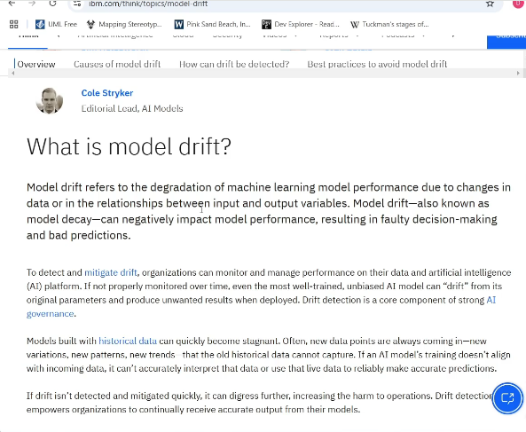](https://www.ibm.com/think/topics/model-drift)
>
>Ahora hablaremos sobre el concepto de desviación, desviación a largo plazo o desviación del modelo.
>Para explicarlo más fácilmente, voy a visitar IBM, ya que tienen una página relacionada con esto.
>Entonces, ¿qué es exactamente una desviación en el rendimiento del modelo? Es simplemente una disminución en su rendimiento.
>
>En resumen.
>En otras palabras, el modelo pierde precisión con el paso del tiempo.
>
>Esto podría deberse a dos razones:
>El modelo aprende de sus interacciones y de las interacciones con...
>
>Por ejemplo, imaginemos que ChatGPT interactúa con muchas personas, y si aprende de estas interacciones, algunas personas podrían decir: "Bien hecho por algo que no funciona bien", y el modelo decaerá porque incorporará datos erróneos en su mecanismo de aprendizaje reforzado.
>
>Otra razón por la que un modelo decaerá o se desviará es porque se generan nuevos datos.
>Porque sabemos que el modelo tiene información sobre los datos del tren.
>
>Pero si se incorporan nuevos datos a la ecuación, por ejemplo, si se tiene un modelo que predice el precio de la vivienda basándose en diez parámetros, pero ahora todos los usuarios del mercado utilizan once, el modelo se deteriorará porque no será tan preciso como los modelos que proporcionan once parámetros o simplemente porque el modelo utiliza datos del año pasado, por lo que desconoce los datos de este año.
>
>Por lo tanto, el modelo se deteriora.
>La deriva del modelo en sí misma significa que el modelo pierde precisión con el tiempo.
>Entonces, ¿qué se hace en este caso?
>
>En primer lugar, es necesario realizar un seguimiento continuo, por lo que se debe supervisar el rendimiento del modelo si se cuenta con un conjunto de datos de referencia que siempre se utiliza para probar el modelo.
>
>Lo que podría hacer es evaluar semanalmente, quizás mensualmente o incluso con frecuencia, según sus necesidades, el rendimiento del modelo y asegurarse de que el parámetro, si el modelo ha decaído o las respuestas ya no alcanzan su nivel de precisión, debería entrenarlo con los datos más recientes disponibles.
>
>Por lo tanto, este es un requisito no funcional, que podría decirse funcional o no funcional según cómo se mire.
>Porque ahora el modelo funciona, pero no con la precisión que debería.
>Así que monitoree su modelo.
>Compárelo o pruébelo con un punto de referencia.
>Y si las cosas no van bien, lo que debe hacer es volver a entrenar su modelo, ya que la parte de hiperparámetros está bien.


### 52. Criteria 4 - Infrastructure to run Model - Model Distillation

>[!NOTE]
>
>[](https://labelbox.com/guides/model-distillation/)
>
>Abordemos la idea de cuánta infraestructura necesito para ejecutar mi modelo.
>Si no lo estás o no estás familiarizado con las pruebas de rendimiento, debes saber que hoy en día las aplicaciones se prueban para comprobar su rendimiento.
>
>Para determinar cuánta potencia de procesamiento necesito para un número específico de usuarios o para un volumen de datos determinado, etc.
>Existen pruebas de carga, pruebas de estrés, etc.
>
>**¿Y por qué hacemos esto?**
>
>Porque queremos saber qué tipo de infraestructura necesitamos para que una aplicación se ejecute con un parámetro específico, que generalmente es el tiempo de salida.
>Entonces, ¿cuánto tiempo tarda mi aplicación en realizar una acción determinada?
>
>Crear un usuario y proporcionarme la respuesta.
>También necesitamos hacer esto en el caso de la IA, y por eso lo estoy mencionando aquí.
>
>**Destilación del modelo.**
>
>Porque tenemos modelos muy grandes, como GPT y Gemini, y modelos muy pequeños, como el modelo Flash, por ejemplo.
>Y esta es la razón por la que tenemos modelos grandes y pequeños: queremos poder ejecutar IA sin una infraestructura especial y dedicada.
>Y por esta razón, nosotros o quienes trabajan con IA han creado estos agentes realmente pequeños.
>
>**¿Pero cómo lo han logrado?**
>
>Usando un concepto llamado destilación de modelos.
>Y no entraré en detalles sobre cómo se hace.
>Hay información en línea.
>Puedo decirles que para realizar la destilación de modelos, solo necesitan tener un modelo de profesor.
>
>Imaginemos que va a ser un Google Gemini y se necesita un modelo de estudiante, que es Gemini Flash.
>Y luego, mediante diferentes mecanismos, pueden enseñar a sus estudiantes.
>O bien, el estudiante puede recibir clases del agente de IA docente hasta que adquiera aproximadamente el 80 % del conocimiento con tan solo el 1 % de la potencia de cálculo.
>
>Existen diferentes técnicas para realizar la destilación de modelos.
>Puedes encontrarlas en línea.
>Pero hay algo que quiero mostrarte.
>
>Pero hay algo que quiero mostrarles.
>De Hugging Face, tenemos este pequeño modelo, que se divide en tres modelos diferentes.
>Hoy en día, los modelos muy grandes tienen casi un billón de parámetros, casi 700 mil millones, etc.
>Pero el agente pequeño tiene tres versiones: 145 millones, tres 60.000.001,7 mil millones de parámetros.
>
>**¿Y cómo se puede ejecutar esto?**
>
>Bueno, si busco aquí, digamos "teléfono", pueden ver que este modelo se puede ejecutar en un iPhone 15 con seis gigabytes de RAM.
>Así de pequeños son.
>Repito, no se pueden entrenar estos modelos en el teléfono.
>Es imposible.
>
>No se necesitan... quiero decir, se podría hacerlo con una vida útil de 1000 años.
>Pero sí se puede ejecutar el modelo en el teléfono.
>Por eso, otra característica muy importante que se debe medir es qué tipo de CPU o GPU necesito para ejecutar mi modelo localmente.
>¿Y cuál es el tiempo de respuesta que obtengo al ejecutar mi modelo localmente?


### 53. Criteria 5 - Memory and Token Limits


>[!NOTE]
>
>[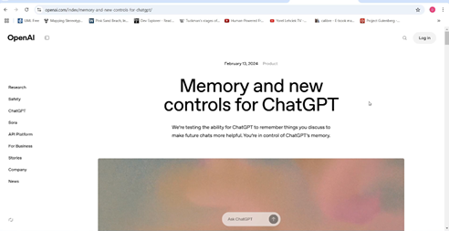](https://openai.com/index/memory-and-new-controls-for-chatgpt/)
>
>Echa un vistazo a este título, la memoria y los nuevos controles para ChatGPT.
>
>**¿Qué significa esto?**
>
>Significa que los chats recuerdan lo que hemos hablado con ellos.
>Tienen memoria.
>Y te lo puedo demostrar ahora mismo.
>
>Voy a ir a Egipto.
>Seleccionaré a mi modelo de foto y preguntaré: "¿Cuál es la fórmula del agua?".
>Y luego haré una pregunta de seguimiento: ¿para qué sirve?
>La idea es que tú hiciste la pregunta y yo obtuve la respuesta.
>Y luego, un ChatGPT tiene el contexto de la pregunta anterior.
>Y luego tengo una especie de pregunta de seguimiento.
>Pero en detalle.
>
>Lo que no sabes es que cada vez que envías una nueva solicitud, todo lo que has discutido en este chat se envía de vuelta a ChatGPT.
>Todas las conversaciones que has tenido, todas las indicaciones que has enviado y todas las respuestas se envían junto con cada pregunta que haces.
>Esto no significa que se almacenen en la memoria.
>
>Significa que toda la conversación se envía de vuelta a ChatGPT para que tenga el contexto de lo que estás hablando.
>Esta es la idea de la memoria, pero ¿cuánta memoria tienes?
>Y aquí es donde debemos pensar en los tokens.
>
>Copio esto y vayamos al tokenizador de la API abierta.
>Voy a obtener esto y copiar la respuesta.
>Hemos usado 256 tokens para obtener la respuesta.
>Esta es la respuesta.
>
>Por lo tanto, siempre que quieras trabajar con la API, debes recordar que no tienen memoria y que debes gestionarla manualmente si quieres probar algo en ella.
>Un atributo no funcional de cualquier modelo de lenguaje grande se refiere a los tokens de entrada y salida.
>
>Aquí en Gemini tenemos una pequeña comparación:
>ChatGPT turbo.
>Sabes, Cloud Three Deep Seek y todos los demás tienen diferentes límites de tokens, y tú tienes un límite de tokens de entrada y salida constantemente.
>
>Hay un límite de tokens de entrada y un límite de tokens de salida.
>
>Por eso, los diferentes modelos son buenos para diferentes tareas.
>Por lo tanto, al realizar cualquier tipo de prueba,
>recuerda también superar el límite de tokens para alcanzar tu límite de tokens.
>
>Y así sucesivamente, para ver qué sucede.
>Por ejemplo, Leipzig tiene 64 contextos y una salida de 8 K.
>Entonces, lo cual es ocho veces menor que la salida, y así sucesivamente.
>
>Ahora, para mostrarles que no hay memoria en la API, tengo un chatbot.
>Básicamente, está llamando a ChatGPT.
>Lo ejecutaré y preguntaré: "¿Cuál es la fórmula del agua?".
>
>Obtendré una respuesta.
>La fórmula química es H₂O.
>Y luego diré para qué sirve.
>No quiero especificar agua porque es transparente.
>
>Quiero hacer la pregunta de seguimiento: ¿para qué sirve?
>
>Como puedo realizar diversas tareas, como responder preguntas, etc.
>No hay memoria.
>Así que si digo algo que seguirá aquí, obtendré lo mismo.
>No funciona.
>Por eso es importante pensar en la memoria, el contexto y los tokens de entrada y salida, ya que necesitas trabajar con ellos para obtener una respuesta adecuada.
>
>Como puedes ver, también puedes definir cuántos tokens, el máximo de tokens que quieres que tu modelo responda.
>En caso de que haya una respuesta muy grande y no quieras 200 o 500 tokens, o lo que sea, solo cinco o no sé.
>También puedes configurarlo.
>Bien.
>
>Esto se trata de la memoria.
>Se prueba como cualquier otro análisis de valor límite.
>Se va por debajo del margen que sobrepasa el límite.
>Y, por supuesto, puedes ser creativo con eso.


## Section 9: GLUE - Benchmark against NLP

### 54. What is GLUE NLP Benchmark

>[!NOTE]
>
**>[ GLUE](https://gluebenchmark.com/) _The General Language Understanding Evaluation_**
>
>El benchmark de Evaluación de la Comprensión del Lenguaje General (GLUE) es una colección de recursos para entrenar, evaluar y analizar sistemas de comprensión del lenguaje natural. GLUE consta de:
>
>* Un benchmark de nueve tareas de comprensión del lenguaje, basadas en oraciones o pares de oraciones, basado en conjuntos de datos ya establecidos y seleccionados para abarcar una amplia gama de tamaños, géneros textuales y grados de dificultad;
>* Un conjunto de datos de diagnóstico diseñado para evaluar y analizar el rendimiento del modelo con respecto a una amplia gama de fenómenos lingüísticos presentes en el lenguaje natural; y
>* Una tabla de clasificación pública para el seguimiento del rendimiento en el benchmark y un panel para visualizar el rendimiento de los modelos en el conjunto de diagnóstico.
>
>El formato del benchmark GLUE es independiente del modelo, por lo que cualquier sistema capaz de procesar oraciones y pares de oraciones y generar las predicciones correspondientes puede participar. Las tareas del benchmark se seleccionan para favorecer los modelos que comparten información entre tareas mediante la compartición de parámetros u otras técnicas de aprendizaje por transferencia. El objetivo final de GLUE es impulsar la investigación en el desarrollo de sistemas generales y robustos de comprensión del lenguaje natural.
>
>[nyu-mll/GLUE-baselines](https://github.com/nyu-mll/GLUE-baselines)
>
>Si vas a la sección de código, te llevará a este repositorio de GitHub.
>Aquí tienes el entorno para descargar los datos de Glue y el código fuente.
>Dado que hay una advertencia de obsolescencia, no usaré nada de lo que está aquí.
>Escribiré mi propio código porque lo que necesitamos son los datos.
>
>También puedes ver, por ejemplo, en este entorno el archivo YAML, que puedes usar si usas una herramienta como la que mostré al principio para aislar tu entorno. Aquí te indica lo que necesitas.
>Pero, como está obsoleta, existen bibliotecas más nuevas que también usaremos.
>Si quieres obtener los datos, aquí tienes los enlaces para descargarlos.
>Aquí tienes la ruta para todos los conjuntos de datos que necesitamos.
>
>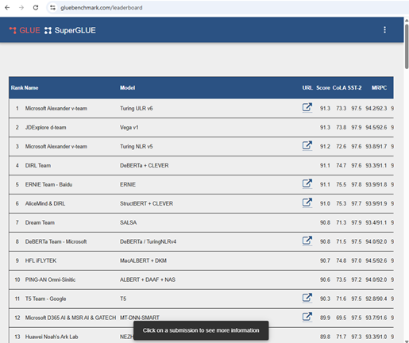
>
>Y luego, aquí también tienen las tareas que cubriremos en una lección aparte: la tabla de clasificación.
>La tabla de clasificación significa, como ven, cuál es el mejor modelo.
>
>¿Qué modelo obtiene la puntuación más alta con respecto a esto? No podrán obtener un resultado al ejecutar la prueba comparativa con una prueba real. Necesitan obtener sus resultados y enviarlos a la gente aquí en un formato específico.
>
>Y solo después de eso podrán ver su puntuación en el video de capacitación que mostraré.
>Cuando ejecutemos la demostración real, la ejecutaremos contra un conjunto de entrenamiento que también contiene los resultados.
>Así es como calculamos, porque para ejecutar contra el conjunto real, no se tienen las predicciones.
>
>No se tienen los valores de verdad fundamentales.
>Por lo tanto, nunca podrán acceder a su propio dispositivo.
>La puntuación real la obtendrás únicamente con los datos de entrenamiento.


### 55. What are the 11 benchmark Tasks of GLUE

>[!NOTE]
>
>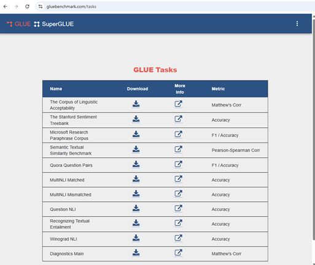
>
>En el video anterior, les comenté que tenemos el punto de referencia de Glue, y este es el que se utiliza.
>Este punto de referencia se evaluará con varias tareas que, como saben, el usuario puede comprender y evaluar.
>
>Originalmente eran ocho, pero ahora son cerca de once tareas diferentes.
>
>Y este es el formato.
>Así que este es el nombre de la tarea.
>Aquí pueden descargar los datos.
>Y esta es la métrica, ya que existen diferentes métricas.
>
>Por ejemplo, esta métrica se relaciona con la precisión gramatical.
>Conocemos F1.
>Y luego hay otras métricas que se discutirán a lo largo de este material de capacitación.
>
>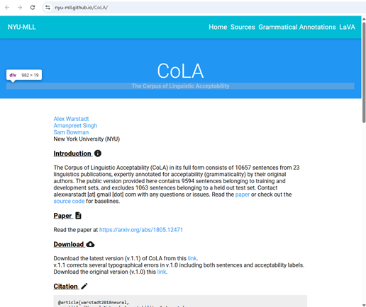
>
>Por ejemplo, veamos esta tarea, la de la cola.
>
>Si buscas más información, verás que esa columna representa el corpus de aceptabilidad lingüística.
>Si quieres leer la investigación que la respalda, ve aquí y verás los juicios de aceptabilidad de las redes neuronales.
>También verás qué valida exactamente esta tarea.
>
>Investiga la capacidad de las redes neuronales artificiales para juzgar la aceptabilidad gramatical de una oración, con el objetivo de evaluar su competencia lingüística.
>
>No haré esto para todas las tareas.
>Está bastante claro.
>Las tareas que tenemos...
>Era la de la cola, que básicamente determina si un texto es gramaticalmente correcto.
>
>Luego está el Stanford Sentment Treebank, que clasifica si un sentimiento es positivo o negativo.
>Así que estás hablando y el modelo identifica si lo que dices tiene una vibra positiva o negativa.
>Microsoft.
>Eh, ahora continuemos.
>Eh, parámetro de similitud textual semántica.
>
>Esto mide la similitud semántica entre dos oraciones en una escala continua.
>Eh, Winograd NLI, que significa inferencia del lenguaje natural, resuelve las referencias de pronombres en oraciones
>con ambigüedad.
>Eh, digamos antecedentes.
>
>Esto significa que estás diciendo dos frases y en un momento determinado, por ejemplo, a Andrés le gusta el agua caliente o el té.
>
>Y en la siguiente oración dices que le gusta mucho tomar té, que no sé qué.
>Así que esto valida si se refiere a Andrés ahora.
>Básicamente, hay muchas otras tareas, por ejemplo, reconocer la implicación textual.
>Esto determina si la oración se sigue original o lógicamente de otra.
>Entonces, si de lo que estás hablando…
>Tiene sentido lógico.
>
>Lo que estás expresando.
>
>Eh, ¿soy...? Por ejemplo, esta es una inferencia de lenguaje natural multigenética que juzga la relación entre una premisa y la hipótesis.
>Así que te dice que esta es la premisa, esta es una hipótesis, y así sucesivamente.
>Estas son las tareas de enlace.
>Cuando expresas algo, estás diciendo algo.
>
>Así es como se validará el modelo frente a estos puntos de referencia.
>Y lo realmente interesante es que puedes realizar pruebas independientes para cada tipo de tarea.
>No necesitas ejecutar todo porque eso llevaría un tiempo.
>Pero puedes simplemente decir: "Oye, quiero ejecutar contra pares de preguntas de Quora, por ejemplo, contra esta, para poder probar contra pares de preguntas de Quora".
>Y por cierto, Qqp detecta si dos preguntas son paráfrasis la una de la otra.
>
>Y pueden ver, por ejemplo, que esta tiene F1 y precisión como métricas, y no indican nada sobre la recuperación, etc.
>Porque estas son las métricas más importantes para este tipo de evaluación.
>Así que esta es, en realidad, la tarea de enlace y los datos, y cómo los obtendremos.
>Les mostraré en el video donde hablamos de nuestro código.
>Pero por ahora, deben saber que esto es para la comprensión del lenguaje natural.
>Hay 11 tipos de puntos de referencia.
>Pueden obtener los datos de todos ellos.
>Pueden obtener los datos de uno de ellos.
>
>[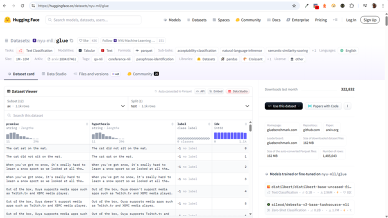](https://huggingface.co/datasets/nyu-mll/glue)
>
>También puedes encontrar los datos aquí mismo, en la `Hugging Face`.
>
>Y puedes encontrar las etiquetas de todos los datos que quieras.
>Y si quieres saber qué hace cada una de estas, digamos, tareas, también puedes encontrarlas aquí.
>Ahora todo está aquí.
>Eso es todo.
>Ah, y por cierto, sí, sí.
>Muy importante.
>
>Olvidé mencionar que está en inglés.
>
>Así que todas las preguntas que hagas deben estar en inglés.
>No significa que no tenga valor traducirlas con una máquina del inglés a otro idioma,
>y hacer las preguntas en otro idioma, porque la traducción podría no ser correcta.
>Así que, si haces esto, siempre necesitas usar estos datos, que están en inglés.
>
>Y el modelo que estás validando debe estar entrenado en inglés. Dicho esto, nos vemos en la parte donde realmente codificamos y ejecutamos nuestra prueba.
>
>Repito que los datos se usan para entrenamiento, no para benchmarking, porque los datos de benchmarking o, digamos, los datos de prueba solo contienen las predicciones, no la tabla de verdad fundamental.
>Y luego, quienes mantienen esta tabla de clasificación te dirán tu puntuación.


### 56. How to run a GLUE benchmark test

>[!NOTE]
>
>[How to run a GLUE benchmark test](videos/2025-08-29_103338.mp4)
>


### 57. Glue benchmarking on Bert Huggingface Model

1. Activamos el Ambiente Virtual de Python con el comando: </br> `.venv/Scripts/activate`
2. Instalamos las librerías faltantes: </br> `pip install seaborn` </br> » [seaborn: statistical data visualization](https://pypi.org/project/seaborn/)
3. Creamos el siguiente archivo **`src/test/LLM/GLUE/evaluate_glue.py`**, con este código inicial:
```py
import pandas as pd
import seaborn as sns
import matplotlib.pyplot as plt
from transformers import AutoTokenizer, AutoModelForSequenceClassification, Trainer, TrainingArguments, DataCollatorWithPadding
from datasets import load_dataset
import evaluate

print("1. Load the BERT-base model and tokenizer")
model_name = "bert-base-uncased"
tokenizer = AutoTokenizer.from_pretrained(model_name)
model = AutoModelForSequenceClassification.from_pretrained(
    model_name, num_labels=2)

print("2. Load the GLUE dataset (e.g. SST-2 fror sentiment analysis)")
task = "sst2"  # Change this for other GLUE tasks (e.e, 'mrpc', 'qqp')
dataset = load_dataset("glue", task)


print("3. Preprocess the dataset")
def preprocess_function(examples):
    return tokenizer(examples["sentence"], truncation=True, padding="max_length", max_length=128)


encoded_dataset = dataset.map(preprocess_function, batched=True)

print("4. Load evaluation metric using 'evaluate'")
metric = evaluate.load("glue", task)
```
4. Continuo Añadiendo pasos del 5 al 8:
```py
print("5. Define a function to compute the metrics")


def compute_metrics(eval_pred):
    logits, labels = eval_pred
    predictions = logits.argmax(axis=1)
    return metric.compute(predictions=predictions, references=labels)


print("6. Create a DataCollaator for dynamic padding")
data_collator = DataCollatorWithPadding(tokenizer=tokenizer)

print("7. Prepare evaluation aguments")
training_args = TrainingArguments(
    output_dir=current_path+"results",
    per_device_eval_batch_size=64,
    logging_dir=current_path+"logs",
    do_train=False,  # No Trainings
    do_eval=True,  # Only evaluation
)

print("8. Initialize Trainer fro evaluation")
trainer = Trainer(
    model=model,
    args=training_args,
    eval_dataset=encoded_dataset["validation"],
    compute_metrics=compute_metrics,
    data_collator=data_collator,  # Use data collator instead of tokenizer
)
```
5. Añado los pasos restantes:
```py
print("9. Evaluate all model on the evaluation set")
results = trainer.evaluate()

# DEBUG: Print all metrics  returned by the evaluation
print("Evaluation results:", results)

print("10. Filter GLUE-specific metrics")
exclude_metrics = ["eval_loss", "eval_runtime", "eval_samples_per_second",
                   "eval_steps_per_second", "eval_model_prepare_time"]
glue_metrics = {k: v for k, v in results.items() if k not in exclude_metrics}

print("Convert GLUE metrics to a DataFrame for visulization")
result_df = pd.DataFrame.from_dict(
    glue_metrics, orient="index", columns=["value"])
result_df.reset_index(inplace=True)
result_df.columns = ["Metric", "Value"]

# DEBUG: Ensure DataFrame is populated correcytly
print("Filtered Results for Graph:", result_df)

print("11. Plot the GLUE metrics")
plt.figure(figsize=(10,6))
sns.barplot(x="Metric", y="Value", data=result_df, palette="viridis")
plt.title(f"GLUE Evaluation Results for Tasks: {task.upper()}", fontsize=16)
plt.xlabel("Metrics", fontsize=14)
plt.ylabel("Values", fontsize=14)
plt.xticks(rotation=45, fontsize=12)
plt.tight_layout()
plt.show()
```
6. En la `TERMINAL` con el Ambiente Virtual de Python, ehecuto este comando: </br> `python ./src/test/LLM/GLUE/evaluate_glue.py`
7. Al terminal aparece esta imagen en pantalla: </br> 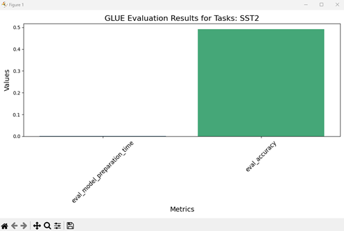
8. Cierro esta ventana y finaliza el proceso en Python.
9. Una vez terminada la prueba salirnos del Ambiente Virtual de Python con el comando: </br> `deactivate`


### 58. Demo - Python GLUE benchmark against GHATGPT

>[!NOTE]
>
>Por diversión, quiero mostrarles cómo comparar ChatGPT con el benchmark Glue SST two.
>
>Una forma de hacerlo, y es bastante divertida, es hacer lo siguiente:
>Acceden a ChatGPT y preguntan cuál es el sentimiento de esta frase.
>Por cierto, esto está tomado de la tarea two.
>
>Una cadena que, finalmente, transporta una reinvención de La Bella y la Bestia y películas de terror de los 90 y 40.
>¿Es positivo o negativo?
>No, es positivo.
>Pueden hacerlo manualmente, solo por diversión, pero con suerte no lo harán.
>
>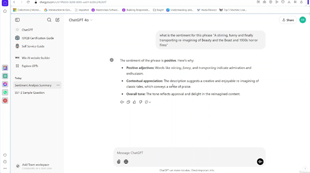
>
>

1. Creamos el archivo **`src/test/LLM/GLUE/glue_gpt.py`**.
2. Activamos el Ambiente Virtual de Python con el comando: </br> `.venv/Scripts/activate`
3. Empezamos con las importaciones necesarias:
```py
import os
from dotenv import load_dotenv  # Load environment variables
from openai import OpenAI
import numpy as np
from datasets import load_dataset
from sklearn.metrics import accuracy_score, precision_score, recall_score, f1_score
```
4. Inicializa el cliente de `OpenAI`:
```py
print("1. Initialize OpenAI client")
OPENAI_API_KEY = os.getenv("OPENAI_API_KEY")
if not OPENAI_API_KEY:
    load_dotenv()  # Carga las variables de entorno del archivo .env
    OPENAI_API_KEY = os.getenv("OPENAI_API_KEY")
# print("OpenAI API Key:", OPENAI_API_KEY)

# Instantiate OpenAI client
openai_client = OpenAI(api_key=OPENAI_API_KEY)
```
5. Función para la respuesta con base en el _prompt_:
```py
def get_openai_response(prompt):
    """
    Sends a prompt to OpenAi's API using the updateaded OPENAI client retrieves the response
    """
    try:
        completion = openai_client.chat.completions.create(
            model="gpt-4",
            messages=[
                {"role": "system", "content": "You are a helpful assistant."},
                {"role": "user", "content": prompt}
            ]
        )
        chat_reponse = completion.choices[0].message.content.strip()
        return chat_reponse
    except Exception as e:
        print(f"An error ccurred: {e}")
        return None
```
6. Función para evaluar los `SST-2` de los primeros 50 ejemplos:
```py
def evaluate_ssts_first_50():
    """
    Evaluate the SST-2 taks using the OpenAI API and computes metrics for the first 50 validations examples.
    """
    print("Load the SST-2 dataset")
    dataset = load_dataset("glue", "sst2")
    validation_set = dataset["validation"]

    print("Ensure we are iterating over dicctionaries (convert to a list fo dictionaries)")
    validation_examples = list(validation_set)

    print("Store predictions and labels")
    predictions = []
    labels = []

    print("Evaluate only the first 50 examples")
    for idx, example in enumerate(validation_examples[:50]):
        print("Ensure 'sentence' is accessed correctly")
        prompt = f"Classify the sentiment of the following sendentece as poistive or negative: \"{example['sentence']}\""

        print("Get the model's prediction using OpenAI API")
        response = get_openai_response(prompt=prompt)

        # Show sprompt and response
        print(f"Prompt ({idx+1}): {prompt}")
        print(f"Response: {response}")

        if response is not None:
            print("Convert the response to a label (e.g., 0 or 1)")
            if "positive" in response.lower():
                predictions.append(1)
            elif "negative" in response.lower():
                predictions.append(0)
            else:
                print(f"Unexpected response: {response}")
        else:
            predictions.append(-1)  # HAndle API failures
        print("Store the true label")
        labels.append(example["label"])

    print("Filter out invalid predictions")
    valid_indices = [i for i, pred in enumerate(predictions) if pred != -1]
    valid_predictions = [predictions[i] for i in valid_indices]
    valid_labels = [labels[i] for i in valid_indices]

    print("Compute evaluation metrics")
    accuracy = accuracy_score(valid_labels, valid_predictions)
    precision = precision_score(
        valid_labels, valid_predictions, average="binary")
    recall = recall_score(valid_labels, valid_predictions, average="binary")
    f1 = f1_score(valid_labels, valid_predictions, average="binary")

    print("Display results")
    results = {
        "Accuracy": accuracy,
        "Precision": precision,
        "Recall": recall,
        "F1-Score": f1,
    }
    for metric, value in results.items():
        print(f"{metric}: {value:.4f}")
```
7. Al final invoco esta super función `evaluate_ssts_first_50()`:
```py
print("run the evaluation for the first 50 SST-2 examples")
if __name__ == "__main__":
    evaluate_ssts_first_50()
```
8. En una `TERMINAL` deonse se ejecute el Ambiente Virtual de Pyton, corro este comando: </br> `python ./src/test/LLM/GLUE/glue_gpt.py`
9. Este es el resultado arrojado al final:
```bash
Compute evaluation metrics
Display results
Accuracy: 0.9400
Precision: 0.9200
Recall: 0.9583
F1-Score: 0.9388
```
10. Una vez terminada la prueba salirnos del Ambiente Virtual de Python con el comando: </br> `deactivate`

